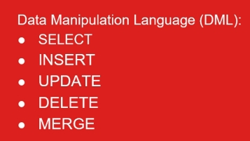
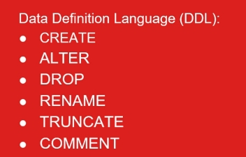
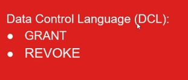

# Banco de Dados Oracle Completo: SQL+PLSQL+Modelagem

https://www.udemy.com/course/banco-de-dados-oracle-completo-sqlplsqlmodelagem-de-dados/

CURSO ORACLE 2024 COMPLETO - Incluindo 3 cursos: SQL PL/SQL e Modelagem de Banco de Dados - Abrangendo versões 11g a 21c

## <a name="indice">Índice</a>

1. [Seção 01: Oracle SQL - Apresentação do Curso Oracle SQL](#parte1)     
2. [Seção 02: Instalação do Oracle Database 21c XE](#parte2)     
3. [Seção 03: Download e Instalação do Oracle SQL Developer](#parte3)     
4. [Seção 04: Oracle SQL - Visão Geral do Oracle Database](#parte4)     
5. [Seção 05: Oracle SQL - Introdução ao SQL](#parte5)     
6. [Seção 06: Oracle SQL - Consultando dados utilizando o comando SQL SELECT](#parte6)     
7. [Seção 07: Oracle SQL - Restringindo e Ordenando Dados](#parte7)     
8. [Seção 08: Oracle SQL - Utilizando Funções Single Row](#parte8)     
9. [Seção 09: Oracle SQL - Utilizando Funções de Conversão e Expressões Condicionais](#parte9)     
10. [Seção 10: Oracle SQL - Agregando dados utilizando Funções de Grupo](#parte10)     
11. [Seção 11: Oracle SQL - Exibindo dados a partir de Múltiplas Tabelas](#parte11)     
12. [Seção 12: Oracle SQL - Utilizando Sub-Consultas](#parte12)     
13. [Seção 13: Oracle SQL - Operadores SET](#parte13)     
14. [Seção 14: Oracle SQL - Comandos DML Manipulando dados](#parte14)     
15. [Seção 15: Oracle SQL - Comandos DDL](#parte15)     
16. [Seção 16: Oracle SQL - Criando e Gerenciando Constraints](#parte16)     
17. [Seção 17: Oracle SQL - Criando e Gerenciando Visões](#parte17)     
18. [Seção 18: Oracle SQL - Criando e Gerenciando Sequencias](#parte18)     
19. [Seção 19: Oracle SQL - Criando e Gerenciando Índices](#parte19)     
20. [Seção 20: Oracle SQL - Criando Sinônimos](#parte20)     
21. [Seção 21: Oracle SQL - Utilizando o SQL*PLUS](#parte21)     
22. [Seção 22: Oracle PL/SQI - Apresentação do curso Oracle 19c PL/SQL Furndamentos](#parte22)     
23. [Seção 23: Oracle PL/SQL - Visão Geral do Oracle PL/SQL](#parte23)     
24. [Seção 24: Oracle PL/SQL- Bloco Anônimo](#parte24)     
25. [Seção 25: Oracle PL/SQL - Declaração de Identificadores - Variáveis e Constantes](#parte25)     
26. [Seção 26: Oracle PL/SQL - Sintaxe e Diretrizes de um Bloco PL/SQL](#parte26)     
27. [Seção 27: Oracle PL/SQL - Utilizando comandos SQL no PL/SQL](#parte27)     
28. [Seção 28: Oracle PL/SQL - Estruturas de Controle](#parte28)     
29. [Seção 29: Oracle PL/SQL - Tipos Compostos - Variável Tipo PL/SQL Record](#parte29)     
30. [Seção 30: Oracle PL/SQL - Tipos Compostos - Collections](#parte30)     
31. [Seção 31: Oracle PL/SQL - Cursor Explícito](#parte31)     
32. [Seção 32: Oracle PL/SQL - Tratamento de Exceções](#parte32)     
33. [Seção 33: Oracle PL/SQL - Procedures de Banco de Dados](#parte33)     
34. [Seção 34: Oracle PL/SQL - Funções de Banco de Dados](#parte34)     
35. [Seção 35: Oracle PL/SQL - Gerenciando Procedures e Functions](#parte35)     
36. [Seção 36: Oracle PL/SQL - Gerenciando Dependências de Objetos](#parte36)     
37. [Seção 37: Oracle PL/SQL - Debugando Procedures e Functions](#parte37)     
38. [Seção 38: Oracle PL/SQL - Packages de Banco de Dados](#parte38)     
39. [Seção 39: Oracle PL/SQL - Database DML Triggers](#parte39)     
40. [Seção 40: Modelagem de Dados - Apresentação do curso Modelagem de Banco de Dados](#parte40)     
41. [Seção 41: Modelagem de Dados - Instalação do Oracle SQL Developer Data Modeler](#parte41)     
42. [Seção 42: Modelagem de Dados -Metodologia Oracle](#parte42)     
43. [Seção 43: Modelagem de Dados - Modelagem de Dados Conceitual](#parte43)     
44. [Seção 44: Modelagem de Dados - Modelagem de Dados Avançada (Detalhada)](#parte44)     
45. [Seção 45: Modelagem de Dados - Database Design - Projeto do Banco de Dados](#parte45)     
46. [Seção 46: Modelagem de Dados - Construção](#parte46)     
47. [Seção 47: Oportunidades de Carreira utilizando Tecnologias Oracle](#parte47)     
---


## <a name="parte1">1 - Seção 01: Oracle SQL - Apresentação do Curso Oracle SQL</a>

### 1 Apresentação do curso Oracle SQL.

[recursos/Seção+2+-+Pratica+Aula+1.sql](recursos/Seção+2+-+Pratica+Aula+1.sql)


[Voltar ao Índice](#indice)

---


## <a name="parte2">2 - Seção 02: Instalação do Oracle Database 21c XE</a>


### 2 Download e Instalação do Oracle Database 21c XE


### 3 Configurando o LISTENER e o TNSNAMES - Criando e testando uma Conexão Local

[recursos/Seção+2+-+Pratica+Aula+2.sql](recursos/Seção+2+-+Pratica+Aula+2.sql)

```
C:\Users\josem>sqlplus system/oracle@xepdb1

SQL*Plus: Release 21.0.0.0.0 - Production on Thu Apr 24 15:19:30 2025
Version 21.3.0.0.0

Copyright (c) 1982, 2021, Oracle.  All rights reserved.

ERROR:
ORA-01017: invalid username/password; logon denied


Enter user-name: system
Enter password:
Last Successful login time: Thu Apr 24 2025 15:17:25 -03:00

Connected to:
Oracle Database 21c Express Edition Release 21.0.0.0.0 - Production
Version 21.3.0.0.0

SQL> select sysdate from dual;

SYSDATE
---------
24-APR-25

SQL>
```


[Voltar ao Índice](#indice)

---


## <a name="parte3">3 - Seção 03: Download e Instalação do Oracle SQL Developer</a>

### 04 Download e Instalação do Oracle SQL Developer

[recursos/Seção+3+-+Pratica+Aula+1.sql](recursos/Seção+3+-+Pratica+Aula+1.sql)


### 05 Criando uma conexão para o usuário SYS (dba) no Oracle SQL Developer

[recursos/Seção+3+-+Pratica+Aula+2.sql](recursos/Seção+3+-+Pratica+Aula+2.sql)


### 06 Criando o Usuário HR

[recursos/Seção+3+-+Aula+3+-+Cria+Usuario+HR.sql](recursos/Seção+3+-+Aula+3+-+Cria+Usuario+HR.sql)

### 07 Criando uma conexão para o usuário HR no SQL Developer

[recursos/Seção+3+-+Pratica+Aula+4.sql](recursos/Seção+3+-+Pratica+Aula+4.sql)

### 08 Criando os objetos do schema do usuário HR

[recursos/Seção+3+-+Aula+5+-+Cria+Objetos+schema+HR.sql](recursos/Seção+3+-+Aula+5+-+Cria+Objetos+schema+HR.sql)

### 09 Populando os objetos do schema do usuário HR

[recursos/Seção+3+-+Aula+6+-+Populando+Objetos+schema+HR.sql](recursos/Seção+3+-+Aula+6+-+Populando+Objetos+schema+HR.sql)

### 10 Criando Índices, inserindo comentários e outros no schema do usuário HR

[recursos/Seção+3+-+Aula+7+-+Criando+indices+e+comentarios+schema+HR.sql](recursos/Seção+3+-+Aula+7+-+Criando+indices+e+comentarios+schema+HR.sql)

[Voltar ao Índice](#indice)

---


## <a name="parte4">4 - Seção 04: Oracle SQL - Visão Geral do Oracle Database</a>

### 11. Oracle SQL - Visão Geral do Oracle Database 21c


[Voltar ao Índice](#indice)

---


## <a name="parte5">5 - Seção 05: Oracle SQL - Introdução ao SQL</a>

### 12. Oracle SQL - Introdução ao SQL

https://docs.oracle.com/en/database/index.html








[Voltar ao Índice](#indice)

---


## <a name="parte6">6 - Seção 06: Oracle SQL - Consultando dados utilizando o comando SQL SELECT</a>


[Voltar ao Índice](#indice)

---


## <a name="parte7">7 - Seção 07: Oracle SQL - Restringindo e Ordenando Dados</a>


[Voltar ao Índice](#indice)

---


## <a name="parte8">8 - Seção 08: Oracle SQL - Utilizando Funções Single Row</a>


[Voltar ao Índice](#indice)

---


## <a name="parte9">9 - Seção 09: Oracle SQL - Utilizando Funções de Conversão e Expressões Condicionais</a>


[Voltar ao Índice](#indice)

---


## <a name="parte10">10 - Seção 10: Oracle SQL - Agregando dados utilizando Funções de Grupo</a>


[Voltar ao Índice](#indice)

---


## <a name="parte11">11 - Seção 11: Oracle SQL - Exibindo dados a partir de Múltiplas Tabelas</a>


[Voltar ao Índice](#indice)

---


## <a name="parte12">12 - Seção 12: Oracle SQL - Utilizando Sub-Consultas</a>


[Voltar ao Índice](#indice)

---


## <a name="parte13">13 - Seção 13: Oracle SQL - Operadores SET</a>


[Voltar ao Índice](#indice)

---


## <a name="parte14">14 - Seção 14: Oracle SQL - Comandos DML Manipulando dados</a>


[Voltar ao Índice](#indice)

---


## <a name="parte15">15 - Seção 15: Oracle SQL - Comandos DDL</a>


[Voltar ao Índice](#indice)

---


## <a name="parte16">16 - Seção 16: Oracle SQL - Criando e Gerenciando Constraints</a>


[Voltar ao Índice](#indice)

---


## <a name="parte17">17 - Seção 17: Oracle SQL - Criando e Gerenciando Visões</a>


[Voltar ao Índice](#indice)

---


## <a name="parte18">18 - Seção 18: Oracle SQL - Criando e Gerenciando Sequencias</a>


[Voltar ao Índice](#indice)

---


## <a name="parte19">19 - Seção 19: Oracle SQL - Criando e Gerenciando Índices</a>


[Voltar ao Índice](#indice)

---


## <a name="parte20">20 - Seção 20: Oracle SQL - Criando Sinônimos</a>


[Voltar ao Índice](#indice)

---


## <a name="parte21">21 - Seção 21: Oracle SQL - Utilizando o SQL*PLUS</a>


[Voltar ao Índice](#indice)

---


## <a name="parte22">22 - Seção 22: Oracle PL/SQI - Apresentação do curso Oracle 19c PL/SQL Furndamentos</a>


[Voltar ao Índice](#indice)

---


## <a name="parte23">23 - Seção 23: Oracle PL/SQL - Visão Geral do Oracle PL/SQL</a>


[Voltar ao Índice](#indice)

---


## <a name="parte24">24 - Seção 24: Oracle PL/SQL- Bloco Anônimo</a>


[Voltar ao Índice](#indice)

---


## <a name="parte25">25 - Seção 25: Oracle PL/SQL - Declaração de Identificadores - Variáveis e Constantes</a>


[Voltar ao Índice](#indice)

---


## <a name="parte26">26 - Seção 26: Oracle PL/SQL - Sintaxe e Diretrizes de um Bloco PL/SQL</a>


[Voltar ao Índice](#indice)

---


## <a name="parte27">27 - Seção 27: Oracle PL/SQL - Utilizando comandos SQL no PL/SQL</a>


[Voltar ao Índice](#indice)

---


## <a name="parte28">28 - Seção 28: Oracle PL/SQL - Estruturas de Controle</a>


[Voltar ao Índice](#indice)

---


## <a name="parte29">29 - Seção 29: Oracle PL/SQL - Tipos Compostos - Variável Tipo PL/SQL Record</a>


[Voltar ao Índice](#indice)

---


## <a name="parte30">30 - Seção 30: Oracle PL/SQL - Tipos Compostos - Collections</a>


[Voltar ao Índice](#indice)

---


## <a name="parte31">31 - Seção 31: Oracle PL/SQL - Cursor Explícito</a>


[Voltar ao Índice](#indice)

---


## <a name="parte32">32 - Seção 32: Oracle PL/SQL - Tratamento de Exceções</a>


[Voltar ao Índice](#indice)

---


## <a name="parte33">33 - Seção 33: Oracle PL/SQL - Procedures de Banco de Dados</a>


[Voltar ao Índice](#indice)

---


## <a name="parte34">34 - Seção 34: Oracle PL/SQL - Funções de Banco de Dados</a>


[Voltar ao Índice](#indice)

---


## <a name="parte35">35 - Seção 35: Oracle PL/SQL - Gerenciando Procedures e Functions</a>


[Voltar ao Índice](#indice)

---


## <a name="parte36">36 - Seção 36: Oracle PL/SQL - Gerenciando Dependências de Objetos</a>


[Voltar ao Índice](#indice)

---


## <a name="parte37">37 - Seção 37: Oracle PL/SQL - Debugando Procedures e Functions</a>


[Voltar ao Índice](#indice)

---


## <a name="parte38">38 - Seção 38: Oracle PL/SQL - Packages de Banco de Dados</a>


[Voltar ao Índice](#indice)

---


## <a name="parte39">39 - Seção 39: Oracle PL/SQL - Database DML Triggers</a>


[Voltar ao Índice](#indice)

---


## <a name="parte40">40 - Seção 40: Modelagem de Dados - Apresentação do curso Modelagem de Banco de Dados</a>


[Voltar ao Índice](#indice)

---


## <a name="parte41">41 - Seção 41: Modelagem de Dados - Instalação do Oracle SQL Developer Data Modeler</a>


[Voltar ao Índice](#indice)

---


## <a name="parte42">42 - Seção 42: Modelagem de Dados -Metodologia Oracle</a>


[Voltar ao Índice](#indice)

---


## <a name="parte43">43 - Seção 43: Modelagem de Dados - Modelagem de Dados Conceitual</a>


[Voltar ao Índice](#indice)

---


## <a name="parte44">44 - Seção 44: Modelagem de Dados - Modelagem de Dados Avançada (Detalhada)</a>


[Voltar ao Índice](#indice)

---


## <a name="parte45">45 - Seção 45: Modelagem de Dados - Database Design - Projeto do Banco de Dados</a>


[Voltar ao Índice](#indice)

---


## <a name="parte46">46 - Seção 46: Modelagem de Dados - Construção</a>


[Voltar ao Índice](#indice)

---


## <a name="parte47">47 - Seção 47: Oportunidades de Carreira utilizando Tecnologias Oracle</a>


[Voltar ao Índice](#indice)

---

