# Banco de Dados Oracle Completo: SQL+PLSQL+Modelagem

https://www.udemy.com/course/banco-de-dados-oracle-completo-sqlplsqlmodelagem-de-dados/

CURSO ORACLE 2024 COMPLETO - Incluindo 3 cursos: SQL PL/SQL e Modelagem de Banco de Dados - Abrangendo versões 11g a 21c

## <a name="indice">Índice</a>

1. [Seção 01: Oracle SQL - Apresentação do Curso Oracle SQL](#parte1)     
2. [Seção 02: Instalação do Oracle Database 21c XE](#parte2)     
3. [Seção 03: Download e Instalação do Oracle SQL Developer](#parte3)     
4. [Seção 04: Oracle SQL - Visão Geral do Oracle Database](#parte4)     
5. [Seção 05: Oracle SQL - Introdução ao SQL](#parte5)     
6. [Seção 06: Oracle SQL - Consultando dados utilizando o comando SQL SELECT](#parte6)     
7. [Seção 07: Oracle SQL - Restringindo e Ordenando Dados](#parte7)     
8. [Seção 08: Oracle SQL - Utilizando Funções Single Row](#parte8)     
9. [Seção 09: Oracle SQL - Utilizando Funções de Conversão e Expressões Condicionais](#parte9)     
10. [Seção 10: Oracle SQL - Agregando dados utilizando Funções de Grupo](#parte10)     
11. [Seção 11: Oracle SQL - Exibindo dados a partir de Múltiplas Tabelas](#parte11)     
12. [Seção 12: Oracle SQL - Utilizando Sub-Consultas](#parte12)     
13. [Seção 13: Oracle SQL - Operadores SET](#parte13)     
14. [Seção 14: Oracle SQL - Comandos DML Manipulando dados](#parte14)     
15. [Seção 15: Oracle SQL - Comandos DDL](#parte15)     
16. [Seção 16: Oracle SQL - Criando e Gerenciando Constraints](#parte16)     
17. [Seção 17: Oracle SQL - Criando e Gerenciando Visões](#parte17)     
18. [Seção 18: Oracle SQL - Criando e Gerenciando Sequencias](#parte18)     
19. [Seção 19: Oracle SQL - Criando e Gerenciando Índices](#parte19)     
20. [Seção 20: Oracle SQL - Criando Sinônimos](#parte20)     
21. [Seção 21: Oracle SQL - Utilizando o SQL*PLUS](#parte21)     
22. [Seção 22: Oracle PL/SQI - Apresentação do curso Oracle 19c PL/SQL Furndamentos](#parte22)     
23. [Seção 23: Oracle PL/SQL - Visão Geral do Oracle PL/SQL](#parte23)     
24. [Seção 24: Oracle PL/SQL- Bloco Anônimo](#parte24)     
25. [Seção 25: Oracle PL/SQL - Declaração de Identificadores - Variáveis e Constantes](#parte25)     
26. [Seção 26: Oracle PL/SQL - Sintaxe e Diretrizes de um Bloco PL/SQL](#parte26)     
27. [Seção 27: Oracle PL/SQL - Utilizando comandos SQL no PL/SQL](#parte27)     
28. [Seção 28: Oracle PL/SQL - Estruturas de Controle](#parte28)     
29. [Seção 29: Oracle PL/SQL - Tipos Compostos - Variável Tipo PL/SQL Record](#parte29)     
30. [Seção 30: Oracle PL/SQL - Tipos Compostos - Collections](#parte30)     
31. [Seção 31: Oracle PL/SQL - Cursor Explícito](#parte31)     
32. [Seção 32: Oracle PL/SQL - Tratamento de Exceções](#parte32)     
33. [Seção 33: Oracle PL/SQL - Procedures de Banco de Dados](#parte33)     
34. [Seção 34: Oracle PL/SQL - Funções de Banco de Dados](#parte34)     
35. [Seção 35: Oracle PL/SQL - Gerenciando Procedures e Functions](#parte35)     
36. [Seção 36: Oracle PL/SQL - Gerenciando Dependências de Objetos](#parte36)     
37. [Seção 37: Oracle PL/SQL - Debugando Procedures e Functions](#parte37)     
38. [Seção 38: Oracle PL/SQL - Packages de Banco de Dados](#parte38)     
39. [Seção 39: Oracle PL/SQL - Database DML Triggers](#parte39)     
40. [Seção 40: Modelagem de Dados - Apresentação do curso Modelagem de Banco de Dados](#parte40)     
41. [Seção 41: Modelagem de Dados - Instalação do Oracle SQL Developer Data Modeler](#parte41)     
42. [Seção 42: Modelagem de Dados -Metodologia Oracle](#parte42)     
43. [Seção 43: Modelagem de Dados - Modelagem de Dados Conceitual](#parte43)     
44. [Seção 44: Modelagem de Dados - Modelagem de Dados Avançada (Detalhada)](#parte44)     
45. [Seção 45: Modelagem de Dados - Database Design - Projeto do Banco de Dados](#parte45)     
46. [Seção 46: Modelagem de Dados - Construção](#parte46)     
47. [Seção 47: Oportunidades de Carreira utilizando Tecnologias Oracle](#parte47)     
---


## <a name="parte1">1 - Seção 01: Oracle SQL - Apresentação do Curso Oracle SQL</a>

### 1 Apresentação do curso Oracle SQL.

[recursos/Seção+2+-+Pratica+Aula+1.sql](recursos/Seção+2+-+Pratica+Aula+1.sql)


[Voltar ao Índice](#indice)

---


## <a name="parte2">2 - Seção 02: Instalação do Oracle Database 21c XE</a>


### 2 Download e Instalação do Oracle Database 21c XE

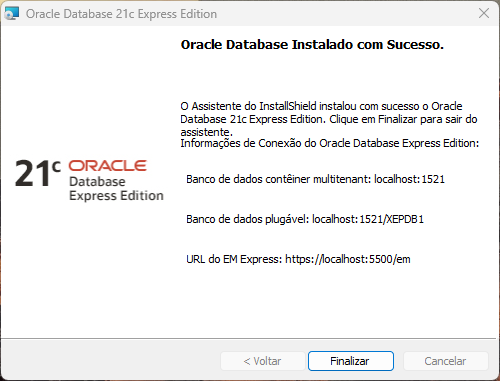

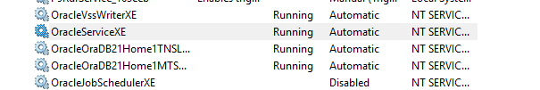


### 3 Configurando o LISTENER e o TNSNAMES - Criando e testando uma Conexão Local

[recursos/Seção+2+-+Pratica+Aula+2.sql](recursos/Seção+2+-+Pratica+Aula+2.sql)

```
C:\Users\josem>sqlplus system/oracle@xepdb1

SQL*Plus: Release 21.0.0.0.0 - Production on Thu Apr 24 15:19:30 2025
Version 21.3.0.0.0

Copyright (c) 1982, 2021, Oracle.  All rights reserved.

ERROR:
ORA-01017: invalid username/password; logon denied


Enter user-name: system
Enter password:
Last Successful login time: Thu Apr 24 2025 15:17:25 -03:00

Connected to:
Oracle Database 21c Express Edition Release 21.0.0.0.0 - Production
Version 21.3.0.0.0

SQL> select sysdate from dual;

SYSDATE
---------
24-APR-25

SQL>
```


[Voltar ao Índice](#indice)

---


## <a name="parte3">3 - Seção 03: Download e Instalação do Oracle SQL Developer</a>

### 04 Download e Instalação do Oracle SQL Developer

[recursos/Seção+3+-+Pratica+Aula+1.sql](recursos/Seção+3+-+Pratica+Aula+1.sql)


### 05 Criando uma conexão para o usuário SYS (dba) no Oracle SQL Developer

[recursos/Seção+3+-+Pratica+Aula+2.sql](recursos/Seção+3+-+Pratica+Aula+2.sql)


### 06 Criando o Usuário HR

[recursos/Seção+3+-+Aula+3+-+Cria+Usuario+HR.sql](recursos/Seção+3+-+Aula+3+-+Cria+Usuario+HR.sql)

### 07 Criando uma conexão para o usuário HR no SQL Developer

[recursos/Seção+3+-+Pratica+Aula+4.sql](recursos/Seção+3+-+Pratica+Aula+4.sql)

### 08 Criando os objetos do schema do usuário HR

[recursos/Seção+3+-+Aula+5+-+Cria+Objetos+schema+HR.sql](recursos/Seção+3+-+Aula+5+-+Cria+Objetos+schema+HR.sql)

### 09 Populando os objetos do schema do usuário HR

[recursos/Seção+3+-+Aula+6+-+Populando+Objetos+schema+HR.sql](recursos/Seção+3+-+Aula+6+-+Populando+Objetos+schema+HR.sql)

### 10 Criando Índices, inserindo comentários e outros no schema do usuário HR

[recursos/Seção+3+-+Aula+7+-+Criando+indices+e+comentarios+schema+HR.sql](recursos/Seção+3+-+Aula+7+-+Criando+indices+e+comentarios+schema+HR.sql)

[Voltar ao Índice](#indice)

---


## <a name="parte4">4 - Seção 04: Oracle SQL - Visão Geral do Oracle Database</a>

### 11. Oracle SQL - Visão Geral do Oracle Database 21c


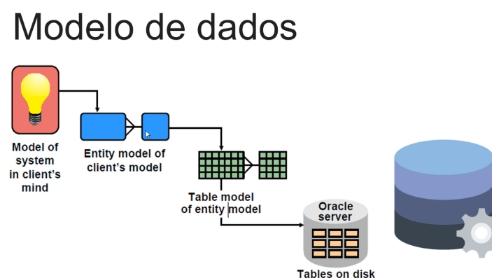

[Voltar ao Índice](#indice)

---


## <a name="parte5">5 - Seção 05: Oracle SQL - Introdução ao SQL</a>

### 12. Oracle SQL - Introdução ao SQL

https://docs.oracle.com/en/database/index.html


#### Data Manipulation Language (DML)

- **SELECT**  
  Recupera dados de uma tabela ou vista no banco de dados.

- **INSERT**  
  Adiciona novos registros em uma tabela.

- **UPDATE**  
  Modifica registros existentes em uma tabela.

- **DELETE**  
  Remove registros de uma tabela.

- **MERGE**  
  Combina registros de duas tabelas baseando-se em condições definidas.


##### Explicação com exemplos de código SQL

1. **SELECT**:  
   O comando `SELECT` é usado para buscar dados de tabelas.  
   ```sql
   SELECT nome, idade FROM funcionarios WHERE departamento = 'Vendas';
   SELECT * FROM produtos;
   ```

2. **INSERT**:  
   Utilizado para inserir novos registros em uma tabela.  
   ```sql
   INSERT INTO funcionarios (nome, idade, departamento) VALUES ('Ana', 28, 'RH');
   INSERT INTO produtos (nome, preco) VALUES ('Celular', 1200);
   ```

3. **UPDATE**:  
   Modifica dados existentes em uma tabela.  
   ```sql
   UPDATE funcionarios SET idade = 29 WHERE nome = 'Ana';
   UPDATE produtos SET preco = 1150 WHERE nome = 'Celular';
   ```

4. **DELETE**:  
   Remove registros de uma tabela.  
   ```sql
   DELETE FROM funcionarios WHERE departamento = 'Vendas';
   DELETE FROM produtos WHERE preco > 5000;
   ```

5. **MERGE**:  
   Combina registros entre tabelas com base em condições.  
   ```sql
   MERGE INTO funcionarios destino
   USING novos_funcionarios origem
   ON destino.id = origem.id
   WHEN MATCHED THEN
       UPDATE SET destino.nome = origem.nome
   WHEN NOT MATCHED THEN
       INSERT (id, nome, idade, departamento)
       VALUES (origem.id, origem.nome, origem.idade, origem.departamento);
   ```


##### Data Definition Language (DDL)

- **CREATE**  
  Usado para criar novos objetos no banco de dados (tabelas, índices, vistas, etc.).

- **ALTER**  
  Usado para modificar a estrutura de objetos existentes no banco de dados.

- **DROP**  
  Usado para deletar objetos existentes no banco de dados.

- **RENAME**  
  Usado para renomear objetos do banco de dados.

- **TRUNCATE**  
  Usado para remover todas as linhas de uma tabela rapidamente, sem log de exclusão.

- **COMMENT**  
  Usado para adicionar comentários nos objetos do banco de dados.


##### Explicação com exemplos de código SQL

1. **CREATE**:  
   O comando `CREATE` é utilizado para criar novos objetos no banco de dados.  
   ```sql
   CREATE TABLE funcionarios (
       id INT PRIMARY KEY,
       nome VARCHAR(100),
       cargo VARCHAR(50),
       salario DECIMAL(10, 2)
   );
   ```

2. **ALTER**:  
   O comando `ALTER` modifica objetos existentes.  
   ```sql
   ALTER TABLE funcionarios ADD email VARCHAR(100);
   ALTER TABLE funcionarios DROP COLUMN email;
   ```

3. **DROP**:  
   O comando `DROP` deleta objetos do banco de dados.  
   ```sql
   DROP TABLE funcionarios;
   DROP INDEX idx_nome;
   ```

4. **RENAME**:  
   O comando `RENAME` renomeia objetos.  
   ```sql
   RENAME TABLE funcionarios TO colaboradores;
   ```

5. **TRUNCATE**:  
   O comando `TRUNCATE` remove todas as linhas de uma tabela.  
   ```sql
   TRUNCATE TABLE funcionarios;
   ```

6. **COMMENT**:  
   O comando `COMMENT` adiciona comentários nos objetos do banco de dados.  
   ```sql
   COMMENT ON TABLE funcionarios IS 'Tabela com informações sobre os funcionários';
   COMMENT ON COLUMN funcionarios.nome IS 'Nome completo do funcionário';
   ```


#### Data Control Language (DCL)

##### GRANT
- Usado para conceder permissões a usuários ou roles para acessar objetos do banco de dados.  
  **Exemplo de código SQL:**  
  ```sql
  GRANT SELECT, INSERT ON funcionarios TO usuario1;
  GRANT ALL PRIVILEGES ON tabela TO role1;
  ```

##### REVOKE
- Usado para remover permissões previamente concedidas a usuários ou roles.  
  **Exemplo de código SQL:**  
  ```sql
  REVOKE SELECT, INSERT ON funcionarios FROM usuario1;
  REVOKE ALL PRIVILEGES ON tabela FROM role1;
  ```


#### Transaction Control

- **COMMIT**
- **ROLLBACK**
- **SAVEPOINT**


#### **COMMIT**
`COMMIT` é usado para **salvar** todas as alterações feitas durante a transação no banco de dados de forma permanente.

**Exemplo SQL:**
```sql
BEGIN TRANSACTION;

INSERT INTO clientes (nome, email) VALUES ('Maria', 'maria@email.com');
UPDATE clientes SET email = 'novoemail@email.com' WHERE id = 1;

COMMIT;
```
> **Explicação:**  
> Depois do `COMMIT`, as alterações ficam permanentes no banco de dados.

---

#### **ROLLBACK**
`ROLLBACK` é usado para **desfazer** todas as alterações feitas na transação atual, voltando o banco de dados ao estado anterior ao início da transação.

**Exemplo SQL:**
```sql
BEGIN TRANSACTION;

DELETE FROM clientes WHERE id = 2;

-- Opa, percebemos que o ID estava errado
ROLLBACK;
```
> **Explicação:**  
> O `ROLLBACK` cancela a exclusão do cliente, como se a operação nunca tivesse ocorrido.

---

#### **SAVEPOINT**
`SAVEPOINT` cria um **ponto de salvamento** dentro de uma transação, permitindo que você faça um `ROLLBACK` apenas até esse ponto, sem cancelar toda a transação.

**Exemplo SQL:**
```sql
BEGIN TRANSACTION;

INSERT INTO pedidos (produto, quantidade) VALUES ('Notebook', 1);
SAVEPOINT ponto1;

INSERT INTO pedidos (produto, quantidade) VALUES ('Teclado', 2);

-- Algo deu errado na segunda inserção
ROLLBACK TO ponto1;

COMMIT;
```
> **Explicação:**  
> Usamos `SAVEPOINT` para marcar um momento seguro. Se houver erro depois dele, o `ROLLBACK TO` retorna até aquele ponto, e não até o início da transação.

---

### 🧠 Dicas de Melhores Práticas:
- Sempre use `COMMIT` apenas quando tiver certeza de que todos os dados foram manipulados corretamente.
- Use `SAVEPOINT` para operações mais delicadas, onde erros parciais podem ocorrer.
- Após um `ROLLBACK`, revise o que aconteceu antes de tentar a operação de novo.


[Voltar ao Índice](#indice)

---


## <a name="parte6">6 - Seção 06: Oracle SQL - Consultando dados utilizando o comando SQL SELECT</a>

### 13. Oracle SQL - Consultando dados utilizando o comando SQL SELECT

- [recursos/Seção+6+-+Prática+Aula+1.sql](recursos/Seção+6+-+Prática+Aula+1.sql)

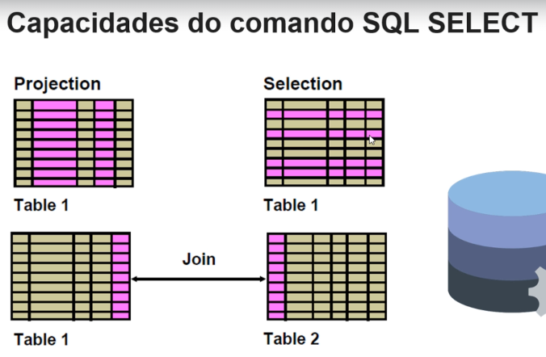


#### Escrevendo comandos SQL

- Comandos SQL não são case sensitivos
- Comandos SQL podem se estender por uma ou mais linhas
- Palavras-chave (Keywords) não podem ser abreviadas ou divididas através das linhas
- Cláusulas são normalmente colocadas em linhas separadas
- Indentações são utilizadas para facilitar o entendimento do comando
- Comandos SQL são terminados por ponto e vírgula (;)


#### Alinhamento de colunas em cabeçalhos

- **Colunas Character e Date**  
  Alinhamento default do cabeçalho: Esquerda
- **Colunas Number**  
  Alinhamento default do cabeçalho: Direita
- **Exibição default do cabeçalho**: Letras Maiúsculas

#### Regras de Precedência de Operadores

Mesmas regras de precedência da matemática:
1. Identidade (Positivo ou Negativo).
2. Multiplicação e Divisão: possuem a mesma precedência, resolvendo da esquerda para a direita.
3. Soma e Subtração: possuem a mesma precedência, resolvendo da esquerda para a direita.

#### Entendo o valor Nulo (NULL)

- Null é ausência de valor.
- Null não é zero.
- Null não é espaços em branco.
- Null não é zeros binários.

#### Utilizando Valores Nulos em Expressões Aritméticas

- **Qualquer expressão aritmética utilizando NULL retorna NULL.**

```sql
SELECT  first_name, last_name, job_id, commission_pct, 200000 * commission_pct
FROM    employees
WHERE   commission_pct IS NULL;


FIRST_NAME           LAST_NAME                 JOB_ID     COMMISSION_PCT 200000*COMMISSION_PCT
-------------------- ------------------------- ---------- -------------- ---------------------
Donald               OConnell                  SH_CLERK                                       
Douglas              Grant                     SH_CLERK                                       
Jennifer             Whalen                    AD_ASST                                        
Michael              Hartstein                 MK_MAN                                         
Pat                  Fay                       MK_REP                                         
Susan                Mavris                    HR_REP                                         
Hermann              Baer                      PR_REP                                         
Shelley              Higgins                   AC_MGR                                         
William              Gietz                     AC_ACCOUNT                                     
Steven               King                      AD_PRES                                        
Neena                Kochhar                   AD_VP                                          
```

#### Alias de Coluna

- Renomeia o cabeçalho da coluna.
- Segue imediatamente o nome da coluna.
- Opcionalmente pode ser utilizada a palavra-chave **AS** entre a coluna e o alias.
- Quando o alias contém espaços, caracteres especiais ou for case sensitive (letras minúsculas), então deve ser colocado entre aspas duplas (").

```sql
SELECT first_name "Nome", last_name "Sobrenome", salary "Salário ($)", commission_pct "Percentual de comissão"
FROM   employees;


Nome                 Sobrenome                 Salário ($) Percentual de comissão
-------------------- ------------------------- ----------- ----------------------
Donald               OConnell                         2600                       
Douglas              Grant                            2600                       
Jennifer             Whalen                           4400                       
Michael              Hartstein                       13000                       
```

#### Operador de concatenação

- Liga colunas ou strings de caracteres com outras colunas ou strings de caracteres.
- É representado por duas barras verticais (||).
- Cria uma coluna resultante da ligação que é um string de caracteres.

```sql
SELECT first_name || ' ' || last_name || ', data de admissão: ' || hire_date "Funcionário"
FROM   employees;


Funcionário                                                                         
------------------------------------------------------------------------------------
Lisa Ozer, data de admissão: 11-MAR-05
Harrison Bloom, data de admissão: 23-MAR-06
Tayler Fox, data de admissão: 24-JAN-06
William Smith, data de admissão: 23-FEB-07
Elizabeth Bates, data de admissão: 24-MAR-07
Sundita Kumar, data de admissão: 21-APR-08
Ellen Abel, data de admissão: 11-MAY-04
Alyssa Hutton, data de admissão: 19-MAR-05
Jonathon Taylor, data de admissão: 24-MAR-06
Jack Livingston, data de admissão: 23-APR-06
Kimberely Grant, data de admissão: 24-MAY-07
```
#### Strings de caracteres

- Um literal é um caracter, um número, ou uma string que é incluída em um comando SELECT.
- Literais de Datas e caracteres devem ser definidos entre aspas simples (`'`).
- Cada literal ou string de caracteres será exibido uma vez para cada linha retornada.

#### Operador alternativo para aspas

- Você pode especificar seu próprio operador alternativo para aspas.
- Escolha qualquer delimitador.
- Facilita a legibilidade e usabilidade.

```sql
SELECT department_name || q'[ Department's Manager Id: ]'
|| manager_id "Departamento e Gerente"
FROM departments;


Departamento e Gerente                                                                          
------------------------------------------------------------------------------------------------
Administration Department's Manager Id: 200
Marketing Department's Manager Id: 201
Purchasing Department's Manager Id: 114
Human Resources Department's Manager Id: 203
Shipping Department's Manager Id: 121
IT Department's Manager Id: 103
Public Relations Department's Manager Id: 204
Sales Department's Manager Id: 145
Executive Department's Manager Id: 100
Finance Department's Manager Id: 108
Accounting Department's Manager Id: 205
```

#### Linhas duplicadas

- Por default as consultas exibem todas as linhas retornadas, incluindo as linhas duplicadas.

```sql
-- Linhas duplicadas
SELECT department_id
FROM employees;

DEPARTMENT_ID
-------------
           50
           50
           10
           20
           20
           40
           70

-- Utilizando DISTINCT para eliminar linhas duplicadas

SELECT DISTINCT department_id
FROM employees;


DEPARTMENT_ID
-------------
           50
           10
           20
           40
           70
          110
           90
           60
          100
           30
           80
```

[Voltar ao Índice](#indice)

---


## <a name="parte7">7 - Seção 07: Oracle SQL - Restringindo e Ordenando Dados</a>

### 14. Oracle SQL - Restringindo e Ordenando Dados

- [recursos/Seção+7+-+Prática+Aula+1.sql](/recursos/Seção+7+-+Prática+Aula+1.sql)

#### Restringindo as linhas que serão retornadas

- Selecione as linhas que serão retornadas utilizando a cláusula `WHERE`

A cláusula `WHERE` é usada para **filtrar registros** que satisfazem uma condição específica. Apenas as linhas que atendem ao critério da cláusula `WHERE` serão incluídas no resultado da consulta.

---

### 📌 Exemplos de uso da cláusula `WHERE`

#### 1. Selecionar clientes de um país específico

```sql
SELECT * FROM clientes
WHERE pais = 'Brasil';
```

Esse comando retorna todos os clientes cujo país seja "Brasil".

---

#### 2. Filtrar produtos com preço maior que 100

```sql
SELECT nome, preco FROM produtos
WHERE preco > 100;
```

Retorna o nome e preço dos produtos que custam mais de R$ 100.

---

#### 3. Buscar funcionários com salário entre 3000 e 6000

```sql
SELECT nome, salario FROM funcionarios
WHERE salario BETWEEN 3000 AND 6000;
```

Usa `BETWEEN` para retornar funcionários com salários dentro desse intervalo.

---

#### 4. Encontrar pedidos feitos após uma certa data

```sql
SELECT * FROM pedidos
WHERE data_pedido > '2024-01-01';
```

Retorna todos os pedidos realizados após 1º de janeiro de 2024.

---

#### 5. Buscar nomes que começam com a letra "A"

```sql
SELECT nome FROM usuarios
WHERE nome LIKE 'A%';
```

Utiliza `LIKE` com o caractere curinga `%` para encontrar nomes que começam com "A".

---

### ✅ Boas práticas

- Utilize índices nas colunas frequentemente usadas em cláusulas `WHERE` para melhorar o desempenho.
- Evite funções nas colunas da cláusula `WHERE` quando possível, pois isso pode desativar o uso de índices.
- Prefira operadores como `BETWEEN`, `IN`, `LIKE` com cuidado para manter a legibilidade e performance.

---

### ⚠️ Evitar

- Evite escrever condições vagas ou sem filtro, como `WHERE 1=1`, pois isso pode resultar em consultas ineficientes ou até perigosas.
- Não confunda `=` com `LIKE` ou `IN` — cada um tem seu propósito específico para filtragem.

---

#### Strings de caractere e datas

- **Strings de caracteres e datas são delimitados por aspas simples (`'`)**

  Em SQL, qualquer valor literal de texto ou data precisa estar entre aspas simples.

  **Exemplo:**
  ```sql
  SELECT * FROM produtos WHERE nome = 'Teclado';
  SELECT * FROM pedidos WHERE data_pedido = '2024-04-29';
  ```

---

- **Valores de strings de caracteres são case sensitive**

  Comparações de strings em muitos bancos de dados (como PostgreSQL e Oracle) diferenciam letras maiúsculas de minúsculas.

  **Exemplo:**
  ```sql
  SELECT * FROM usuarios WHERE nome = 'João';  -- diferente de 'joão'
  ```

  > 🔍 Observação: em bancos como MySQL, a sensibilidade a maiúsculas/minúsculas pode depender do collation da tabela/coluna (`utf8_general_ci` ignora maiúsculas).

---

- **Valores de strings de data são sensíveis ao formato definido para o banco de dados ou para a sessão**

  Isso significa que a forma como as datas são inseridas ou comparadas deve respeitar o formato de data vigente.

  **Exemplo:**
  ```sql
  SELECT * FROM vendas WHERE data_venda = TO_DATE('29/04/2024', 'DD/MM/YYYY');
  ```

  Em Oracle, por exemplo, a função `TO_DATE` permite especificar o formato. Outros bancos, como PostgreSQL ou MySQL, também podem exigir formatações específicas ou utilizar funções próprias para manipulação de datas.

---

- **O formato default para exibição de datas mais utilizado no Brasil é ‘DD/MM/YY’ ou ‘DD/MM/RR’**

  - `DD` = Dia
  - `MM` = Mês
  - `YY` ou `RR` = Ano com dois dígitos

  **Exemplo:**
  ```sql
  SELECT TO_CHAR(SYSDATE, 'DD/MM/YY') FROM dual;  -- Oracle
  SELECT DATE_FORMAT(NOW(), '%d/%m/%y');          -- MySQL
  ```

  O formato pode ser configurado na sessão ou definido como padrão pelo banco.

---

### ✅ Boas práticas

- Sempre use `TO_DATE()` (Oracle) ou `DATE_FORMAT()`/`STR_TO_DATE()` (MySQL) para evitar ambiguidades.
- Mantenha consistência no formato de datas em toda a aplicação.
- Utilize `UPPER()` ou `LOWER()` se quiser evitar problemas com case sensitivity em strings.

### ⚠️ Evitar

- Não esquecer de usar aspas simples em valores literais.
- Evitar misturar formatos de datas em diferentes partes do código.
- Não confiar no comportamento "default" do banco sem confirmar a configuração de localidade (NLS, locale, etc).

#### Operadores de comparação

| Operator        | Meaning                            |
|----------------|------------------------------------|
| =              | Equal to                           |
| >              | Greater than                       |
| >=             | Greater than or equal to           |
| <              | Less than                          |
| <=             | Less than or equal to              |
| <>             | Not equal to                       |
| BETWEEN ...AND... | Between two values (inclusive)  |
| IN(set)        | Match any of a list of values      |
| LIKE           | Match a character pattern          |
| IS NULL        | Is a null value                    |


#### Selecionando valores por coincidência com padrões utilizando o operador LIKE

- Use o operador LIKE para executar pesquisas de valores que coincidem com padrões utilizando caracteres curingas (wildcards).
- As Condições de pesquisa podem conter caracteres ou números:
  - `%` Combina com zero ou mais caracteres
  - `_` Combina com um e somente um caractere

---

### Explicação com exemplos em Oracle SQL

#### 1. **LIKE com o caractere `%`**
O caractere `%` é utilizado para corresponder a **zero ou mais caracteres**. Muito útil para localizar palavras com início, meio ou fim conhecido.

**Exemplo:**
```sql
SELECT * FROM clientes
WHERE nome LIKE 'Mar%';
```
*Seleciona todos os clientes cujo nome começa com "Mar", como "Maria", "Marcos", "Martins".*

#### 2. **LIKE com o caractere `_`**
O caractere `_` substitui **apenas um caractere**. Ideal quando você quer buscar por valores com comprimento fixo ou variação mínima.

**Exemplo:**
```sql
SELECT * FROM produtos
WHERE codigo LIKE 'A_1';
```
*Seleciona todos os produtos cujo código tenha três caracteres e comece com "A", seguido de qualquer um caractere, e termine com "1".*

#### 3. **Combinação dos curingas**
Você também pode combinar `%` e `_` para pesquisas mais refinadas.

**Exemplo:**
```sql
SELECT * FROM funcionarios
WHERE cargo LIKE '_anal%';
```
*Busca cargos que tenham um caractere antes de "anal" e qualquer quantidade de caracteres depois, como "Analista", "canalizador", etc.*

---

#### Comparações com valor NULO (NULL)

- Qualquer comparação com valor NULL retorna o booleano NULL
- **Para podermos verificar se um valor é NULL deve ser utilizado a expressão IS NULL**

---

### Explicações e Exemplos em Oracle SQL

#### 1. **Comparações com NULL não funcionam com operadores tradicionais**

No Oracle (e em SQL no geral), valores `NULL` representam **desconhecido**, então qualquer operação com `NULL` resulta em `NULL` (não verdadeiro nem falso).

**Errado:**
```sql
SELECT * FROM funcionarios
WHERE salario = NULL;
```
*Esse comando não retorna nada, porque `salario = NULL` nunca será verdadeiro.*

---

#### 2. **Forma correta: `IS NULL` e `IS NOT NULL`**

Use `IS NULL` para verificar se um campo **não possui valor**.

**Exemplo com `IS NULL`:**
```sql
SELECT * FROM funcionarios
WHERE comissao IS NULL;
```
*Retorna funcionários que **não recebem comissão**.*

**Exemplo com `IS NOT NULL`:**
```sql
SELECT * FROM funcionarios
WHERE comissao IS NOT NULL;
```
*Retorna funcionários que **recebem alguma comissão**.*

---

#### Definindo Condições utilizando Operadores Lógicos

- **AND** – Retorna TRUE se ambas as condições são verdadeiras
- **OR** – Retorna TRUE se pelo menos uma das condições for verdadeira
- **NOT** – Retorna a negação da condição.  
  - Retorna TRUE se a condição é falsa  
  - Retorna FALSE se a condição é verdadeira  
  - Retorna NULL se a condição é NULL

---

### Explicações com exemplos em Oracle SQL

#### 🔹 **AND**

Usado quando **todas** as condições devem ser verdadeiras para retornar um resultado.

**Exemplo:**
```sql
SELECT * FROM funcionarios
WHERE departamento_id = 10
AND salario > 3000;
```
*Seleciona funcionários do departamento 10 que recebem mais de 3000.*

---

#### 🔹 **OR**

Usado quando **pelo menos uma** condição deve ser verdadeira.

**Exemplo:**
```sql
SELECT * FROM funcionarios
WHERE departamento_id = 10
OR salario > 3000;
```
*Seleciona funcionários do departamento 10 **ou** que recebem mais de 3000.*

---

#### 🔹 **NOT**

Usado para **negar** uma condição lógica.

**Exemplo:**
```sql
SELECT * FROM funcionarios
WHERE NOT (departamento_id = 10);
```
*Seleciona todos os funcionários **exceto** os do departamento 10.*

---

### Observação sobre NULL com NOT

Quando se usa `NOT` com uma expressão que retorna `NULL`, o resultado continua sendo `NULL`. Exemplo:

```sql
SELECT * FROM funcionarios
WHERE NOT (comissao IS NULL);
```
*Seleciona todos os funcionários **que possuem comissão**, pois `IS NULL` retorna TRUE apenas quando o valor é de fato nulo.*

---

#### Regras de Precedência

1. Operadores aritméticos  
2. Operador de concatenação  
3. Condições de comparação  
4. IS [NOT] NULL, LIKE, [NOT] IN  
5. [NOT] BETWEEN  
6. NOT EQUAL TO  
7. NOT condição lógica  
8. AND condição lógica  
9. OR condição lógica

---

### 📘 Explicações e Exemplos SQL (Oracle)

#### 1. **Operadores aritméticos**
Executam cálculos matemáticos primeiro.

```sql
SELECT nome, salario + salario * 0.10 AS novo_salario
FROM funcionarios;
```
*Aumenta o salário em 10% usando operadores aritméticos.*

---

#### 2. **Operador de concatenação (`||`)**
Concatena duas ou mais strings.

```sql
SELECT nome || ' - ' || cargo AS descricao
FROM funcionarios;
```
*Concatena o nome e o cargo do funcionário.*

---

#### 3. **Condições de comparação (`=`, `<`, `>`, `<=`, `>=`, `<>`)**

```sql
SELECT * FROM funcionarios
WHERE salario >= 3000;
```
*Filtra funcionários com salário maior ou igual a 3000.*

---

#### 4. **`IS [NOT] NULL`, `LIKE`, `[NOT] IN`**

```sql
-- IS NULL
SELECT * FROM funcionarios WHERE comissao IS NULL;

-- LIKE
SELECT * FROM funcionarios WHERE nome LIKE 'J%';

-- IN
SELECT * FROM funcionarios WHERE departamento_id IN (10, 20, 30);
```

---

#### 5. **`[NOT] BETWEEN`**

```sql
SELECT * FROM funcionarios
WHERE salario BETWEEN 2000 AND 5000;
```
*Seleciona funcionários com salário entre 2000 e 5000 (inclusive).*

---

#### 6. **NOT EQUAL TO (`<>`)**

```sql
SELECT * FROM funcionarios
WHERE cargo <> 'Gerente';
```
*Seleciona todos os funcionários que não são Gerentes.*

---

#### 7. **NOT (condição lógica)**

```sql
SELECT * FROM funcionarios
WHERE NOT (departamento_id = 10);
```
*Seleciona funcionários que **não** estão no departamento 10.*

---

#### 8. **AND (condição lógica)**

```sql
SELECT * FROM funcionarios
WHERE salario > 2000 AND cargo = 'Analista';
```
*Ambas as condições precisam ser verdadeiras.*

---

#### 9. **OR (condição lógica)**

```sql
SELECT * FROM funcionarios
WHERE salario > 5000 OR cargo = 'Diretor';
```
*Apenas uma das condições precisa ser verdadeira.*


Essas regras de precedência são importantes para garantir que as expressões sejam avaliadas na ordem correta, evitando erros de lógica nas consultas.

---

#### Utilizando a cláusula ORDER BY

- Ordene as linhas recuperadas utilizando a cláusula ORDER BY:
  – ASC: Ordem ascendente, default
  – DESC: Ordem descendente
- A cláusula ORDER BY é a última no comando SELECT


---

### 📘 Explicações com Exemplos em Oracle SQL

#### 🔹 `ORDER BY`

A cláusula `ORDER BY` é usada para classificar os registros retornados por uma consulta.

---

#### 🟢 `ASC` – Ordem Ascendente (padrão)

Ordena os resultados do menor para o maior (A-Z ou 0-9).

```sql
SELECT nome, salario
FROM funcionarios
ORDER BY salario ASC;
```

> Ordena os funcionários do menor para o maior salário.

---

#### 🔴 `DESC` – Ordem Descendente

Ordena os resultados do maior para o menor (Z-A ou 9-0).

```sql
SELECT nome, salario
FROM funcionarios
ORDER BY salario DESC;
```

> Ordena os funcionários do maior para o menor salário.

---

#### ✅ A cláusula `ORDER BY` deve ser **a última** em uma instrução `SELECT`

Isso significa que ela deve vir **depois** de cláusulas como `WHERE`, `GROUP BY` e `HAVING`.

Exemplo com `WHERE`:

```sql
SELECT nome, salario
FROM funcionarios
WHERE departamento_id = 10
ORDER BY nome;
```

#### Utilizando Variáveis de Substituição - &

- Utilize uma variável prefixada com um (&) para solicitar um prompt para o usuário digitar um valor


---

### 📘 Explicação com Exemplo em Oracle SQL

As variáveis de substituição com `&` são utilizadas no Oracle SQL*Plus (ou ferramentas compatíveis como SQL Developer) para permitir entrada dinâmica de valores.

---

#### 🔹 Como funciona:

Quando você usa `&nome_variavel`, o Oracle solicita que o usuário digite um valor para substituir a variável no momento da execução.

---

#### ✅ Exemplo:

```sql
SELECT * 
FROM funcionarios 
WHERE departamento_id = &departamento;
```

> Ao executar este comando, será exibido um prompt:  
`Enter value for departamento:`  
Se o usuário digitar `10`, o comando executado será:

```sql
SELECT * 
FROM funcionarios 
WHERE departamento_id = 10;
```

---

#### 🔁 Exemplo com várias variáveis:

```sql
SELECT * 
FROM funcionarios 
WHERE salario BETWEEN &salario_min AND &salario_max;
```

> O usuário será solicitado a informar dois valores: `salario_min` e `salario_max`.

---

Essas variáveis são muito úteis para **criar scripts reutilizáveis** e **consultas parametrizadas** em ambientes de aprendizado e administração.

---

#### Utilizando Variáveis de Substituição - &&

Utilize `&&` se você deseja reutilizar o valor da variável sem solicitar um prompt para o usuário a cada vez que referenciar a variável:

```sql
SELECT employee_id, last_name, salary, department_id
FROM employees
WHERE employee_id = &&employee_id;
```

---

### 📘 Explicação sobre `&&` em Oracle SQL

No Oracle SQL (usando ferramentas como SQL*Plus ou Oracle SQL Developer), a variável `&&nome` permite reutilizar o valor digitado uma única vez **sem reexibir o prompt** toda vez que a variável for usada novamente.

---

#### ✅ Exemplo Prático:

```sql
SELECT employee_id, last_name
FROM employees
WHERE employee_id = &&id;
```

> O Oracle irá solicitar **uma única vez**:  
`Enter value for id:`  
Se o usuário digitar `101`, o valor `101` será armazenado na variável `id` e poderá ser reutilizado **em outros comandos subsequentes**, sem solicitar novamente.

---

#### 🔁 Exemplo com Reutilização:

```sql
SELECT * FROM employees WHERE employee_id = &&id;
SELECT * FROM job_history WHERE employee_id = &&id;
```

> Ambos os comandos usarão o mesmo valor digitado para `id`.

---

Isso é especialmente útil para scripts em que o mesmo parâmetro será usado em várias partes, mantendo a entrada do usuário enxuta e eficiente.

```
-- Variáveis de substituição com valores tipo Character e Date

SELECT last_name, department_id, job_id, salary*12
FROM employees
WHERE job_id = '&job_id' ;

```

```
-- Utilizando o comando DEFINE

DEFINE employee_id = 101

SELECT employee_id, last_name, salary, department_id
FROM employees
WHERE employee_id = &employee_id ;

DEFINE employee_id

UNDEFINE employee_id
```


[Voltar ao Índice](#indice)

---


## <a name="parte8">8 - Seção 08: Oracle SQL - Utilizando Funções Single Row</a>

- 15. Oracle SQL - Utilizando Funções Single Row

- [recursos/Seção+8+-+Prática+Aula+1.sql](/recursos/Seção+8+-+Prática+Aula+1.sql)

### Resumo dos Slides da Aula


#### Funções SQL Single Row

#### Características:
- Podem manipular itens de dados  
- Receber argumentos e retornar um valor  
- Atuam sobre cada linha retornada  
- Retornam um resultado por linha  
- Podem modificar o tipo de dado  
- Podem ser aninhadas  
- Recebem argumentos que podem ser colunas ou expressões  

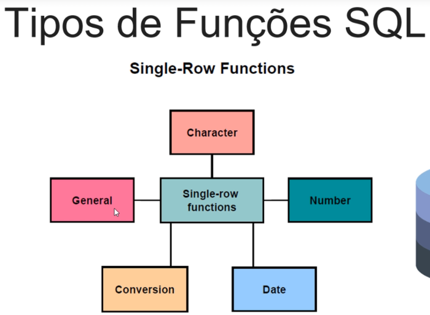


```sql
-- Funções de conversão Maiúsculo & Minúsculo

SELECT employee_id, last_name, department_id
FROM employees
WHERE last_name = 'KING';

SELECT employee_id, last_name, department_id
FROM employees
WHERE UPPER(last_name) = 'KING';
```


```sql
-- Funções de Manipulação de Caracteres

SELECT CONCAT(' Curso: ','Introdução ORACLE 19c'), SUBSTR('Introdução ORACLE 19c',1,11),
       LENGTH('Introdução ORACLE 19c'), INSTR('Introdução ORACLE 19c','ORACLE')
FROM dual;
```


```sql
SELECT first_name "Nome", LPAD(first_name, 20, ' ') "Nome alinhado a direita", RPAD(first_name, 20, ' ') "Nome alinhado a esquerda"
FROM   employees;

SELECT job_title, REPLACE(job_title, 'President', 'Presidente') CARGO
FROM jobs
WHERE  job_title = 'President';
```

#### Funções tipo NUMBER

- **ROUND**: Arredonda o valor para a casa decimal especificada  
- **TRUNC**: Trunca o valor para a casa decimal especificada  
- **MOD**: Retorna o resto da divisão  

```sql
SELECT ROUND(45.923,2), ROUND(45.923,0)
FROM dual;


ROUND(45.923,2) ROUND(45.923,0)
--------------- ---------------
          45.92              46


SELECT TRUNC(45.923,2), TRUNC(45.923,0)
FROM dual;


TRUNC(45.923,2) TRUNC(45.923,0)
--------------- ---------------
          45.92              45


SELECT MOD(1300,600) RESTO
FROM dual;


     RESTO
----------
       100

```


```sql
SELECT ABS(-9), SQRT(9)
FROM dual;


   ABS(-9)    SQRT(9)
---------- ----------
         9          3

```

#### Funções tipo DATE - Trabalhando com Datas

- O format default de exibição de datas é definido pelo DBA através do parâmetro NLS_DATE_FORMAT  
- No Brasil normalmente o formato default de exibição de datas é definido para ‘DD/MM/YY’ ou ‘DD/MM/RR’

```sql
-- Funções tipo DATE 

SELECT sysdate
FROM dual;

DESC dual

SELECT *
FROM dual;

SELECT 30000 * 1.25
FROM dual;

```

#### Cálculos com Datas

- Uma vez que o banco de dados armazena datas como números, você pode executar cálculos utilizando os operadores aritméticos como a adição e subtração.


```sql
SELECT sysdate, sysdate + 30, sysdate + 60, sysdate - 30
FROM dual;

SYSDATE   SYSDATE+3 SYSDATE+6 SYSDATE-3
--------- --------- --------- ---------
03-MAY-25 02-JUN-25 02-JUL-25 03-APR-25


SELECT last_name, ROUND((SYSDATE-hire_date)/7,2) "SEMANAS DE TRABALHO'"
FROM employees;

LAST_NAME                 SEMANAS DE TRABALHO'
------------------------- --------------------
OConnell                                932.34
Grant                                   902.91
Whalen                                 1128.48
Hartstein                              1106.63
Fay                                    1028.48
Mavris                                  1195.2
Baer                                    1195.2
Higgins                                 1195.2
Gietz                                   1195.2
King                                   1141.63
Kochhar                                1023.48

```

#### Outras Funções tipo DATE

| **Função**         | **Resultado**                          |
|--------------------|----------------------------------------|
| MONTHS_BETWEEN     | Número de meses entre duas datas       |
| ADD_MONTHS         | Adiciona meses a uma data              |
| NEXT_DAY           | Próximo dia relativo a data especificada |
| LAST_DAY           | Último dia do mês                      |
| ROUND              | Arredonda a data                       |
| TRUNC              | Trunca a data                          |

```sql
SELECT first_name, last_name, ROUND(MONTHS_BETWEEN(sysdate, hire_date),2) "MESES DE TRABALHO"
FROM employees;

--ERRO
SELECT SYSDATE, ADD_MONTHS(SYSDATE, 3), NEXT_DAY(SYSDATE,'SEXTA FEIRA'), LAST_DAY(SYSDATE)
FROM   dual;

SELECT SYSDATE, ADD_MONTHS(SYSDATE, 3), NEXT_DAY(SYSDATE,'FRIDAY'), LAST_DAY(SYSDATE)
FROM dual;

ALTER SESSION SET NLS_LANGUAGE = 'PORTUGUESE';
SELECT SYSDATE, ADD_MONTHS(SYSDATE, 3), NEXT_DAY(SYSDATE,'SEXTA-FEIRA'), LAST_DAY(SYSDATE)
FROM dual;
```


```sql

SELECT sysdate, ROUND(SYSDATE, 'MONTH'), ROUND(SYSDATE, 'YEAR'), 
       TRUNC(SYSDATE, 'MONTH'), TRUNC(SYSDATE, 'YEAR')
FROM   dual;
       
SELECT SYSDATE, TO_CHAR(TRUNC(SYSDATE),'DD/MM/YYYY HH24:MI:SS')
FROM  dual;


```


### Resumo AI- DEEPSEEAK

# Resumo: Oracle SQL - Funções Single Row

## Visão Geral
Funções Single Row (ou funções de linha única) operam em uma única linha por vez e retornam um resultado para cada linha processada. Elas são usadas para manipular dados, realizar cálculos e formatar resultados.

---

## Tipos e Exemplos de Funções Single Row

### 1. Funções de Caractere
- **UPPER()**: Converte para maiúsculas
  ```sql
  SELECT UPPER(nome) FROM clientes;
  ```
- **LOWER()**: Converte para minúsculas
  ```sql
  SELECT LOWER(descricao) FROM produtos;
  ```
- **INITCAP()**: Primeira letra maiúscula
  ```sql
  SELECT INITCAP('oracle database') FROM dual; -- Retorna "Oracle Database"
  ```

### 2. Funções Numéricas
- **ROUND()**: Arredondamento
  ```sql
  SELECT ROUND(123.456, 2) FROM dual; -- Retorna 123.46
  ```
- **TRUNC()**: Truncamento
  ```sql
  SELECT TRUNC(123.456, 1) FROM dual; -- Retorna 123.4
  ```
- **MOD()**: Módulo (resto da divisão)
  ```sql
  SELECT MOD(10, 3) FROM dual; -- Retorna 1
  ```

### 3. Funções de Data
- **SYSDATE**: Data/hora atual
  ```sql
  SELECT SYSDATE FROM dual;
  ```
- **TO_CHAR()**: Formatação de data
  ```sql
  SELECT TO_CHAR(SYSDATE, 'DD/MM/YYYY HH24:MI') FROM dual;
  ```
- **MONTHS_BETWEEN()**: Diferença em meses
  ```sql
  SELECT MONTHS_BETWEEN('01-JAN-2025', '01-MAR-2024') FROM dual;
  ```

### 4. Funções de Conversão
- **TO_NUMBER()**: Converte para número
  ```sql
  SELECT TO_NUMBER('1234') FROM dual;
  ```
- **TO_DATE()**: Converte para data
  ```sql
  SELECT TO_DATE('10/05/2025', 'DD/MM/YYYY') FROM dual;
  ```

### 5. Funções Condicionais
- **NVL()**: Substitui valores nulos
  ```sql
  SELECT NVL(comissao, 0) FROM vendedores;
  ```
- **DECODE()**: Condicional simples
  ```sql
  SELECT DECODE(status, 'A', 'Ativo', 'I', 'Inativo', 'Desconhecido') FROM usuarios;
  ```

---

## Melhores Práticas

1. **Use aliases para melhor legibilidade**
   ```sql
   SELECT UPPER(nome) AS nome_maiusculo FROM clientes;
   ```

2. **Evite funções em colunas indexadas em WHERE** (pode impedir uso de índices)
   ```sql
   -- RUIM (não usa índice na coluna nome)
   SELECT * FROM clientes WHERE UPPER(nome) = 'JOÃO';
   
   -- MELHOR (considerar armazenar já em maiúsculas ou usar índice function-based)
   ```

3. **Documente conversões complexas**
   ```sql
   -- Formata CPF (documentar o padrão)
   SELECT REGEXP_REPLACE(cpf, '(\d{3})(\d{3})(\d{3})(\d{2})', '\1.\2.\3-\4') AS cpf_formatado
   FROM clientes;
   ```

4. **Trate NULLs explicitamente**
   ```sql
   SELECT NVL(telefone, 'Sem telefone') AS contato FROM clientes;
   ```

---

## Piores Práticas (Evitar)

1. **Aninhamento excessivo de funções**
   ```sql
   -- Difícil de ler e manter
   SELECT TO_CHAR(LAST_DAY(ADD_MONTHS(SYSDATE, 3)), 'DD-MM-YYYY') FROM dual;
   ```

2. **Ignorar localidade em conversões**
   ```sql
   -- Pode falhar em ambientes com configuração diferente
   SELECT TO_DATE('01/02/2025', 'MM/DD/YYYY') FROM dual;
   ```

3. **Usar funções em JOINs sem necessidade**
   ```sql
   -- Performance ruim
   SELECT * FROM tabela1 t1
   JOIN tabela2 t2 ON UPPER(t1.chave) = UPPER(t2.chave);
   ```

4. **Não tratar erros em conversões**
   ```sql
   -- Pode causar erro se houver valores não numéricos
   SELECT TO_NUMBER(codigo) FROM produtos;
   
   -- MELHOR: Usar tratamento de erro ou VALIDATE_CONVERSION no Oracle 12c+
   ```

---

## Exemplo Complexo Combinado

```sql
-- Formata endereço completo com tratamento de nulos
SELECT 
    id_cliente,
    INITCAP(nome) || ' - ' ||
    NVL2(complemento, 
         RTRIM(endereco) || ', ' || INITCAP(complemento), 
         RTRIM(endereco)) || ', ' ||
    INITCAP(cidade) || '/' || UPPER(uf) AS endereco_completo,
    TO_CHAR(data_cadastro, 'DD "de" Month YYYY', 'NLS_DATE_LANGUAGE=PORTUGUESE') AS data_cadastro_br
FROM clientes
WHERE MONTHS_BETWEEN(SYSDATE, data_nascimento)/12 > 18;
```

---

## Conclusão
Funções Single Row são poderosas, mas devem ser usadas com cuidado para:
- Manter a legibilidade do código
- Não comprometer a performance
- Garantir consistência dos resultados


[Voltar ao Índice](#indice)

---


## <a name="parte9">9 - Seção 09: Oracle SQL - Utilizando Funções de Conversão e Expressões Condicionais</a>

- 16 Oracle SQL - Utilizando Funções de Conversão e Expressões Condicionais

[recursos/Seção+9+-+Prática+Aula+1.sql](recursos/Seção+9+-+Prática+Aula+1.sql)


#### RESUMO SLIDES AULA

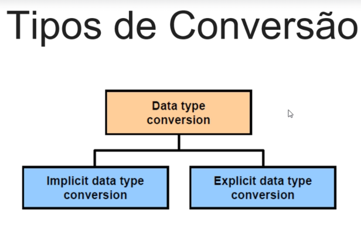

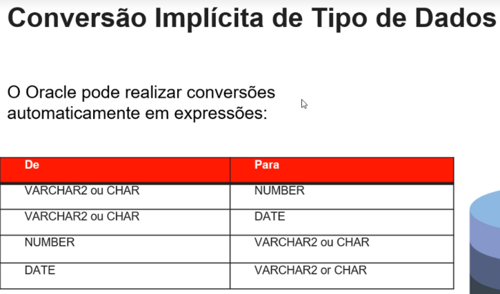

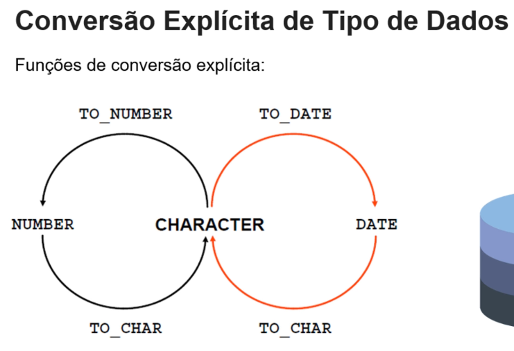

#### Utilizando a Função TO_CHAR com Datas

**Sintaxe:**  
`TO_CHAR(date, 'formato')`  

**Regras do formato:**  
- Deve ser definido entre aspas simples  
- É case-sensitive (sensível a maiúsculas/minúsculas)  
- Pode incluir quaisquer formatos de datas válidos  
- O prefixo `fm` remove espaços em branco desnecessários ou zeros à esquerda  
- Deve ser separado do valor da data por vírgula  

**Exemplo Prático Oracle:**  
```sql
SELECT 
    TO_CHAR(SYSDATE, 'fmDD "de" Month YYYY', 'NLS_DATE_LANGUAGE=PORTUGUESE') AS data_formatada
FROM dual;
-- Resultado: "15 de Julho 2025" (sem zeros ou espaços extras)
```

```sql
-- Utilizando a Função TO_CHAR com Datas

SELECT last_name,TO_CHAR(hire_date, 'DD/MM/YYYY  HH24:MI:SS') DT_ADMISSÂO
FROM employees;


LAST_NAME                 DT_ADMISSÂO         
------------------------- --------------------
OConnell                  21/06/2007  00:00:00
Grant                     13/01/2008  00:00:00
Whalen                    17/09/2003  00:00:00
Hartstein                 17/02/2004  00:00:00
Fay                       17/08/2005  00:00:00
Mavris                    07/06/2002  00:00:00
Baer                      07/06/2002  00:00:00
Higgins                   07/06/2002  00:00:00


SELECT sysdate,TO_CHAR(sysdate, 'DD/MM/YYYY  HH24:MI:SS') DATA
FROM   dual;

YSDATE   DATA                
--------- --------------------
03-MAY-25 03/05/2025  16:00:04


SELECT last_name, TO_CHAR(hire_date, 'DD, "de" Month "de" YYYY') DT_ADMISSÂO
FROM employees;


LAST_NAME                 DT_ADMISSÂO                                        
------------------------- ---------------------------------------------------
OConnell                  21, de June      de 2007                           
Grant                     13, de January   de 2008                           
Whalen                    17, de September de 2003                           
Hartstein                 17, de February  de 2004                           
Fay                       17, de August    de 2005   


SELECT last_name, TO_CHAR(hire_date, 'FMDD, "de" Month "de" YYYY') DT_ADMISSÂO
FROM employees;


LAST_NAME                 DT_ADMISSÂO                                        
------------------------- ---------------------------------------------------
OConnell                  21, de June de 2007                                
Grant                     13, de January de 2008                             
Whalen                    17, de September de 2003                           
Hartstein                 17, de February de 2004                            
Fay                       17, de August de 2005                              
Mavris                    7, de June de 2002                                 
Baer                      7, de June de 2002        

```

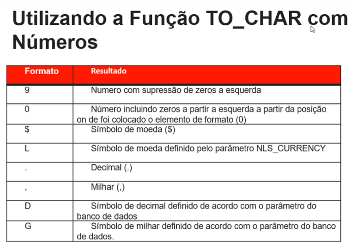

```sql
-- Utilizando a Função TO_CHAR com Números

SELECT first_name, last_name, TO_CHAR(salary, 'L99G999G999D99') SALARIO
FROM employees;


FIRST_NAME           LAST_NAME                 SALARIO                 
-------------------- ------------------------- ------------------------
Donald               OConnell                                 $2,600.00
Douglas              Grant                                    $2,600.00
Jennifer             Whalen                                   $4,400.00
Michael              Hartstein                               $13,000.00
Pat                  Fay                                      $6,000.00

SELECT first_name, last_name, TO_CHAR(salary, 'L99G999G999D99') SALARIO
FROM employees;


FIRST_NAME           LAST_NAME                 SALARIO                 
-------------------- ------------------------- ------------------------
Donald               OConnell                                 $2,600.00
Douglas              Grant                                    $2,600.00
Jennifer             Whalen                                   $4,400.00
Michael              Hartstein                               $13,000.00
Pat                  Fay                                      $6,000.00
```

#### Utilizando a Função TO_NUMBER

**Função de Conversão:**  
`TO_NUMBER(char[, 'formato'])`  

**Propósito:**  
Converter uma string de caracteres para um valor numérico.

**Características:**  
- O parâmetro `char` representa a string a ser convertida  
- O parâmetro opcional `'formato'` especifica o padrão de formatação numérica  
- Requer que a string contenha apenas caracteres numéricos válidos  

**Exemplo Prático Oracle:**  
```sql
SELECT TO_NUMBER('1.234,56', '9G999D99') AS valor_numérico
FROM dual;
-- Converte a string "1.234,56" para o número 1234.56
```


#### Utilizando a Função TO_DATE

**Função de Conversão:**  
`TO_DATE(char[, 'formato'])`  

**Propósito:**  
Converter uma string de caracteres para um valor do tipo DATE.

**Características:**  
- `char`: String contendo a data a ser convertida  
- `'formato'` (opcional): Especifica o padrão da data na string  
- Se omitido, usa o formato padrão NLS_DATE_FORMAT  

**Exemplos Oracle:**  
```sql
-- Conversão básica
SELECT TO_DATE('15/07/2025', 'DD/MM/YYYY') FROM dual;

-- Com formato completo
SELECT TO_DATE('15-Jul-2025 14:30', 'DD-Mon-YYYY HH24:MI') FROM dual;

-- Usando máscara FM para remover espaços extras
SELECT TO_DATE('15   Jul    2025', 'fmDD Mon YYYY') FROM dual;
```

**Melhores Práticas:**  
1. **Sempre especifique o formato** para evitar ambiguidades  
2. **Use prefixo FM** para strings com espaços inconsistentes  
3. **Considere NLS_DATE_LANGUAGE** para meses em outros idiomas:  

```sql
ALTER SESSION SET NLS_DATE_LANGUAGE = 'PORTUGUESE';
SELECT TO_DATE('15-Julho-2025', 'DD-Month-YYYY') FROM dual;
```

#### Funções Aninhadas

**Princípio Básico:**
- Funções single-row podem ser aninhadas em múltiplos níveis
- A avaliação ocorre de dentro para fora (do nível mais profundo para o mais externo)

**Sintaxe Genérica:**
```sql
F3(F2(F1(col, arg1), arg2), arg3)
```

**Exemplo Prático Oracle:**
```sql
-- Exemplo com 3 níveis de aninhamento
SELECT 
    UPPER(TO_CHAR(LAST_DAY(ADD_MONTHS(SYSDATE, 3)), 'DD-MON-YYYY')) AS data_processamento
FROM dual;
/* Fluxo de execução:
1. ADD_MONTHS(SYSDATE, 3) → Adiciona 3 meses à data atual
2. LAST_DAY() → Pega o último dia do mês resultante
3. TO_CHAR() → Formata como string
4. UPPER() → Converte para maiúsculas
*/
```

**Regras Importantes:**
1. **Ordem de Execução:** O Oracle sempre resolve primeiro a função mais interna
2. **Limite de Níveis:** Suporta até ~200 níveis de aninhamento (praticamente ilimitado)
3. **Legibilidade:** Recomenda-se no máximo 5-7 níveis para manter o código compreensível

**Boas Práticas:**
```sql
-- Formato recomendado para aninhamentos complexos
SELECT
    RPAD(
        SUBSTR(
            INITCAP(nome_cliente),
            1,
            10
        ),
        15,
        '.'
    ) AS nome_formatado
FROM clientes;
```

**Aviso:** Evite aninhamentos excessivos que prejudiquem a legibilidade e performance.

#### Funções Genéricas

**Visão Geral:**  
Funções que operam com qualquer tipo de dado no Oracle Database.

**Principais Funções:**

| Função       | Sintaxe                     | Comportamento                                                                 |
|--------------|-----------------------------|-------------------------------------------------------------------------------|
| **NVL**      | `NVL(expr1, expr2)`         | Retorna `expr2` se `expr1` for NULL, caso contrário retorna `expr1`           |
| **NVL2**     | `NVL2(expr1, expr2, expr3)` | Retorna `expr2` se `expr1` não for NULL, ou `expr3` se `expr1` for NULL       |
| **NULLIF**   | `NULLIF(expr1, expr2)`      | Retorna NULL se `expr1` = `expr2`, caso contrário retorna `expr1`             |
| **COALESCE** | `COALESCE(expr1, ..., exprn)`| Retorna o primeiro valor não-NULL na lista de expressões                      |

**Exemplos Práticos:**

```sql
-- NVL: Substituição simples de NULL
SELECT nome, NVL(comissao, 0) AS comissao_ajustada FROM vendedores;

-- NVL2: Lógica condicional com NULL
SELECT produto, NVL2(estoque, 'Disponível', 'Esgotado') AS status FROM produtos;

-- NULLIF: Comparação para retornar NULL
SELECT NULLIF(salario_atual, salario_anterior) AS diferenca FROM empregados;

-- COALESCE: Primeiro valor não-nulo
SELECT COALESCE(telefone, celular, email, 'Sem contato') AS contato FROM clientes;
```

**Características Comuns:**
- Operam com qualquer tipo de dados (NUMBER, VARCHAR2, DATE, etc.)
- Todas tratam valores NULL de forma específica
- Podem ser aninhadas com outras funções
- Essenciais para tratamento de dados incompletos

**Melhor Prática:**  
Use `COALESCE` em vez de múltiplos `NVL` aninhados para maior clareza:

```sql
-- Em vez de:
SELECT NVL(col1, NVL(col2, NVL(col3, 'padrão'))) FROM tabela;

-- Prefira:
SELECT COALESCE(col1, col2, col3, 'padrão') FROM tabela;
```

#### Utilizando a Função COALESCE

**Comportamento:**
- Aceita múltiplos argumentos (2 ou mais expressões)
- Retorna o **primeiro valor não-NULL** na lista de expressões
- Se todas as expressões forem NULL, retorna NULL

**Fluxo de Avaliação:**
1. Avalia a primeira expressão:
   - Se **não for NULL**, retorna este valor (interrompe a avaliação)
   - Se for NULL, passa para a próxima expressão
2. Repete o processo até encontrar um valor não-NULL ou esgotar os argumentos

**Exemplo Prático Oracle:**
```sql
-- Retorna o primeiro valor não-nulo encontrado:
SELECT 
    COALESCE(telefone_residencial, 
             telefone_celular, 
             telefone_comercial, 
             'Nenhum contato disponível') AS contato_prioritario
FROM clientes;
```

**Caso Especial:**
```sql
-- Se todos forem NULL, retorna NULL (a menos que haja um valor padrão final)
SELECT COALESCE(NULL, NULL, NULL) FROM dual;  -- Retorna NULL
```

**Vantagens:**
- Mais elegante que múltiplos NVL aninhados
- Avaliação curto-circuito (otimizada)
- Pode ser usada com qualquer tipo de dado

**Comparação NVL vs COALESCE:**
```sql
-- Equivalência funcional:
SELECT NVL(col1, NVL(col2, 'padrão')) FROM tabela;  -- Com NVL aninhado
SELECT COALESCE(col1, col2, 'padrão') FROM tabela;   -- Mais limpo com COALESCE
```

#### Utilizando a Função NVL2

**Sintaxe:**  
```sql
  NVL2(expressão_avaliada, valor_se_nao_null, valor_se_null)
```

**Funcionamento:**  
- Avalia a `expressão_avaliada`:
  - Se **NÃO for NULL**, retorna `valor_se_nao_null`
  - Se **for NULL**, retorna `valor_se_null`

**Exemplo da Imagem:**
```sql
SELECT 
    last_name, 
    salary, 
    commission_pct,
    NVL2(commission_pct, 10, 0) AS PERCENTUAL_ATERADO
FROM employees;
```

**Resultado Esperado:**
- Para funcionários COM comissão (`commission_pct` ≠ NULL): retorna `10`
- Para funcionários SEM comissão (`commission_pct` = NULL): retorna `0`

**Exemplo Adicional:**
```sql
-- Aplicando aumento condicional
SELECT 
    product_name,
    price,
    NVL2(discount, price * 0.9, price) AS preco_final
FROM products;
```

**Vantagens:**
- Mais conciso que `CASE WHEN expressão IS NOT NULL THEN ... ELSE ... END`
- Funciona com qualquer tipo de dado no Oracle
- Avaliação de único passe (melhor performance)

#### Utilizando a Função NULLIF

**Sintaxe:**  
```sql
NULLIF(expressão1, expressão2)
```

**Comportamento:**  
- Compara os dois argumentos:
  - Se **forem iguais**, retorna `NULL`
  - Se **diferentes**, retorna o valor da primeira expressão (`expressão1`)

**Exemplo da Imagem:**
```sql
SELECT 
    NULLIF(1000, 1000),  -- Retorna NULL (valores iguais)
    NULLIF(1000, 2000)   -- Retorna 1000 (valores diferentes)
FROM dual;
```

**Saída Esperada:**
```
NULL    1000
```

**Casos de Uso Comuns:**
1. **Evitar divisão por zero:**
```sql
SELECT valor / NULLIF(total, 0) AS porcentagem FROM métricas;
```

2. **Identificar mudanças:**
```sql
SELECT 
    produto_id,
    NULLIF(preço_atual, preço_anterior) AS alteração_preço
FROM produtos;
```

**Regras Importantes:**
- Ambos os argumentos devem ser do mesmo tipo de dado
- Frequentemente usada com funções de agregação
- Alternativa mais elegante que `CASE WHEN expr1 = expr2 THEN NULL ELSE expr1 END`

**Exemplo Avançado:**
```sql
SELECT 
    cliente_id,
    NULLIF(TO_CHAR(última_compra, 'YYYY-MM'), 
          TO_CHAR(SYSDATE, 'YYYY-MM')) AS meses_com_compra
FROM clientes;
```

#### Expressões Condicionais

**Função:**  
Permitem implementar lógica condicional (IF-THEN-ELSE) diretamente em consultas SQL.

**Métodos Disponíveis:**

1. **Expressão CASE** (Padrão ANSI SQL)
   
```sql
CASE 
    WHEN condição1 THEN resultado1
    WHEN condição2 THEN resultado2
    ...
    ELSE resultado_padrão
END
```

2. **Expressão DECODE** (Específico do Oracle)
```sql
DECODE(coluna, 
      valor1, resultado1,
      valor2, resultado2,
      ...,
      resultado_padrão)
```

**Exemplo Prático:**

```sql
-- Usando CASE
SELECT nome,
       CASE
           WHEN salario > 10000 THEN 'Alto'
           WHEN salario > 5000 THEN 'Médio'
           ELSE 'Baixo'
       END AS faixa_salarial
FROM empregados;

-- Usando DECODE
SELECT produto,
       DECODE(categoria,
              'E', 'Eletrônico',
              'V', 'Vestuário',
              'Outros') AS tipo_produto
FROM produtos;
```

**Principais Diferenças:**
| **CASE** | **DECODE** |
|----------|------------|
| Padrão ANSI | Exclusivo Oracle |
| Aceita condições complexas | Comparações diretas de igualdade |
| Mais legível para múltiplas condições | Mais compacto para comparações simples |

**Melhor Prática:**  
Prefira `CASE` para condições complexas e `DECODE` para comparações simples de igualdade.


#### RESUMO GERAL COM AI - DEEPSEEK


### Visão Geral
Funções de conversão transformam dados entre tipos (texto, número, data), enquanto expressões condicionais permitem lógica condicional diretamente no SQL.

---

## 1. Funções de Conversão (Principais)

### TO_CHAR()
Converte números/datas para texto com formatação:

```sql
-- Data para texto
SELECT TO_CHAR(SYSDATE, 'DD/MM/YYYY HH24:MI:SS') FROM dual;

-- Número para texto formatado
SELECT TO_CHAR(1234.56, 'L999G999D99') FROM dual; -- Ex: "R$1.234,56"
```

### TO_NUMBER()
Converte texto para número:

```sql
SELECT TO_NUMBER('1.234,56', '9G999D99') FROM dual;
```

### TO_DATE()
Converte texto para data:

```sql
SELECT TO_DATE('15/03/2025', 'DD/MM/YYYY') FROM dual;
```

---

## 2. Expressões Condicionais

### CASE (Padrão ANSI)
```sql
SELECT nome,
       CASE 
          WHEN salario > 10000 THEN 'Alto'
          WHEN salario > 5000 THEN 'Médio'
          ELSE 'Baixo'
       END AS categoria_salario
FROM empregados;
```

### DECODE (Específico Oracle)
```sql
SELECT nome,
       DECODE(uf, 
              'SP', 'Paulista',
              'RJ', 'Carioca',
              'Outro') AS naturalidade
FROM clientes;
```

---

## Exemplos Complexos

### Combinação de Funções
```sql
SELECT TO_CHAR(
         ADD_MONTHS(
           TO_DATE('15/' || mes || '/' || ano, 'DD/MM/YYYY'),
           6
         ), 'Month YYYY'
       ) AS data_projetada
FROM tabela_temporal;
```

### Expressão Condicional com Agregação
```sql
SELECT departamento,
       COUNT(*) AS total,
       SUM(CASE WHEN salario > 5000 THEN 1 ELSE 0 END) AS acima_media
FROM empregados
GROUP BY departamento;
```

---

## Melhores Práticas ✅

1. **Sempre especifique formato em conversões**:
   ```sql
   -- Bom
   SELECT TO_DATE('15-03-2025', 'DD-MM-YYYY') FROM dual;
   ```

2. **Use CASE para lógica complexa** (mais legível que DECODE):
   ```sql
   CASE WHEN status = 'A' AND salario > 1000 THEN ... END
   ```

3. **Trate valores nulos explicitamente**:
   ```sql
   SELECT NVL(TO_CHAR(comissao, '999D99'), '0,00') FROM vendedores;
   ```

---

## Piores Práticas ❌ (Evitar)

1. **Conversão implícita** (pode causar erros):
   ```sql
   -- Ruim (depende da configuração do banco)
   SELECT * FROM pedidos WHERE data = '15/03/2025';
   ```

2. **Aninhamento excessivo de DECODE**:
   ```sql
   -- Difícil manutenção
   DECODE(col1, 'A', DECODE(col2, 'X', 1, 0), 0)
   ```

3. **Ignorar localidade em formatos**:
   ```sql
   -- Pode falhar em outros ambientes
   SELECT TO_NUMBER('1.234,56') FROM dual;
   ```

4. **Usar conversões em colunas indexadas**:
   ```sql
   -- Evite (invalida índices)
   SELECT * FROM clientes WHERE TO_CHAR(data_cadastro, 'YYYY') = '2025';
   ```

---

## Exemplo Completo (Boas Práticas)

```sql
-- Relatório formatado com tratamento de nulos e localização
SELECT 
    nome,
    TO_CHAR(data_nascimento, 'DD "de" Month YYYY', 
           'NLS_DATE_LANGUAGE=PORTUGUESE') AS nascimento_br,
    CASE
        WHEN meses_servico > 120 THEN 'Sênior'
        WHEN meses_servico > 60 THEN 'Pleno'
        ELSE 'Júnior'
    END AS senioridade,
    NVL(TO_CHAR(comissao, 'L999G990D00', 'NLS_NUMERIC_CHARACTERS='',.'''), 
        'Sem comissão') AS comissao_formatada
FROM vendedores
WHERE TO_DATE(data_contrato, 'DD/MM/YYYY') > ADD_MONTHS(SYSDATE, -24);
```

---

## Conclusão
- Funções de conversão garantem integridade dos tipos de dados
- Expressões condicionais trazem lógica para consultas SQL
- Sempre prefira formatação explícita e tratamento de erros
- Documente conversões complexas para manutenção futura


[Voltar ao Índice](#indice)

---


## <a name="parte10">10 - Seção 10: Oracle SQL - Agregando dados utilizando Funções de Grupo</a>

### 17 Oracle SQL - Agregando dados utilizando Funções de Grupo

- [Seção+10+-+Prática+Aula+1.sql](/recursos/Seção+10+-+Prática+Aula+1.sql)

#### Principais Funções de Grupo

- **AVG** - Calcula a média de valores  
- **COUNT** - Conta o número de linhas ou valores não nulos  
- **MAX** - Retorna o valor máximo  
- **MIN** - Retorna o valor mínimo  
- **SUM** - Soma todos os valores  
- **STDDEV** - Calcula o desvio padrão  
- **VARIANCE** - Calcula a variância estatística  

**Exemplo Básico Oracle:**
```sql
SELECT 
    AVG(salario) AS media_salarial,
    COUNT(*) AS total_funcionarios,
    MAX(data_admissao) AS ultima_admissao,
    MIN(salario) AS menor_salario,
    SUM(vendas) AS total_vendas,
    STDDEV(comissao) AS desvio_comissao,
    VARIANCE(notas) AS variancia_avaliacoes
FROM empregados;
```

**Observações:**
1. Todas as funções ignoram valores NULL (exceto COUNT(*))
2. Podem ser combinadas com GROUP BY para análise por grupos
3. STDDEV e VARIANCE são particularmente úteis para análise estatística

#### Utilizando as Funções AVG e SUM

**Características:**
- Operam exclusivamente com dados numéricos
- Ignoram valores NULL nos cálculos
- Podem ser usadas com cláusulas GROUP BY para análise segmentada

**Exemplos Oracle:**

```sql
-- Cálculo básico
SELECT 
    AVG(salario) AS média_salarial,
    SUM(vendas) AS total_vendas
FROM funcionarios;

-- Com filtros e agrupamento
SELECT 
    departamento,
    AVG(salario) AS média_dept,
    SUM(horas_extras) AS total_horas_extras
FROM empregados
WHERE data_contratacao > TO_DATE('01/01/2023', 'DD/MM/YYYY')
GROUP BY departamento;
```

**Diferenças Chave:**
| Função | Descrição | Comportamento com NULL |
|--------|-----------|------------------------|
| `AVG()` | Calcula média aritmética | Ignora valores NULL |
| `SUM()` | Soma valores | Ignora valores NULL |

**Melhor Prática:**
```sql
-- Use ROUND com AVG para controle de casas decimais
SELECT 
    departamento,
    ROUND(AVG(salario), 2) AS média_formatada
FROM empregados
GROUP BY departamento;
```

```sql
SELECT AVG(salary), SUM(salary) FROM   employees;

AVG(SALARY) SUM(SALARY)
----------- -----------
 6461.83178      691416
```

#### Utilizando as Funções MIN e MAX

**Características:**
- Operam com diversos tipos de dados:
  - Numéricos
  - Caracteres (texto)
  - Datas
- Ignoram valores NULL nos cálculos

**Exemplos Oracle:**

```sql
-- Com números
SELECT 
    MIN(preco) AS menor_preco,
    MAX(estoque) AS maior_estoque
FROM produtos;

-- Com texto (ordem alfabética)
SELECT 
    MIN(nome) AS primeiro_alfabetico,
    MAX(nome) AS ultimo_alfabetico
FROM clientes;

-- Com datas
SELECT 
    MIN(data_admissao) AS primeira_admissao,
    MAX(data_nascimento) AS mais_novo
FROM empregados;
```

**Comportamento por Tipo de Dado:**
| Tipo      | MIN Retorna | MAX Retorna |
|-----------|-------------|-------------|
| Numérico  | Menor valor | Maior valor |
| Texto     | Primeiro na ordem alfabética | Último na ordem alfabética |
| Data      | Data mais antiga | Data mais recente |

**Melhor Prática:**
```sql
-- Combine com TO_CHAR para formatar datas
SELECT 
    TO_CHAR(MIN(data_venda), 'DD/MM/YYYY') AS primeira_venda,
    TO_CHAR(MAX(data_venda), 'DD/MM/YYYY') AS ultima_venda
FROM vendas;
```

```sql
-- Utilizando as Funções MIN e MAX

SELECT MIN(hire_date), MAX(hire_date)
FROM   employees;

MIN(HIRE_ MAX(HIRE_
--------- ---------
13-JAN-01 21-APR-08


SELECT MIN(salary), MAX(salary)
FROM   employees;

MIN(SALARY) MAX(SALARY)
----------- -----------
       2100       24000
```

#### Utilizando a Função COUNT

**Comportamento:**
- `COUNT(*)` retorna o número total de linhas na tabela ou grupo (inclui NULLs e duplicatas)

**Exemplos Oracle:**

```sql
-- Contagem total de registros
SELECT COUNT(*) AS total_clientes FROM clientes;

-- Com filtro WHERE
SELECT COUNT(*) FROM pedidos WHERE status = 'FATURADO';

-- Com GROUP BY
SELECT departamento, COUNT(*) AS qtd_funcionarios
FROM empregados
GROUP BY departamento;
```

**Variações Importantes:**
1. `COUNT(*)` - Conta todas as linhas
2. `COUNT(coluna)` - Conta apenas valores não-NULL na coluna especificada
3. `COUNT(DISTINCT coluna)` - Conta valores únicos não-NULL

**Exemplo Prático:**
```sql
SELECT 
    COUNT(*) AS total_registros,
    COUNT(telefone) AS com_telefone,
    COUNT(DISTINCT cidade) AS cidades_unicas
FROM clientes;
```

**Melhor Prática:**
- Use `COUNT(1)` como alternativa mais eficiente a `COUNT(*)` em algumas versões do Oracle
- Para contagem de valores distintos, sempre use `COUNT(DISTINCT coluna)`


```sql
-- Utilizando a Função COUNT

SELECT COUNT(*)
FROM   employees;

  COUNT(*)
----------
       107

SELECT COUNT(commission_pct)
FROM   employees;

COUNT(COMMISSION_PCT)
---------------------
                   35

SELECT COUNT(commission_pct), COUNT(*)
FROM employees;


COUNT(COMMISSION_PCT)   COUNT(*)
--------------------- ----------
                   35        107


SELECT COUNT(NVL(commission_pct,0))
FROM employees;

COUNT(NVL(COMMISSION_PCT,0))
----------------------------
                         107


-- Utilizando a Função COUNT com DISTINCT

SELECT COUNT(DISTINCT department_id)
FROM   employees;

COUNT(DISTINCTDEPARTMENT_ID)
----------------------------
                          11

SELECT COUNT(department_id)
FROM   employees;

COUNT(DEPARTMENT_ID)
--------------------
                 106
```

#### Funções de Grupo e valores NULOS

**Comportamento Fundamental:**
- Todas as funções de grupo **ignoram automaticamente** valores NULL em seus cálculos

**Exceção Notável:**
```sql
COUNT(*)  -- Conta TODAS as linhas, inclusive as com NULL
```

**Exemplos Oracle:**

```sql
-- AVG ignora NULLs no cálculo da média
SELECT AVG(comissao) FROM vendedores;  -- Soma apenas valores não-nulos

-- SUM não considera NULLs
SELECT SUM(bonus) FROM funcionarios;   -- NULLs são tratados como zero na soma

-- COUNT(coluna) exclui NULLs
SELECT COUNT(email) FROM clientes;     -- Conta apenas emails válidos
```

**Comparação de Comportamento:**

| Função   | Tratamento de NULL       | Exemplo Resultado |
|----------|--------------------------|-------------------|
| `AVG()`  | Ignorado                 | `(10+20)/2 = 15` (se um valor for NULL) |
| `COUNT(*)` | Inclui linhas com NULL  | Conta todas as linhas da tabela |
| `MAX()`  | Ignorado                 | Retorna o maior valor não-NULL |

**Melhor Prática:**

```sql
-- Use NVL para substituir NULLs quando necessário
SELECT AVG(NVL(comissao, 0)) FROM vendedores;  -- Trata NULL como zero
```

```sql
-- Funções de Grupo e valores NULOS

SELECT AVG(commission_pct)
FROM   employees;


AVG(COMMISSION_PCT)
-------------------
         .222857143

-- Tratamento de NULOS em Funções de Grupo 

SELECT AVG(NVL(commission_pct, 0))
FROM   employees;

AVG(NVL(COMMISSION_PCT,0))
--------------------------
               .0728971963
```

### 18 Oracle SQL - Criando e Selecionando Grupos

- [Seção+10+-+Prática+Aula+2.sql](/recursos/Seção+10+-+Prática+Aula+2.sql)


#### Criando Grupos utilizando a Cláusula GROUP BY

**Sintaxe Básica:**
```sql
SELECT coluna, função_grupo(coluna)  
FROM tabela  
[WHERE condição]  
[GROUP BY expressão_group_by]  
[ORDER BY coluna];
```

**Exemplo Prático Oracle:**
```sql
-- Agrupamento simples
SELECT 
    departamento, 
    AVG(salario) AS media_salarial
FROM empregados
GROUP BY departamento;

-- Com múltiplas colunas e filtro
SELECT 
    departamento,
    cargo,
    COUNT(*) AS quantidade
FROM empregados
WHERE data_contratacao > TO_DATE('01/01/2023', 'DD/MM/YYYY')
GROUP BY departamento, cargo
ORDER BY departamento;
```

**Regras Essenciais:**
1. Todas as colunas não-agregadas no SELECT devem estar no GROUP BY
2. A cláusula WHERE filtra linhas **antes** do agrupamento
3. Use ORDER BY para ordenar os resultados finais

**Cenário Complexo:**
```sql
-- Agrupamento com JOIN e função de data
SELECT 
    TO_CHAR(v.data_venda, 'YYYY-MM') AS mes_venda,
    p.categoria,
    SUM(v.valor) AS total_vendas,
    COUNT(DISTINCT v.cliente_id) AS clientes_ativos
FROM vendas v
JOIN produtos p ON v.produto_id = p.id
GROUP BY TO_CHAR(v.data_venda, 'YYYY-MM'), p.categoria
HAVING SUM(v.valor) > 10000
ORDER BY mes_venda;
```

**Boas Práticas:**
- Liste colunas do GROUP BY na mesma ordem do SELECT
- Use aliases para melhor legibilidade
- Para filtros pós-agrupação, use HAVING em vez de WHERE

#### Sequência Lógica

1. WHERE – Selecionar as linhas a serem recuperadas  
2. GROUP BY – Formar os grupos *  
3. HAVING – Selecionar os grupos a serem recuperados  
4. Exibir colunas ou expressões do SELECT ordenando pelo critério definido no ORDER BY  

#### Utilizando a Cláusula GROUP BY

- Se o comando SELECT utiliza Grupos, então todas as colunas ou expressões na lista da cláusula SELECT que não estão em uma Função de Grupo devem estar na cláusula GROUP BY

```sql

-- Utilizando a clásula Group by com mais de uma Coluna ou Expressão

SELECT department_id, job_id, SUM(salary)
FROM employees
GROUP BY department_id, job_id
ORDER BY department_id, job_id;

DEPARTMENT_ID JOB_ID     SUM(SALARY)
------------- ---------- -----------
           10 AD_ASST           4400
           20 MK_MAN           13000
           20 MK_REP            6000
           30 PU_CLERK         13900
           30 PU_MAN           11000

SELECT department_id, job_id, SUM(salary)
FROM employees
GROUP BY department_id, job_id
ORDER BY department_id, job_id;


DEPARTMENT_ID JOB_ID     SUM(SALARY)
------------- ---------- -----------
           10 AD_ASST           4400
           20 MK_MAN           13000
           20 MK_REP            6000
           30 PU_CLERK         13900
           30 PU_MAN           11000
           40 HR_REP            6500
```

#### Consultas incorretas utilizando Funções de Grupo

- Você não pode utilizar a cláusula WHERE para restringir grupos  
- Você não pode utilizar Funções de Grupo na cláusula WHERE  

Obs: Utilize a cláusula HAVING para restringir grupos

```sql
-- Corrigindo consultas incorretas utilizando Funções de Grupo

SELECT department_id,  AVG(salary)
FROM employees
GROUP BY department_id;

-- Consultas incorretas utilizando Funções de Grupo

SELECT department_id, MAX(salary)
FROM   employees
WHERE  MAX(salary) > 10000
GROUP BY department_id;

```

```sql
-- Corrigindo consultas incorretas utilizando Funções de Grupo

-- Restringindo Grupos utilizando a cláusula HAVING

SELECT department_id, MAX(salary)
FROM   employees
GROUP BY department_id
HAVING MAX(salary)>10000;

SELECT job_id, SUM(salary) TOTAL
FROM   employees
WHERE  job_id <> 'SA_REP'
GROUP BY job_id
HAVING   SUM(salary) > 10000
ORDER BY SUM(salary);
```

```sql

-- Aninhando Funções de Grupo

SELECT MAX(AVG(salary))
FROM employees
GROUP BY department_id;

SELECT AVG(salary)
FROM   employees
GROUP BY department_id;
```


[Voltar ao Índice](#indice)

---


## <a name="parte11">11 - Seção 11: Oracle SQL - Exibindo dados a partir de Múltiplas Tabelas</a>

### 19 Oracle SQL - Exibindo dados a partir de Múltiplas Tabelas

- [recursos/Seção+11+-+Prática+Aula+1.sql](/recursos/Seção+11+-+Prática+Aula+1.sql)

#### Tipos de Joins compatíveis com SQL ANSI 1999

- Natural joins:
  - NATURAL JOIN
  - USING
  - ON
- OUTER joins:
  - LEFT OUTER JOIN
  - RIGHT OUTER JOIN
  - FULL OUTER JOIN
- Cross join

#### Qualificando nomes de colunas ambíguos

- Utilize prefixos de tabela para qualificar nomes de colunas que são iguais em múltiplas tabelas  
- Utilize prefixos de tabela para otimizar a performance  

```sql

-- Utilizando Prefixos Coluna com Nomes de Tabela 

SELECT employees.employee_id, employees.last_name, 
       employees.department_id, departments.department_name
FROM   employees JOIN departments 
       ON (employees.department_id = departments.department_id);
```
| EMPLOYEE\_ID | LAST\_NAME | DEPARTMENT\_ID | DEPARTMENT\_NAME |
| :--- | :--- | :--- | :--- |
| 200 | Whalen | 10 | Administration |
| 201 | Hartstein | 20 | Marketing |
| 202 | Fay | 20 | Marketing |
| 114 | Raphaely | 30 | Purchasing |
| 119 | Colmenares | 30 | Purchasing |
| 115 | Khoo | 30 | Purchasing |
| 116 | Baida | 30 | Purchasing |
| 117 | Tobias | 30 | Purchasing |
| 118 | Himuro | 30 | Purchasing |
| 203 | Mavris | 40 | Human Resources |


#### Qualificando nomes de colunas ambíguos

- Ao invés de prefixos com o nome completo da tabela utilize Alias de Tabela  
- Alias de Tabela podem ser nomes abreviados mantendo o código SQL menor e utilizando menos memória  
- Utilize Alias de Tabela para diferenciar colunas que possuem nomes idênticos, mas residem em tabelas diferentes  

```sql
-- Utilizando Alias de Tabela

SELECT e.employee_id, e.last_name, e.department_id, d.department_name
FROM   employees e JOIN departments d
ON     (e.department_id = d.department_id);
```

| EMPLOYEE\_ID | LAST\_NAME | DEPARTMENT\_ID | DEPARTMENT\_NAME |
| :--- | :--- | :--- | :--- |
| 200 | Whalen | 10 | Administration |
| 201 | Hartstein | 20 | Marketing |
| 202 | Fay | 20 | Marketing |
| 114 | Raphaely | 30 | Purchasing |
| 119 | Colmenares | 30 | Purchasing |
| 115 | Khoo | 30 | Purchasing |
| 116 | Baida | 30 | Purchasing |
| 117 | Tobias | 30 | Purchasing |
| 118 | Himuro | 30 | Purchasing |
| 203 | Mavris | 40 | Human Resources |

#### Criando Natural Joins

- A cláusula NATURAL JOIN é baseada em todas as colunas nas duas tabelas que possuem e o mesmo nome  
- Seleciona as linhas a partir das duas tabelas que possuem valores iguais em todas colunas envolvidas na cláusula  
- Se as colunas possuem o mesmo nome, mas possuem diferentes tipos de dados, um erro será retornado  

```sql
-- Utilizando Natural Joins

SELECT  department_id, department_name, location_id, city
FROM    departments
NATURAL JOIN locations;
```
| DEPARTMENT\_ID | DEPARTMENT\_NAME | LOCATION\_ID | CITY |
| :--- | :--- | :--- | :--- |
| 60 | IT | 1400 | Southlake |
| 50 | Shipping | 1500 | South San Francisco |
| 10 | Administration | 1700 | Seattle |
| 30 | Purchasing | 1700 | Seattle |
| 90 | Executive | 1700 | Seattle |
| 100 | Finance | 1700 | Seattle |
| 110 | Accounting | 1700 | Seattle |
| 120 | Treasury | 1700 | Seattle |
| 130 | Corporate Tax | 1700 | Seattle |
| 140 | Control And Credit | 1700 | Seattle |

#### JOIN com a Cláusula USING – SQL ANSI 1999

SELECT tabela.coluna, tabela.coluna  
FROM tabela  
JOIN tabela USING (nome_coluna)

```sql
-- JOIN com a Cláusula USING

SELECT e.employee_id, e.last_name, d.location_id, department_id, d.department_name
FROM employees e
  JOIN departments d USING (department_id);
```
| EMPLOYEE\_ID | LAST\_NAME | LOCATION\_ID | DEPARTMENT\_ID | DEPARTMENT\_NAME |
| :--- | :--- | :--- | :--- | :--- |
| 200 | Whalen | 1700 | 10 | Administration |
| 201 | Hartstein | 1800 | 20 | Marketing |
| 202 | Fay | 1800 | 20 | Marketing |
| 114 | Raphaely | 1700 | 30 | Purchasing |
| 119 | Colmenares | 1700 | 30 | Purchasing |
| 115 | Khoo | 1700 | 30 | Purchasing |
| 116 | Baida | 1700 | 30 | Purchasing |
| 117 | Tobias | 1700 | 30 | Purchasing |
| 118 | Himuro | 1700 | 30 | Purchasing |
| 203 | Mavris | 2400 | 40 | Human Resources |


#### Utilizando Alias de Tabela com a Cláusula USING

- Não qualifique (prefixe) uma coluna que é utilizada na cláusula USING

```sql
-- Join com a Cláusula ON

SELECT e.employee_id, e.last_name, e.department_id, d.location_id
FROM employees e JOIN departments d
ON (e.department_id = d.department_id);
```
| EMPLOYEE\_ID | LAST\_NAME | DEPARTMENT\_ID | LOCATION\_ID |
| :--- | :--- | :--- | :--- |
| 200 | Whalen | 10 | 1700 |
| 201 | Hartstein | 20 | 1800 |
| 202 | Fay | 20 | 1800 |
| 114 | Raphaely | 30 | 1700 |
| 119 | Colmenares | 30 | 1700 |
| 115 | Khoo | 30 | 1700 |
| 116 | Baida | 30 | 1700 |
| 117 | Tobias | 30 | 1700 |
| 118 | Himuro | 30 | 1700 |
| 203 | Mavris | 40 | 2400 |

```sql
-- Joins utilizando várias tabelas com a Cláusula ON

SELECT e.employee_id, j.job_title, d.department_name, l.city, l.state_province, l.country_id
FROM employees e
  JOIN jobs        j ON (e.job_id = j.job_id)
  JOIN departments d ON (e.department_id = d.department_id)
  JOIN locations   l ON (d.location_id = l.location_id)
ORDER BY e.employee_id;
```
| EMPLOYEE\_ID | JOB\_TITLE | DEPARTMENT\_NAME | CITY | STATE\_PROVINCE | COUNTRY\_ID |
| :--- | :--- | :--- | :--- | :--- | :--- |
| 100 | President | Executive | Seattle | Washington | US |
| 101 | Administration Vice President | Executive | Seattle | Washington | US |
| 102 | Administration Vice President | Executive | Seattle | Washington | US |
| 103 | Programmer | IT | Southlake | Texas | US |
| 104 | Programmer | IT | Southlake | Texas | US |
| 105 | Programmer | IT | Southlake | Texas | US |
| 106 | Programmer | IT | Southlake | Texas | US |
| 107 | Programmer | IT | Southlake | Texas | US |
| 108 | Finance Manager | Finance | Seattle | Washington | US |
| 109 | Accountant | Finance | Seattle | Washington | US |

```sql
-- Incluindo condições adicionais a condição de Join na cláusula WHERE

SELECT e.employee_id, e.last_name, e.salary, e.department_id, d.department_name
FROM employees e JOIN departments d
ON  (e.department_id = d.department_id)
WHERE (e.salary BETWEEN 10000 AND 15000);

```
| EMPLOYEE\_ID | LAST\_NAME | SALARY | DEPARTMENT\_ID | DEPARTMENT\_NAME |
| :--- | :--- | :--- | :--- | :--- |
| 201 | Hartstein | 13000.00 | 20 | Marketing |
| 114 | Raphaely | 11000.00 | 30 | Purchasing |
| 204 | Baer | 10000.00 | 70 | Public Relations |
| 147 | Errazuriz | 12000.00 | 80 | Sales |
| 169 | Bloom | 10000.00 | 80 | Sales |
| 145 | Russell | 14000.00 | 80 | Sales |
| 146 | Partners | 13500.00 | 80 | Sales |
| 174 | Abel | 11000.00 | 80 | Sales |
| 148 | Cambrault | 11000.00 | 80 | Sales |
| 149 | Zlotkey | 10500.00 | 80 | Sales |

```sql
-- Incluindo condições adicionais a condição de Join utilizando AND

SELECT e.employee_id, e.last_name, e.salary, e.department_id, d.department_name
FROM employees e JOIN departments d
ON (e.department_id = d.department_id) AND
   (e.salary BETWEEN 10000 AND 15000);

```
| EMPLOYEE\_ID | LAST\_NAME | SALARY | DEPARTMENT\_ID | DEPARTMENT\_NAME |
| :--- | :--- | :--- | :--- | :--- |
| 201 | Hartstein | 13000.00 | 20 | Marketing |
| 114 | Raphaely | 11000.00 | 30 | Purchasing |
| 204 | Baer | 10000.00 | 70 | Public Relations |
| 147 | Errazuriz | 12000.00 | 80 | Sales |
| 169 | Bloom | 10000.00 | 80 | Sales |
| 145 | Russell | 14000.00 | 80 | Sales |
| 146 | Partners | 13500.00 | 80 | Sales |
| 174 | Abel | 11000.00 | 80 | Sales |
| 148 | Cambrault | 11000.00 | 80 | Sales |
| 149 | Zlotkey | 10500.00 | 80 | Sales |

```sql
-- Self Join Utilizando a Cláusula ON

SELECT empregado.employee_id "Id empregado", empregado.last_name "Sobrenome empregado",
       gerente.employee_id "Id gerente", gerente.last_name "Sobrenome gerente"
FROM employees empregado JOIN employees gerente
ON (empregado.manager_id = gerente.employee_id)
ORDER BY empregado.employee_id;

```

| Id empregado | Sobrenome empregado | Id gerente | Sobrenome gerente |
| :--- | :--- | :--- | :--- |
| 101 | Kochhar | 100 | King |
| 102 | De Haan | 100 | King |
| 103 | Hunold | 102 | De Haan |
| 104 | Ernst | 103 | Hunold |
| 105 | Austin | 103 | Hunold |
| 106 | Pataballa | 103 | Hunold |
| 107 | Lorentz | 103 | Hunold |
| 108 | Greenberg | 101 | Kochhar |
| 109 | Faviet | 108 | Greenberg |
| 110 | Chen | 108 | Greenberg |


### 20 Oracle SQL - Nonequijoins

- [recursos/Seção+11+-+Prática+Aula+2.sql](/recursos/Seção+11+-+Prática+Aula+2.sql)

#### Nonequijoins

- Realizando um JOIN quando a condição de ligação não é uma condição de igualdade.

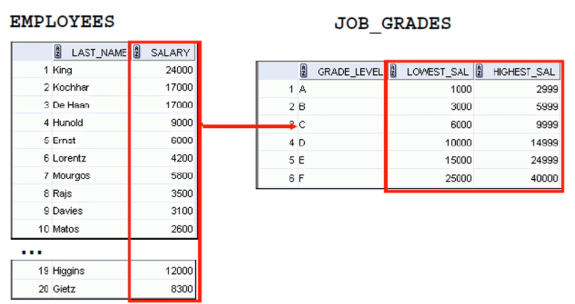

```sql
-- Nonequijoins

SELECT   e.employee_id, e.salary, j.grade_level, j.lowest_sal, j.highest_sal
FROM     employees e 
  JOIN   job_grades j
     ON  NVL(e.salary,0) BETWEEN j.lowest_sal AND j.highest_sal
ORDER BY e.salary;
```

```sql

SELECT   e.employee_id, e.salary, j.grade_level, j.lowest_sal, j.highest_sal
FROM     employees e 
  JOIN   job_grades j
     ON  NVL(e.salary,0) >= j.lowest_sal AND 
         NVL(e.salary,0) <= j.highest_sal
ORDER BY e.salary;
```

| EMPLOYEE\_ID | SALARY | GRADE\_LEVEL | LOWEST\_SAL | HIGHEST\_SAL |
| :--- | :--- | :--- | :--- | :--- |
| 132 | 2100.00 | A | 1000.00 | 2999.00 |
| 128 | 2200.00 | A | 1000.00 | 2999.00 |
| 136 | 2200.00 | A | 1000.00 | 2999.00 |
| 135 | 2400.00 | A | 1000.00 | 2999.00 |
| 127 | 2400.00 | A | 1000.00 | 2999.00 |
| 182 | 2500.00 | A | 1000.00 | 2999.00 |
| 144 | 2500.00 | A | 1000.00 | 2999.00 |
| 140 | 2500.00 | A | 1000.00 | 2999.00 |
| 119 | 2500.00 | A | 1000.00 | 2999.00 |
| 131 | 2500.00 | A | 1000.00 | 2999.00 |


### **Resumo sobre Nonequijoins**

**O que são Nonequijoins?**  
Nonequijoins (ou "junções não igualitárias") são operações de `JOIN` em SQL onde a condição de ligação entre as tabelas **não** é baseada em igualdade (`=`), mas sim em outros operadores de comparação, como:  
- `>` (maior que)  
- `<` (menor que)  
- `>=` (maior ou igual)  
- `<=` (menor ou igual)  
- `BETWEEN` (intervalo)  
- `LIKE` (padrões de texto)  

---

**Quando usar?**  
São úteis para:  
1. **Comparar intervalos de valores**:  
   - Exemplo: Vincular produtos a faixas de preço em uma tabela de categorias.  
   ```sql
   SELECT p.nome_produto, c.categoria
   FROM produtos p
   JOIN categorias c ON p.preco BETWEEN c.preco_min AND c.preco_max;
   ```

2. **Relacionar dados hierárquicos**:  
   - Exemplo: Funcionários e seus níveis salariais em uma tabela de faixas.  

3. **Filtrar com condições complexas**:  
   - Exemplo: Clientes com datas de cadastro anteriores a um período específico em outra tabela.  

---

**Diferença para EQUIJOINS**  
- **EQUIJOIN**: Usa `=` para relacionar chaves primárias/estrangeiras (ex: `ON tabelaA.id = tabelaB.id`).  
- **NONEQUIJOIN**: Usa outros operadores para relações não exatas.  

**Cuidados:**  
- Pode gerar resultados inesperados se a condição não for bem definida.  
- Pode ser menos eficiente que equijoins em bancos de dados grandes.  

---

**Exemplo Prático (Oracle):**  
```sql
-- Relaciona funcionários com suas faixas salariais (sem igualdade)
SELECT e.nome, e.salario, f.nivel
FROM funcionarios e
JOIN faixas_salariais f ON e.salario BETWEEN f.salario_min AND f.salario_max;
``` 

Essa consulta retorna o nível de cada funcionário com base em onde seu salário se encaixa na tabela `faixas_salariais`.

### 21 Oracle SQL - INNER Joins

- [recursos/Seção+11+-+Prática+Aula+3.sql](/recursos/Seção+11+-+Prática+Aula+3.sql)

#### INNER Join

- No SQL ANSI:1999, o join entre duas tabelas que retorna somente as linhas onde a condição de ligação coincidem é chamado INNER join (a palavra INNER é opcional)

```sql
-- Join com a Cláusula ON

SELECT e.employee_id, j.job_title, d.department_name, l.city, l.state_province, l.country_id
FROM   employees e
  INNER JOIN jobs        j ON e.job_id = j.job_id
  INNER JOIN departments d ON d.department_id = e.department_id
  INNER JOIN locations   l ON d.location_id = l.location_id
ORDER BY e.employee_id;

SELECT e.employee_id, j.job_title, d.department_name, l.city, l.state_province, l.country_id
FROM   employees e
  JOIN jobs        j ON e.job_id = j.job_id
  JOIN departments d ON d.department_id = e.department_id
  JOIN locations   l ON d.location_id = l.location_id
ORDER BY e.employee_id;
```

| EMPLOYEE\_ID | JOB\_TITLE | DEPARTMENT\_NAME | CITY | STATE\_PROVINCE | COUNTRY\_ID |
| :--- | :--- | :--- | :--- | :--- | :--- |
| 100 | President | Executive | Seattle | Washington | US |
| 101 | Administration Vice President | Executive | Seattle | Washington | US |
| 102 | Administration Vice President | Executive | Seattle | Washington | US |
| 103 | Programmer | IT | Southlake | Texas | US |
| 104 | Programmer | IT | Southlake | Texas | US |
| 105 | Programmer | IT | Southlake | Texas | US |
| 106 | Programmer | IT | Southlake | Texas | US |
| 107 | Programmer | IT | Southlake | Texas | US |
| 108 | Finance Manager | Finance | Seattle | Washington | US |
| 109 | Accountant | Finance | Seattle | Washington | US |

```sql
-- Utilizando Natural Joins

SELECT  department_id, department_name, location_id, city
FROM    departments
NATURAL INNER JOIN locations;

SELECT  department_id, department_name, location_id, city
FROM    departments
NATURAL JOIN locations;
```

| DEPARTMENT\_ID | DEPARTMENT\_NAME | LOCATION\_ID | CITY |
| :--- | :--- | :--- | :--- |
| 60 | IT | 1400 | Southlake |
| 50 | Shipping | 1500 | South San Francisco |
| 10 | Administration | 1700 | Seattle |
| 30 | Purchasing | 1700 | Seattle |
| 90 | Executive | 1700 | Seattle |
| 100 | Finance | 1700 | Seattle |
| 110 | Accounting | 1700 | Seattle |
| 120 | Treasury | 1700 | Seattle |
| 130 | Corporate Tax | 1700 | Seattle |
| 140 | Control And Credit | 1700 | Seattle |

```sql
-- JOIN com a Cláusula USING

SELECT e.employee_id, e.last_name, d.location_id, department_id, d.department_name
FROM employees e
  INNER JOIN departments d USING (department_id);
  
SELECT e.employee_id, e.last_name, d.location_id, department_id, d.department_name
FROM employees e
  JOIN departments d USING (department_id);
```

| EMPLOYEE\_ID | LAST\_NAME | LOCATION\_ID | DEPARTMENT\_ID | DEPARTMENT\_NAME |
| :--- | :--- | :--- | :--- | :--- |
| 200 | Whalen | 1700 | 10 | Administration |
| 201 | Hartstein | 1800 | 20 | Marketing |
| 202 | Fay | 1800 | 20 | Marketing |
| 114 | Raphaely | 1700 | 30 | Purchasing |
| 119 | Colmenares | 1700 | 30 | Purchasing |
| 115 | Khoo | 1700 | 30 | Purchasing |
| 116 | Baida | 1700 | 30 | Purchasing |
| 117 | Tobias | 1700 | 30 | Purchasing |
| 118 | Himuro | 1700 | 30 | Purchasing |
| 203 | Mavris | 2400 | 40 | Human Resources |


# INNER JOIN em SQL

## 📌 O que é INNER JOIN?
O **INNER JOIN** (ou simplesmente `JOIN`) é uma operação que combina registros de duas tabelas quando há valores correspondentes nas colunas especificadas.

## 🔍 Como funciona?
- Retorna **apenas** as linhas onde existe correspondência em AMBAS as tabelas
- Linhas sem correspondência são **excluídas** do resultado
- É o tipo de JOIN mais comum e eficiente

## ✍️ Sintaxe Básica
```sql
SELECT colunas
FROM tabela1
[INNER] JOIN tabela2 
    ON tabela1.coluna = tabela2.coluna;
```
> 💡 A palavra `INNER` é opcional - apenas `JOIN` produz o mesmo resultado

## 🏆 Quando usar?
Situações ideais:
- Relacionar pedidos com clientes
- Vincular produtos a categorias
- Consultar alunos matriculados em disciplinas

## 📊 Exemplo Prático (Oracle)

**Tabelas:**
```sql
-- Funcionários
CREATE TABLE funcionarios (
    id NUMBER,
    nome VARCHAR2(100),
    departamento_id NUMBER
);

-- Departamentos
CREATE TABLE departamentos (
    id NUMBER,
    nome VARCHAR2(100)
);
```

**Consulta:**
```sql
SELECT f.nome AS funcionario, 
       d.nome AS departamento
FROM funcionarios f
JOIN departamentos d 
    ON f.departamento_id = d.id;
```

**Resultado:**
| funcionario | departamento |
|-------------|--------------|
| João Silva  | TI           |
| Maria Souza | RH           |

## ⚖️ INNER JOIN vs OUTER JOIN
| Tipo         | Comportamento                          |
|--------------|----------------------------------------|
| INNER JOIN   | Apenas correspondências exatas         |
| LEFT JOIN    | Todas linhas da tabela esquerda        |
| RIGHT JOIN   | Todas linhas da tabela direita         |
| FULL JOIN    | Todas linhas de ambas tabelas          |

## 💡 Dicas Importantes
1. Use **aliases** para simplificar consultas
   ```sql
   SELECT f.nome, d.nome
   FROM funcionarios f
   JOIN departamentos d ON f.depto_id = d.id;
   ```

2. Pode juntar múltiplas tabelas:
   ```sql
   SELECT f.nome, d.nome, p.nome_projeto
   FROM funcionarios f
   JOIN departamentos d ON f.depto_id = d.id
   JOIN projetos p ON d.id = p.depto_id;
   ```

3. Evite a sintaxe legada (usando WHERE) - prefira o padrão ANSI

## ⚠️ Cuidados
- Colunas com valores `NULL` não serão pareadas
- Certifique-se que as colunas de junção têm tipos de dados compatíveis
- Em tabelas grandes, crie índices nas colunas de junção para melhor performance

## 🔄 Sintaxe Alternativa (Oracle)
```sql
-- Equivalente usando WHERE (não recomendado)
SELECT f.nome, d.nome
FROM funcionarios f, departamentos d
WHERE f.departamento_id = d.id;
```

> 📌 **Melhor prática**: Sempre use a sintaxe explícita `JOIN...ON` para maior clareza e manutenibilidade do código.

## 🚀 Vantagens do INNER JOIN
- **Performance**: Geralmente mais rápido que OUTER JOINs
- **Precisão**: Retorna apenas dados relacionados
- **Legibilidade**: Facilita o entendimento das relações entre tabelas


### 22 Oracle SQL - OUTER Joins

- [recursos/Seção+11+-+Prática+Aula+4.sql](/recursos/Seção+11+-+Prática+Aula+4.sql)

#### OUTER Join

- Retornando Registros que não correspondem a condição de JOIN Utilizando OUTER Join

#### LEFT OUTER Join

- Um join entre duas tabelas que retorna as linhas que resultam do INNER join e também as linhas que não coincidem a partir da tabela LEFT é chamado de LEFT OUTER Join

```sql
-- LEFT OUTER JOIN

SELECT e.first_name, e.last_name, d.department_id, d.department_name
FROM employees e LEFT OUTER JOIN departments d
     ON (e.department_id = d.department_id) 
ORDER BY d.department_id;
```

| FIRST\_NAME | LAST\_NAME | DEPARTMENT\_ID | DEPARTMENT\_NAME |
| :--- | :--- |:---------------|:-----------------|
| Jennifer | Whalen | 10             | Administration   |
| Michael | Hartstein | 20             | Marketing        |
| Pat | Fay | 20             | Marketing        |
| Den | Raphaely | 30             | Purchasing       |
| Alexander | Khoo | 30             | Purchasing       |
| Shelli | Baida | 30             | Purchasing       |
| Sigal | Tobias | 30             | Purchasing       |
| Guy | Himuro | 30             | Purchasing       |
| Karen | Colmenares | 30             | Purchasing       |
| Susan | Mavris | (null)              | (null)           |


-- RIGHT OUTER JOIN

SELECT d.department_id, d.department_name, e.first_name, e.last_name
FROM employees e RIGHT OUTER JOIN departments d
     ON (e.department_id = d.department_id) 
ORDER BY d.department_id;


| DEPARTMENT\_ID | DEPARTMENT\_NAME | FIRST\_NAME | LAST\_NAME |
| :--- | :--- | :--- | :--- |
| 10 | Administration | Jennifer | Whalen |
| 20 | Marketing | Pat | Fay |
| 20 | Marketing | Michael | Hartstein |
| 30 | Purchasing | Sigal | Tobias |
| 30 | Purchasing | Karen | Colmenares |
| 30 | Purchasing | Shelli | Baida |
| 30 | Purchasing | Den | Raphaely |
| 30 | Purchasing | Alexander | Khoo |
| 30 | Purchasing | (null)  | (null)  |
| 40 | Human Resources | (null)  | (null)  |

```sql
-- FULL OUTER JOIN

SELECT d.department_id, d.department_name, e.first_name, e.last_name
FROM   employees e FULL OUTER JOIN departments d
     ON (e.department_id = d.department_id) 
ORDER BY d.department_id;
```

| DEPARTMENT\_ID | DEPARTMENT\_NAME | FIRST\_NAME | LAST\_NAME |
| :--- |:-----------------|:------------|:-----------|
| 10 | Administration   | Jennifer    | Whalen     |
| 20 | Marketing        | Pat         | Fay        |
| 20 | Marketing        | Michael     | Hartstein  |
| 30 | Purchasing       | Sigal       | Tobias     |
| 30 | Purchasing       | Shelli      | Baida      |
| 30 | Purchasing       | Karen       | Colmenares |
| 30 | <null>           | Guy         | Himuro     |
| 30 | Purchasing       | Den         | Raphaely   |
| 30 | Purchasing       | Alexander   | Khoo       |
| 40 | Human Resources  | <null>      | <null>     |


### 23 Oracle SQL - Produto Cartesiano

- [recursos/Seção+11+-+Prática+Aula+5.sql](/recursos/Seção+11+-+Prática+Aula+5.sql)

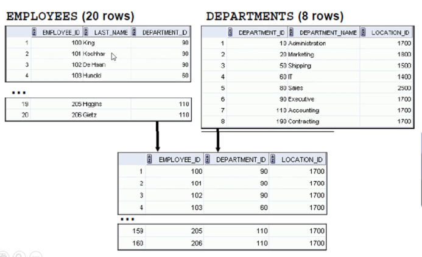

#### Gerando um Produto Cartesiano utilizando Cross Join

- A Cláusula CROSS JOIN produz um produto Cartesiano entre as duas tabelas.

```sql
-- Gerando um Produto Cartesiano utilizando Cross Join

SELECT last_name, department_name
FROM   employees
  CROSS JOIN departments;
```
| LAST\_NAME | DEPARTMENT\_NAME |
| :--- | :--- |
| Abel | Administration |
| Ande | Administration |
| Atkinson | Administration |
| Austin | Administration |
| Baer | Administration |
| Baida | Administration |
| Banda | Administration |
| Bates | Administration |
| Bell | Administration |
| Bernstein | Administration |

---

# CROSS JOIN no Oracle Database

## 📌 O que é CROSS JOIN?

O **CROSS JOIN** é um tipo de operação de junção em SQL que produz o **produto cartesiano** entre duas tabelas. No Oracle Database, assim como em outros SGBDs, ele combina cada linha da primeira tabela com todas as linhas da segunda tabela.

## 🔍 Como funciona?

- **Produto Cartesiano**: Combinação linear de todas as linhas
  - Se a tabela A tem *m* linhas e a tabela B tem *n* linhas
  - O resultado terá *m × n* linhas
- **Não requer** condição de junção (não usa ON ou USING)
- **Sintaxe básica**:
  ```sql
  SELECT colunas
  FROM tabela1
  CROSS JOIN tabela2;
  ```

## 💡 Casos de Uso Comuns

1. **Geração de dados combinatórios**:
   ```sql
   -- Combina cores com tamanhos para gerar todas variações
   SELECT c.cor, t.tamanho
   FROM cores c
   CROSS JOIN tamanhos t;
   ```

2. **Criação de datasets completos** para relatórios

3. **Testes de performance** (geração de massa de dados)

## ⚠️ Cuidados Importantes

1. **Impacto de performance**:
   - Tabelas com 1.000 linhas cada → 1.000.000 de resultados
   - Pode consumir recursos excessivos

2. **Uso consciente**:
   - Evite em tabelas grandes
   - Considere filtros adicionais (WHERE)

## 🆚 Comparação com outros JOINs

| Tipo         | Descrição                          | Oracle Syntax Example             |
|--------------|-----------------------------------|-----------------------------------|
| INNER JOIN   | Apenas linhas correspondentes     | `SELECT ... FROM A JOIN B ON...`  |
| LEFT JOIN    | Todas da esquerda + correspondentes | `SELECT ... FROM A LEFT JOIN B...`|
| CROSS JOIN   | Todas combinações possíveis        | `SELECT ... FROM A CROSS JOIN B`  |

## 🔄 Sintaxes Alternativas no Oracle

1. **Padrão ANSI** (recomendado):
   ```sql
   SELECT *
   FROM departamentos
   CROSS JOIN funcionarios;
   ```

2. **Sintaxe tradicional** (sem WHERE):
   ```sql
   SELECT *
   FROM departamentos, funcionarios;
   ```

## 📊 Exemplo Prático

```sql
-- Tabelas de exemplo
CREATE TABLE meses (
    mes_num NUMBER,
    mes_nome VARCHAR2(20)
);

CREATE TABLE anos (
    ano NUMBER
);

-- CROSS JOIN para gerar calendário
SELECT a.ano, m.mes_num, m.mes_nome
FROM anos a
CROSS JOIN meses m
ORDER BY a.ano, m.mes_num;
```

## 🚀 Boas Práticas

1. **Use com moderação** em tabelas pequenas
2. **Combine com WHERE** para limitar resultados:
   ```sql
   SELECT p.produto, r.regiao
   FROM produtos p
   CROSS JOIN regioes r
   WHERE r.regiao IN ('Norte', 'Sul');
   ```
3. **Prefira a sintaxe explícita** `CROSS JOIN` para maior clareza

> ⚠️ **Atenção**: Em implementações Oracle, o CROSS JOIN pode ser menos eficiente que outros joins para grandes volumes de dados. Sempre avalie o plano de execução.


### 24 Oracle SQL - Joins utilizando sintaxe Oracle

- [recursos/Seção+11+-+Prática+Aula+6.sql](/recursos/Seção+11+-+Prática+Aula+6.sql)

#### Tipos de Joins utilizando sintaxe Oracle

- Equipin  
- Nonequipin  
- Outer join  
- Self-join

```sql
-- EquiJoin utilizando Sintaxe Oracle

SELECT e.employee_id, e.last_name, e.department_id, d.department_id, d.location_id
FROM   employees e,
       departments d
WHERE  (e.department_id = d.department_id)
ORDER BY e.department_id;
```
| EMPLOYEE\_ID | LAST\_NAME | DEPARTMENT\_ID | DEPARTMENT\_ID | LOCATION\_ID |
| :--- | :--- | :--- | :--- | :--- |
| 200 | Whalen | 10 | 10 | 1700 |
| 201 | Hartstein | 20 | 20 | 1800 |
| 202 | Fay | 20 | 20 | 1800 |
| 114 | Raphaely | 30 | 30 | 1700 |
| 119 | Colmenares | 30 | 30 | 1700 |
| 115 | Khoo | 30 | 30 | 1700 |
| 116 | Baida | 30 | 30 | 1700 |
| 117 | Tobias | 30 | 30 | 1700 |
| 118 | Himuro | 30 | 30 | 1700 |
| 203 | Mavris | 40 | 40 | 2400 |

```sql
-- Joins entre várias tabelas utilizando Sintaxe Oracle

SELECT e.employee_id, j.job_title, d.department_name, l.city, l.state_province, l.country_id
FROM   employees e,
       jobs j,
       departments d, 
       locations l
WHERE (e.job_id = j.job_id)               AND
      (d.department_id = e.department_id) AND
      (d.location_id = l.location_id)
ORDER BY e.employee_id;

-- Incluindo condições adicionais a condição de Join utilizando AND

SELECT e.employee_id, e.salary, j.job_title, 
       d.department_name, l.city, l.state_province, l.country_id
FROM   employees e,
       jobs j,
       departments d, 
       locations l
WHERE (e.job_id = j.job_id)  AND
      (d.department_id = e.department_id) AND
      (d.location_id = l.location_id)     AND
      (e.salary >= 1000)
ORDER BY e.employee_id;

```

| EMPLOYEE\_ID | JOB\_TITLE | DEPARTMENT\_NAME | CITY | STATE\_PROVINCE | COUNTRY\_ID |
| :--- | :--- | :--- | :--- | :--- | :--- |
| 100 | President | Executive | Seattle | Washington | US |
| 101 | Administration Vice President | Executive | Seattle | Washington | US |
| 102 | Administration Vice President | Executive | Seattle | Washington | US |
| 103 | Programmer | IT | Southlake | Texas | US |
| 104 | Programmer | IT | Southlake | Texas | US |
| 105 | Programmer | IT | Southlake | Texas | US |
| 106 | Programmer | IT | Southlake | Texas | US |
| 107 | Programmer | IT | Southlake | Texas | US |
| 108 | Finance Manager | Finance | Seattle | Washington | US |
| 109 | Accountant | Finance | Seattle | Washington | US |


| EMPLOYEE\_ID | SALARY | JOB\_TITLE | DEPARTMENT\_NAME | CITY | STATE\_PROVINCE | COUNTRY\_ID |
| :--- | :--- | :--- | :--- | :--- | :--- | :--- |
| 100 | 24000.00 | President | Executive | Seattle | Washington | US |
| 101 | 17000.00 | Administration Vice President | Executive | Seattle | Washington | US |
| 102 | 17000.00 | Administration Vice President | Executive | Seattle | Washington | US |
| 103 | 9000.00 | Programmer | IT | Southlake | Texas | US |
| 104 | 6000.00 | Programmer | IT | Southlake | Texas | US |
| 105 | 4800.00 | Programmer | IT | Southlake | Texas | US |
| 106 | 4800.00 | Programmer | IT | Southlake | Texas | US |
| 107 | 4200.00 | Programmer | IT | Southlake | Texas | US |
| 108 | 12008.00 | Finance Manager | Finance | Seattle | Washington | US |
| 109 | 9000.00 | Accountant | Finance | Seattle | Washington | US |


```sql
-- NonequiJoin Utilizando Sintaxe Oracle

SELECT e.employee_id, e.salary, j.grade_level, j.lowest_sal, j.highest_sal
FROM   employees e,
       job_grades j
WHERE  NVL(e.salary,0) BETWEEN j.lowest_sal AND j.highest_sal
ORDER BY e.salary;
```
| EMPLOYEE\_ID | SALARY | GRADE\_LEVEL | LOWEST\_SAL | HIGHEST\_SAL |
| :--- | :--- | :--- | :--- | :--- |
| 132 | 2100.00 | A | 1000.00 | 2999.00 |
| 128 | 2200.00 | A | 1000.00 | 2999.00 |
| 136 | 2200.00 | A | 1000.00 | 2999.00 |
| 135 | 2400.00 | A | 1000.00 | 2999.00 |
| 127 | 2400.00 | A | 1000.00 | 2999.00 |
| 182 | 2500.00 | A | 1000.00 | 2999.00 |
| 144 | 2500.00 | A | 1000.00 | 2999.00 |
| 140 | 2500.00 | A | 1000.00 | 2999.00 |
| 119 | 2500.00 | A | 1000.00 | 2999.00 |
| 131 | 2500.00 | A | 1000.00 | 2999.00 |


```sql
-- Outer Join Utilizando Sintaxe Oracle

SELECT e.first_name, e.last_name, d.department_id, d.department_name
FROM   employees e,
       departments d
WHERE  e.department_id = d.department_id(+) 
ORDER BY e.department_id;

SELECT e.first_name, e.last_name, d.department_id, d.department_name
FROM   employees e,
       departments d
WHERE  e.department_id(+) = d.department_id 
ORDER BY e.first_name;
```

| FIRST\_NAME | LAST\_NAME | DEPARTMENT\_ID | DEPARTMENT\_NAME |
| :--- | :--- |:---------------| :--- |
| Jennifer | Whalen | 10             | Administration |
| Michael | Hartstein | 20             | Marketing |
| Pat | Fay | 20             | Marketing |
| Den | Raphaely | 30             | Purchasing |
| Alexander | Khoo | 30             | Purchasing |
| Shelli | Baida | 30             | Purchasing |
| Sigal | Tobias | 30             | Purchasing |
| Guy | Himuro | 30             | Purchasing |
| Karen | Colmenares | 30             | Purchasing |
| Susan | Mavris | <null>         | <null> |


| FIRST\_NAME | LAST\_NAME | DEPARTMENT\_ID | DEPARTMENT\_NAME |
| :--- | :--- | :--- | :--- |
| Adam | Fripp | 50 | Shipping |
| Alana | Walsh | 50 | Shipping |
| Alberto | Errazuriz | 80 | Sales |
| Alexander | Khoo | 30 | Purchasing |
| Alexander | Hunold | 60 | IT |
| Alexis | Bull | 50 | Shipping |
| Allan | McEwen | 80 | Sales |
| Alyssa | Hutton | 80 | Sales |
| <null> | <null> | 80 | Sales |
| <null> | <null> | 50 | Shipping |

```sql
-- Self-join Utilizando Sintaxe Oracle

SELECT empregado.employee_id "Id empregado", empregado.last_name "Sobrenome empregado",
       gerente.employee_id "Id gerente", gerente.last_name "Sobrenome gerente"
FROM   employees empregado,
       employees gerente
WHERE (empregado.manager_id = gerente.employee_id)
ORDER BY empregado.employee_id;

DESC employees
```
| Id empregado | Sobrenome empregado | Id gerente | Sobrenome gerente |
| :--- | :--- | :--- | :--- |
| 101 | Kochhar | 100 | King |
| 102 | De Haan | 100 | King |
| 103 | Hunold | 102 | De Haan |
| 104 | Ernst | 103 | Hunold |
| 105 | Austin | 103 | Hunold |
| 106 | Pataballa | 103 | Hunold |
| 107 | Lorentz | 103 | Hunold |
| 108 | Greenberg | 101 | Kochhar |
| 109 | Faviet | 108 | Greenberg |
| 110 | Chen | 108 | Greenberg |

```sql
-- Outer Join e Self Join Utilizando Sintaxe Oracle

SELECT empregado.employee_id "Id empregado", empregado.last_name "Sobrenome empregado",
       gerente.employee_id "Id gerente", gerente.last_name "Sobrenome gerente"
FROM   employees empregado,
       employees gerente
WHERE (empregado.manager_id = gerente.employee_id(+))
ORDER BY empregado.employee_id;
```

| Id empregado | Sobrenome empregado | Id gerente | Sobrenome gerente |
| :--- | :--- | :--- | :--- |
| 100 | King | null | null |
| 101 | Kochhar | 100 | King |
| 102 | De Haan | 100 | King |
| 103 | Hunold | 102 | De Haan |
| 104 | Ernst | 103 | Hunold |
| 105 | Austin | 103 | Hunold |
| 106 | Pataballa | 103 | Hunold |
| 107 | Lorentz | 103 | Hunold |
| 108 | Greenberg | 101 | Kochhar |
| 109 | Faviet | 108 | Greenberg |


```sql
-- Produto Cartesiano
-- é um erro!
SELECT e.employee_id, e.first_name, e.last_name, j.job_id, j.job_title
FROM   employees e, jobs j;

-- Corrigindo Produto Cartesiano 

SELECT e.employee_id, e.first_name, e.last_name, j.job_id, j.job_title
FROM   employees e, jobs j
WHERE  e.job_id = j.job_id;
```

| EMPLOYEE\_ID | FIRST\_NAME | LAST\_NAME | JOB\_ID | JOB\_TITLE |
| :--- | :--- | :--- | :--- | :--- |
| 206 | William | Gietz | AC\_ACCOUNT | Public Accountant |
| 205 | Shelley | Higgins | AC\_MGR | Accounting Manager |
| 200 | Jennifer | Whalen | AD\_ASST | Administration Assistant |
| 100 | Steven | King | AD\_PRES | President |
| 101 | Neena | Kochhar | AD\_VP | Administration Vice President |
| 102 | Lex | De Haan | AD\_VP | Administration Vice President |
| 111 | Ismael | Sciarra | FI\_ACCOUNT | Accountant |
| 110 | John | Chen | FI\_ACCOUNT | Accountant |
| 113 | Luis | Popp | FI\_ACCOUNT | Accountant |
| 112 | Jose Manuel | Urman | FI\_ACCOUNT | Accountant |


[Voltar ao Índice](#indice)

---


## <a name="parte12">12 - Seção 12: Oracle SQL - Utilizando Sub-Consultas</a>

### 25 Oracle SQL - Sub-Consultas Single-Row

[Seção+12+-+Prática+Aula+1.sql](recursos/Se%C3%A7%C3%A3o%2B12%2B-%2BPr%C3%A1tica%2BAula%2B1.sql)

#### Diretrizes para Sub-Consultas

  * A Sub-Consulta deve ficar entre parênteses
  * A Sub-Consulta deve ficar a direita do operador de comparação para melhor entendimento e compreensão do código, entretanto, a Sub-Consulta pode aparecer em qualquer lado do operador
  * Utilize operadores single-row com Sub-Consultas single-row
  * Utilize operadores multiple-row com Sub-Consultas multiple-row

-----

### Resumo das Diretrizes para Sub-Consultas (Baseado na Imagem)

O texto da imagem apresenta quatro diretrizes fundamentais para o uso de sub-consultas em SQL:

1.  **Delimitação com Parênteses:** Toda sub-consulta deve ser obrigatoriamente aninhada dentro de parênteses `()`. Isso define claramente o escopo da consulta interna.
2.  **Posicionamento em Comparações:** Para melhor legibilidade, sugere-se que a sub-consulta seja colocada à direita do operador de comparação (ex: `coluna = (SELECT ...)`). No entanto, é tecnicamente possível que ela apareça à esquerda (ex: `(SELECT ...) = coluna`), embora menos comum e potencialmente menos intuitivo.
3.  **Coerência com Operadores Single-Row:** Ao usar uma sub-consulta que retorna uma única linha (single-row subquery), deve-se empregar operadores de comparação que esperam um único valor (ex: `=`, `>`, `<`, `<=`, `>=`, `<>`).
4.  **Coerência com Operadores Multiple-Row:** Ao usar uma sub-consulta que pode retornar múltiplas linhas (multiple-row subquery), é necessário utilizar operadores apropriados para lidar com conjuntos de valores (ex: `IN`, `ANY`, `ALL`, `EXISTS`).

### Boas e Más Práticas Relacionadas às Diretrizes

#### Boas Práticas 👍

1.  **Sempre Usar Parênteses:** É uma regra sintática fundamental. Não há exceção. Isso melhora a clareza e garante que o SGBD interprete a consulta corretamente.
2.  **Posição à Direita para Clareza:** Manter a sub-consulta à direita do operador de comparação (`valor = (subconsulta)`) é o padrão e torna o código mais fácil de ler e entender para a maioria dos desenvolvedores, pois segue um fluxo lógico de "comparar X com o resultado de Y".
3.  **Escolha Correta de Operadores:**
      * **Single-Row:** Utilizar `=` , `>` , `<` , etc., com sub-consultas que garantidamente retornam um único valor (ex: usando funções de agregação como `MAX()`, `MIN()`, `AVG()` sem `GROUP BY`, ou filtrando por uma chave primária). Isso evita o erro "ORA-01427: single-row subquery returns more than one row".
      * **Multiple-Row:** Usar `IN` (para verificar se um valor está contido em um conjunto de resultados), `ANY` (para comparar um valor com qualquer valor no conjunto de resultados retornado pela subconsulta, usado com `>`, `<`, etc.), `ALL` (para comparar um valor com todos os valores no conjunto de resultados), e `EXISTS` (para verificar se a subconsulta retorna alguma linha).
4.  **Formatação e Indentação:** Indentar a sub-consulta em relação à consulta principal melhora significativamente a legibilidade, especialmente em consultas complexas.
5.  **Comentários Explicativos:** Para sub-consultas com lógica não trivial, adicionar um breve comentário explicando seu propósito pode ser muito útil.

#### Más Práticas 👎

1.  **Omissão de Parênteses:** Levará a um erro de sintaxe.
2.  **Posicionamento Inconsistente/Confuso:** Embora permitido, colocar a sub-consulta à esquerda do operador de comparação sem uma razão forte pode dificultar a leitura.
3.  **Mismatch de Operadores e Tipo de Sub-consulta:**
      * Usar um operador single-row (ex: `=`) com uma sub-consulta que *pode* retornar múltiplas linhas. Isso é uma causa comum de erros (`ORA-01427`).
      * Usar um operador multiple-row (ex: `IN`) com uma sub-consulta que você espera que retorne apenas um valor, mas de forma inadequada. Embora possa funcionar, pode mascarar um entendimento incorreto da lógica ou dos dados.
4.  **Sub-consultas Desnecessariamente Complexas:** Se uma `JOIN` puder realizar a mesma tarefa de forma mais clara e eficiente, ela geralmente é preferível.
5.  **Ignorar o Impacto de `NULL`s:** Se uma sub-consulta single-row não retornar linhas, ela retorna `NULL`. Comparações com `NULL` (ex: `coluna = NULL`) geralmente não se comportam como esperado (resultam em `UNKNOWN`). É preciso estar ciente disso e usar `IS NULL` ou funções como `NVL`/`COALESCE` se necessário. Para sub-consultas com `NOT IN`, se o conjunto de resultados da sub-consulta contiver um `NULL`, a condição `NOT IN` inteira pode avaliar para `FALSE` ou `UNKNOWN` inesperadamente.
6.  **Falta de Teste Isolado:** Não testar a sub-consulta separadamente para verificar se ela retorna o número esperado de linhas e colunas, e os valores corretos, antes de integrá-la à consulta principal.

---
Operadores Comuns Utilizados com Sub-Consultas Single-Row:

Os operadores de comparação padrão são frequentemente usados com sub-consultas single-row:

- "=" (Igual a)
- ">" (Maior que)
- "<" (Menor que)
- ">=" (Maior ou igual a)
- "<=" (Menor ou igual a)
- "<>" ou != (Diferente de)

```sql
-- Sub-Consultas Single-Row

SELECT first_name, last_name, job_id, salary
FROM   employees
WHERE  salary >
                (SELECT AVG(NVL(salary,0))
                 FROM employees);              

```

```sql
-- Utilizando Sub-consultas na Cláusula HAVING

SELECT e1.department_id, MAX(e1.salary)
FROM   employees e1
GROUP BY e1.department_id
HAVING MAX(salary) <  (SELECT AVG(e2.salary)
                       FROM   employees e2);
```

```sql
-- O que ocorre quando a Sub-Consulta retorna nenhuma linha?

SELECT employee_id, first_name, last_name
FROM   employees
WHERE  last_name =  (SELECT last_name
                     FROM   employees
                     WHERE  last_name = 'Suzuki');
```

---

### RESUMO GEMINI

## Resumo: Sub-Consultas Single-Row em Oracle SQL

Sub-consultas "single-row" (linha única) são consultas aninhadas dentro de uma consulta principal (externa) que **retornam no máximo uma linha e uma coluna**. O valor retornado por essa sub-consulta é então utilizado pela consulta externa, geralmente em cláusulas como `WHERE`, `HAVING`, ou na lista de `SELECT`.

A principal característica é que elas são projetadas para retornar um valor escalar único, que pode ser comparado com uma coluna ou expressão na consulta externa. Se uma sub-consulta single-row retornar mais de uma linha, um erro Oracle será gerado (ORA-01427: single-row subquery returns more than one row).

**Operadores Comuns Utilizados com Sub-Consultas Single-Row:**

Os operadores de comparação padrão são frequentemente usados com sub-consultas single-row:
* `=` (Igual a)
* `>` (Maior que)
* `<` (Menor que)
* `>=` (Maior ou igual a)
* `<=` (Menor ou igual a)
* `<>` ou `!=` (Diferente de)

**Exemplo Conceitual:**

```sql
SELECT nome_funcionario, salario
FROM   funcionarios
WHERE  salario = (SELECT AVG(salario)
                  FROM   funcionarios
                  WHERE  departamento_id = 10);
```

Neste exemplo, `(SELECT AVG(salario) FROM funcionarios WHERE departamento_id = 10)` é uma sub-consulta single-row que retorna a média salarial do departamento 10. Este valor único é então usado para encontrar funcionários cujo salário é igual a essa média.

---
### Boas Práticas 👍

1.  **Garantir Retorno Único:** Certifique-se de que a lógica da sub-consulta realmente retornará no máximo uma linha. Use funções de agregação (`MAX`, `MIN`, `AVG`, `SUM`, `COUNT`) ou condições `WHERE` restritivas (como `WHERE ROWNUM = 1` ou `WHERE chave_primaria = valor`) se necessário para garantir isso.
2.  **Clareza e Legibilidade:** Use sub-consultas single-row quando elas tornarem a consulta mais fácil de entender em comparação com joins complexos ou outras abordagens. Comente o propósito da sub-consulta se a lógica não for imediatamente óbvia.
3.  **Uso em Cláusulas Apropriadas:** São ideais para comparações em `WHERE` e `HAVING`, ou para buscar um valor específico na lista de `SELECT`.
4.  **Performance:** Para sub-consultas simples e que não são executadas repetidamente (não correlacionadas), o impacto na performance geralmente é aceitável.
5.  **Testes:** Sempre teste a sub-consulta isoladamente para verificar se ela retorna o resultado esperado (uma única linha e coluna) antes de integrá-la à consulta principal.

### Más Práticas 👎

1.  **Risco de Múltiplas Linhas:** Escrever sub-consultas que *poderiam* acidentalmente retornar múltiplas linhas sem tratamento adequado. Isso causa o erro `ORA-01427`.
2.  **Retorno de Múltiplas Colunas:** Tentar usar uma sub-consulta single-row em um contexto que espera um único valor escalar, mas a sub-consulta seleciona múltiplas colunas. (Ex: `WHERE coluna = (SELECT col1, col2 FROM ...)`).
3.  **Nulos Inesperados:** Se a sub-consulta não retornar nenhuma linha, ela retornará `NULL`. Isso pode levar a resultados inesperados na consulta externa se não for tratado (por exemplo, `salario = NULL` não se comporta como `salario = 0`). Use `NVL` ou `COALESCE` se necessário.
4.  **Complexidade Excessiva:** Evite aninhar múltiplas sub-consultas single-row de forma que a consulta se torne difícil de ler e depurar. Às vezes, um `JOIN` pode ser mais eficiente e legível.
5.  **Sub-consultas Correlacionadas Ineficientes:** Embora sub-consultas single-row possam ser correlacionadas (referenciando colunas da consulta externa), se mal escritas, podem levar a uma execução lenta, pois a sub-consulta pode ser executada para cada linha da consulta externa. Avalie se um `JOIN` seria mais performático.
6.  **Uso Desnecessário:** Se o mesmo resultado puder ser alcançado de forma mais simples e direta (por exemplo, com uma variável em PL/SQL ou um `JOIN` simples), prefira a abordagem mais simples.

--- 

### 26 Oracle SQL - Sub-Consultas Multiple-row

[Seção+12+-+Prática+Aula+2.sql](recursos/Se%C3%A7%C3%A3o%2B12%2B-%2BPr%C3%A1tica%2BAula%2B2.sql)

- Possibilitam que a Sub-Consulta retorne mais do que uma linha
- Utiliza o operadores de comparação multiple-row

```sql
-- Sub-Consultas Multiple-row

SELECT employee_id, first_name, last_name
FROM   employees
WHERE  salary IN 
                (SELECT    AVG(NVL(salary,0))
                 FROM      employees
                 GROUP BY  department_id);

-- Utilizando operador NOT IN em Sub-consultas Multiple-Row

SELECT employee_id, first_name, last_name
FROM   employees
WHERE  salary NOT IN
                (SELECT    AVG(NVL(salary,0))
                 FROM      employees
                 GROUP BY  department_id);
```

```sql
-- Utilizando operador ANY em Sub-consultas Multiple-Row

SELECT employee_id, last_name, job_id, salary
FROM   employees
WHERE  salary < ANY
                   (SELECT salary
                    FROM   employees
                    WHERE  job_id = 'IT_PROG');
```

```sql
-- Utilizando operador ALL em Sub-consultas Multiple-Row

SELECT employee_id, last_name, job_id, salary
FROM   employees
WHERE  salary < ALL
                   (SELECT salary
                    FROM   employees
                    WHERE  job_id = 'IT_PROG');
```

```sql
-- Cuidados com Valores Nulos em uma Sub-consulta com Operador IN

SELECT emp.employee_id, emp.last_name
FROM   employees emp
WHERE  emp.employee_id IN (SELECT mgr.manager_id
                           FROM employees mgr);

-- Cuidados com Valores Nulos em uma Sub-consulta com Operador NOT IN

SELECT emp.employee_id, emp.last_name
FROM   employees emp
WHERE  emp.employee_id NOT IN (SELECT mgr.manager_id
                               FROM employees mgr);
```

---
#### RESUMO GEMINI

Para a aula **Seção 12: Oracle SQL - Utilizando Sub-Consultas - Aula 26 Sub-Consultas Multiple-Row**, segue o resumo e as boas e más práticas:

## Resumo: Sub-Consultas Multiple-Row em Oracle SQL

Sub-consultas "multiple-row" (múltiplas linhas) são consultas aninhadas que **podem retornar uma ou mais linhas, mas devem retornar apenas uma coluna** para serem usadas com operadores de comparação específicos. Esses operadores são projetados para comparar um valor da consulta externa com um conjunto de valores (a lista de valores retornada pela sub-consulta).

Os principais operadores utilizados com sub-consultas multiple-row são:

* **`IN`**: Compara se um valor da consulta externa é igual a **qualquer um** dos valores retornados pela sub-consulta.
    * Exemplo: `SELECT nome_produto FROM produtos WHERE id_categoria IN (SELECT id FROM categorias WHERE nome_setor = 'Eletrônicos');`
        (Seleciona produtos cuja categoria está na lista de categorias do setor de Eletrônicos).

* **`ANY`**: Compara um valor da consulta externa com **cada valor** retornado pela sub-consulta usando um operador de comparação (`=`, `>`, `<`, `>=`, `<=`, `<>`). A condição é verdadeira se a comparação for verdadeira para **pelo menos um** dos valores retornados.
    * `> ANY`: Maior que o mínimo valor retornado.
    * `< ANY`: Menor que o máximo valor retornado.
    * `= ANY`: Equivalente ao `IN`.
    * Exemplo: `SELECT nome_funcionario, salario FROM funcionarios WHERE salario > ANY (SELECT salario_minimo FROM cargos WHERE departamento = 'Vendas');`
        (Seleciona funcionários cujo salário é maior que *pelo menos um* dos salários mínimos dos cargos de Vendas, ou seja, maior que o menor salário mínimo de Vendas).

* **`ALL`**: Compara um valor da consulta externa com **cada valor** retornado pela sub-consulta usando um operador de comparação. A condição é verdadeira somente se a comparação for verdadeira para **todos** os valores retornados.
    * `> ALL`: Maior que o máximo valor retornado.
    * `< ALL`: Menor que o mínimo valor retornado.
    * Exemplo: `SELECT nome_produto, preco FROM produtos WHERE preco > ALL (SELECT preco_medio FROM concorrentes WHERE id_produto_similar = produtos.id);`
        (Seleciona produtos cujo preço é maior que o preço médio de *todos* os seus concorrentes diretos).

É crucial que a sub-consulta multiple-row retorne apenas uma coluna, pois os operadores (`IN`, `ANY`, `ALL`) esperam comparar valores da consulta externa com uma lista de valores únicos, e não com múltiplas colunas.

---
### Boas Práticas 👍

1.  **Use o Operador Correto:** Escolha `IN`, `ANY` ou `ALL` com base na lógica de comparação exata que você precisa. `IN` é o mais comum e geralmente mais intuitivo.
2.  **Garanta Uma Única Coluna:** A sub-consulta deve sempre selecionar apenas uma coluna. Múltiplas colunas resultarão em erro (`ORA-00913: too many values`).
3.  **Clareza com `ANY` e `ALL`:** Ao usar `ANY` ou `ALL`, certifique-se de que a lógica da comparação (`>`, `<`, `=`) combinada com o operador seja clara. Comentar o código pode ser útil aqui. Por exemplo, `salario > ANY (subconsulta)` significa "salário maior que o menor valor da subconsulta".
4.  **Alternativas para `NOT IN`:** Seja cauteloso com `NOT IN` se a sub-consulta puder retornar `NULL`. Se um dos valores retornados pela sub-consulta for `NULL`, a condição `NOT IN` inteira pode avaliar para `FALSE` ou `UNKNOWN`, não retornando as linhas esperadas. Considere usar `NOT EXISTS` ou `LEFT JOIN ... WHERE IS NULL` como alternativas mais seguras em tais cenários.
5.  **Índices:** Para um bom desempenho, as colunas envolvidas na junção implícita (a coluna da consulta externa e a coluna retornada pela sub-consulta) devem ser indexadas, especialmente se as tabelas forem grandes.
6.  **Teste Isolado:** Teste a sub-consulta isoladamente para verificar os valores que ela retorna e se são os esperados antes de integrá-la à consulta principal.

### Más Práticas 👎

1.  **Selecionar Múltiplas Colunas:** Uma sub-consulta usada com `IN`, `ANY` ou `ALL` não pode selecionar mais de uma coluna.
2.  **Confundir `ANY` e `ALL`:** Usar `ANY` quando se quer dizer `ALL`, ou vice-versa, leva a resultados lógicos incorretos. Por exemplo, `salario > ALL (subconsulta)` é muito diferente de `salario > ANY (subconsulta)`.
3.  **Ignorar `NULL`s com `NOT IN`:** Como mencionado, se a sub-consulta usada com `NOT IN` retornar qualquer valor `NULL`, nenhuma linha será retornada pela condição `NOT IN` (a menos que todas as outras comparações também falhem). Isso é uma armadilha comum.
4.  **Sub-consultas Muito Grandes com `IN`:** Se a sub-consulta retornar um número muito grande de valores, o desempenho com `IN` pode degradar. Em alguns casos, um `JOIN` ou `EXISTS` pode ser mais eficiente. O Oracle geralmente otimiza bem, mas é algo a se observar.
5.  **Uso de `!= ANY` ou `<> ANY`:** Embora sintaticamente válido, `!= ANY (subconsulta)` significa "diferente de pelo menos um valor". Se a sub-consulta tiver mais de um valor distinto (ou mesmo um, se não for o que se compara), isso quase sempre será verdadeiro. Muitas vezes, o que se deseja é `NOT IN` (que é `!= ALL` implicitamente) ou uma lógica diferente.
6.  **Uso de `= ALL`:** Se uma sub-consulta retorna mais de um valor distinto, `= ALL` só será verdadeiro se todos esses valores distintos forem idênticos e iguais ao valor da consulta externa, o que é uma condição raramente útil ou intencional. Se a sub-consulta retorna um único valor, `= ALL` se comporta como `=`.
---

### 27 Oracle SQL - Utilizando operadores EXISTS e NOT EXISTS

[Seção+12+-+Prática+Aula+3.sql](recursos/Se%C3%A7%C3%A3o%2B12%2B-%2BPr%C3%A1tica%2BAula%2B3.sql)

```sql

-- Utilizando operador EXISTS

SELECT d.department_id, d.department_name
FROM   departments d
WHERE  EXISTS
             (SELECT e.department_id
               FROM   employees e
               WHERE d.department_id = 
                             e.department_id);
							 
-- Utilizando operador EXISTS

SELECT d.department_id, d.department_name
FROM   departments d
WHERE  EXISTS (SELECT e.department_id
               FROM employees e
               WHERE d.department_id = e.department_id);

-- Utilizando operador NOT EXISTS

SELECT d.department_id, d.department_name
FROM   departments d
WHERE  NOT EXISTS (SELECT e.department_id
                   FROM employees e
                   WHERE d.department_id = e.department_id);
    
```

---
#### RESUMO GEMINI

Os operadores **`EXISTS`** e **`NOT EXISTS`** são utilizados em SQL para verificar se uma sub-consulta retorna alguma linha ou não. Eles são considerados operadores de "existência" e resultam em um valor booleano (verdadeiro ou falso).

* **`EXISTS`**: A condição `EXISTS` é **verdadeira** se a sub-consulta aninhada a ela retornar **pelo menos uma linha**. Se a sub-consulta não retornar nenhuma linha, a condição `EXISTS` é falsa.
* **`NOT EXISTS`**: A condição `NOT EXISTS` é **verdadeira** se a sub-consulta aninhada a ela **não retornar nenhuma linha**. Se a sub-consulta retornar pelo menos uma linha, a condição `NOT EXISTS` é falsa.

**Características Principais:**

1.  **Foco na Existência, Não nos Valores:** Diferentemente de `IN` ou operadores de comparação, `EXISTS` e `NOT EXISTS` não se importam com *quais* valores são retornados pela sub-consulta, apenas se *alguma* linha é retornada. Por isso, é comum usar `SELECT 1`, `SELECT '*''`, ou `SELECT NULL` na sub-consulta, pois o conteúdo selecionado é irrelevante para a lógica do `EXISTS`.
2.  **Sub-consultas Correlacionadas:** Frequentemente, são usados com sub-consultas correlacionadas. Uma sub-consulta correlacionada é aquela que referencia uma ou mais colunas da consulta externa. A sub-consulta é, conceitualmente, reavaliada para cada linha da consulta externa.
3.  **Avaliação "Curto-Circuito":** Assim que o SGBD determina que a condição é satisfeita (por exemplo, encontra a primeira linha para `EXISTS` ou confirma a ausência de linhas para `NOT EXISTS` após verificar todos os dados relevantes), ele pode parar de processar a sub-consulta para a linha atual da consulta externa.

**Exemplo Conceitual com `EXISTS`:**

```sql
SELECT d.nome_departamento
FROM   departamentos d
WHERE  EXISTS (SELECT 1
               FROM   funcionarios f
               WHERE  f.departamento_id = d.id_departamento
                 AND  f.salario > 100000);
```

Este exemplo seleciona nomes de departamentos onde *existe* pelo menos um funcionário naquele departamento com salário superior a 100.000.

**Exemplo Conceitual com `NOT EXISTS`:**

```sql
SELECT c.nome_cliente
FROM   clientes c
WHERE  NOT EXISTS (SELECT 1
                   FROM   pedidos p
                   WHERE  p.cliente_id = c.id_cliente);
```

Este exemplo seleciona nomes de clientes que *não possuem* nenhum pedido registrado na tabela de pedidos.

---
### Boas Práticas 👍

1.  **Use `SELECT 1` ou Similar na Sub-consulta:** Como os valores retornados pela sub-consulta são irrelevantes para `EXISTS`/`NOT EXISTS`, usar `SELECT 1`, `SELECT '*''` ou `SELECT NULL` é uma convenção comum e pode, em alguns casos, sinalizar ao otimizador (e a outros desenvolvedores) que apenas a existência de linhas é importante.
2.  **Preferível a `IN` com Sub-consultas Grandes ou `NULL`s:**
    * `NOT EXISTS` é geralmente mais eficiente e seguro do que `NOT IN` quando a sub-consulta pode retornar `NULL`s, pois `NOT IN` se comporta de maneira inesperada com `NULL`s.
    * Para verificações de existência, `EXISTS` pode ser mais performático que `IN`, especialmente se a sub-consulta retorna muitas linhas, pois `EXISTS` para na primeira ocorrência.
3.  **Clareza para Checagens de Existência:** Use `EXISTS` quando a intenção é verificar a presença de registros relacionados, e `NOT EXISTS` para verificar a ausência. Isso torna a intenção da consulta mais clara.
4.  **Indexação em Colunas de Junção (Correlação):** Em sub-consultas correlacionadas com `EXISTS`/`NOT EXISTS`, as colunas usadas na cláusula `WHERE` da sub-consulta que se conectam à consulta externa devem ser bem indexadas para otimizar o desempenho.
5.  **Combine com Lógica Adicional:** `EXISTS` e `NOT EXISTS` podem ser combinados com `AND`, `OR`, e `NOT` na cláusula `WHERE` principal para construir condições complexas.

### Más Práticas 👎

1.  **Selecionar Colunas Reais Desnecessariamente (`SELECT coluna_real`):** Embora funcione, selecionar colunas específicas da tabela interna (ex: `SELECT nome_funcionario FROM funcionarios ...`) dentro de um `EXISTS` é desnecessário e pode ser levemente menos eficiente, além de confundir quem lê o código, fazendo pensar que os valores da `coluna_real` são usados de alguma forma (eles não são). A exceção é se você precisa dessas colunas para outras partes da sub-consulta (ex: em um `WHERE` aninhado dentro da sub-consulta do `EXISTS`).
2.  **Usar `COUNT(*)` Dentro do `EXISTS`:** Evite construções como `WHERE EXISTS (SELECT COUNT(*) FROM ... HAVING COUNT(*) > 0)`. A simples presença de uma linha já satisfaz `EXISTS`. A contagem é um trabalho extra desnecessário. Apenas `WHERE EXISTS (SELECT 1 FROM ...)` é suficiente.
3.  **Sub-consultas Não Correlacionadas Ineficazes:** Se a sub-consulta dentro de `EXISTS` não for correlacionada e sempre retornar (ou nunca retornar) linhas, a condição `EXISTS` se tornará uma constante (sempre verdadeira ou sempre falsa), o que pode indicar um erro lógico ou uma forma ineficiente de escrever a consulta.
4.  **Confundir com `IN`:** Não use `EXISTS` quando você realmente precisa comparar valores específicos. Se a lógica é "esta coluna é igual a um dos valores retornados pela sub-consulta?", então `IN` (ou `= ANY`) é mais apropriado.
5.  **Má Otimização por Falta de Índices:** Não ter índices adequados nas colunas de correlação pode levar a varreduras completas da tabela interna para cada linha da tabela externa, resultando em péssimo desempenho.

---

### 28 Oracle SQL - Utilizando Sub-consulta correlacionada

[Seção+12+-+Prática+Aula+4.sql](recursos/Se%C3%A7%C3%A3o%2B12%2B-%2BPr%C3%A1tica%2BAula%2B4.sql)

```sql
-- Utilizando Sub-Consultas Correlacionadas
               
SELECT e1.employee_id, e1.first_name, e1.last_name, e1.department_id, e1.salary
FROM   employees e1
WHERE  e1.salary >= (SELECT    TRUNC(AVG(NVL(salary,0)),0)
                     FROM      employees e2
                     WHERE     e1.department_id = e2.department_id);
                   
SELECT    TRUNC(AVG(NVL(salary,0)),0)
FROM      employees e2
WHERE     e2.department_id = 60;
```

---
RESUMO GEMINI

Uma **sub-consulta correlacionada** é uma consulta aninhada (interna) que depende de valores da consulta externa para sua execução. Diferentemente de uma sub-consulta simples (não correlacionada), que é executada uma vez e seu resultado é usado pela consulta externa, uma sub-consulta correlacionada é, conceitualmente, **executada repetidamente, uma vez para cada linha processada pela consulta externa**.

A "correlação" ocorre porque a sub-consulta interna faz referência a uma ou mais colunas da tabela que está sendo processada na consulta externa. Essa referência cria um vínculo entre as duas consultas.

**Como Funciona:**

1.  A consulta externa lê uma linha.
2.  Os valores das colunas referenciadas dessa linha da consulta externa são passados para a sub-consulta interna.
3.  A sub-consulta interna é executada usando esses valores.
4.  O resultado da sub-consulta interna é então usado pela consulta externa para completar a avaliação da condição (no `WHERE` ou `HAVING`) ou para calcular um valor (se a sub-consulta estiver na lista de `SELECT`) para a linha atual da consulta externa.
5.  O processo se repete para a próxima linha da consulta externa.

**Onde São Usadas:**

* **Cláusula `WHERE`**: Para filtrar linhas da consulta externa com base em uma condição que depende de dados relacionados na sub-consulta para cada linha. Frequentemente usadas com `EXISTS`, `NOT EXISTS`, `IN`, ou operadores de comparação.
* **Cláusula `SELECT`**: Para retornar um valor calculado ou buscado pela sub-consulta para cada linha da consulta externa (neste caso, a sub-consulta deve ser escalar, ou seja, retornar no máximo uma linha e uma coluna).
* **Cláusula `HAVING`**: Similar ao `WHERE`, mas para filtrar grupos após a agregação.

**Exemplo Conceitual:**

```sql
SELECT e.nome_empregado, e.salario, e.id_departamento
FROM   empregados e
WHERE  e.salario > (SELECT AVG(s.salario)
                    FROM   empregados s
                    WHERE  s.id_departamento = e.id_departamento); -- Correlação aqui
```

Neste exemplo, para cada empregado `e` da tabela `empregados`, a sub-consulta calcula o salário médio (`AVG(s.salario)`) *apenas* para o departamento `s.id_departamento` que é igual ao departamento do empregado atual (`e.id_departamento`). A consulta externa então lista os empregados cujo salário é maior que a média de seu próprio departamento.

---

### Boas Práticas 👍

1.  **Clareza para Problemas Específicos:** Use sub-consultas correlacionadas quando elas expressarem a lógica de forma mais clara do que alternativas como `JOINs` complexos, especialmente para verificações de "para cada linha X, faça Y".
2.  **`EXISTS` e `NOT EXISTS`:** São frequentemente os casos de uso mais eficientes e legíveis para sub-consultas correlacionadas, especialmente para verificar a existência (ou não) de registros relacionados.
3.  **Indexação:** As colunas usadas na cláusula `WHERE` da sub-consulta que criam a correlação com a consulta externa devem ser indexadas. Isso é crucial para o desempenho, pois a sub-consulta é executada muitas vezes.
4.  **Escopo Pequeno da Sub-consulta:** Tente garantir que a sub-consulta correlacionada precise processar o menor conjunto de dados possível a cada execução. Filtros adicionais dentro da sub-consulta (além da condição de correlação) podem ajudar.
5.  **Teste Cuidadoso:** Teste a lógica da correlação exaustivamente com diferentes cenários de dados para garantir que ela produz os resultados corretos. Teste a sub-consulta isoladamente (substituindo as colunas de correlação por valores literais) para entender seu comportamento.

### Más Práticas 👎

1.  **Impacto no Desempenho:** Por serem executadas repetidamente, sub-consultas correlacionadas mal escritas ou usadas em tabelas muito grandes sem indexação adequada podem levar a um desempenho muito ruim.
2.  **Uso Excessivo Quando `JOIN` é Melhor:** Muitas vezes, um `JOIN` (especialmente `INNER JOIN`, `LEFT JOIN`) pode alcançar o mesmo resultado de forma mais eficiente e, às vezes, mais legível do que uma sub-consulta correlacionada, principalmente se a sub-consulta estiver na lista de `SELECT`.
3.  **Correlação Incorreta:** Erros na lógica da condição de correlação podem levar a resultados incorretos que podem ser difíceis de depurar. Certifique-se de que as colunas corretas estão sendo vinculadas.
4.  **Sub-consultas na Lista de `SELECT` sem Garantia de Linha Única:** Se uma sub-consulta correlacionada na lista de `SELECT` retornar mais de uma linha para uma determinada linha da consulta externa, um erro Oracle (`ORA-01427: single-row subquery returns more than one row`) será gerado. Ela deve ser escalar.
5.  **Complexidade Desnecessária:** Aninhar múltiplas sub-consultas correlacionadas ou criar correlações muito complexas pode tornar o SQL extremamente difícil de entender, manter e otimizar.
6.  **Não Considerar Alternativas:** Antes de optar por uma sub-consulta correlacionada, avalie se funções analíticas (window functions) ou `JOINs` podem resolver o problema de forma mais eficiente ou elegante.

---

### 29 Oracle SQL - Utilizando Sub-consultas Multiple-Column

[Seção+12+-+Prática+Aula+5.sql](recursos/Se%C3%A7%C3%A3o%2B12%2B-%2BPr%C3%A1tica%2BAula%2B5.sql)

```sql
-- Utilizando Sub-consultas Multiple-Column 

SELECT e1.employee_id, e1.first_name, e1.job_id, e1.salary
FROM   employees e1
WHERE (e1.job_id, e1.salary) IN (SELECT   e2.job_id, MAX(e2.salary)
                                 FROM     employees e2
                                 GROUP by e2.job_id);
								 
```

---
RESUMO GEMINI

**Sub-consultas multiple-column** (múltiplas colunas) são consultas aninhadas que retornam **duas ou more colunas por linha**. Elas são usadas para comparar múltiplos valores de uma linha da consulta externa com os múltiplos valores de uma linha (ou conjunto de linhas) retornados pela sub-consulta.

Existem duas formas principais de utilizar sub-consultas multiple-column:

1.  **Comparações Pairwise (linha a linha) na Cláusula `WHERE` ou `HAVING`**:
    * Neste caso, a sub-consulta deve retornar **no máximo uma linha**, mas com múltiplas colunas. Os valores das colunas da consulta externa são comparados em pares com os valores das colunas correspondentes da única linha retornada pela sub-consulta.
    * A sintaxe comum envolve agrupar as colunas entre parênteses.
    * **Exemplo:**
        ```sql
        SELECT nome_funcionario, cargo, salario
        FROM   funcionarios
        WHERE  (cargo, salario) = (SELECT 'Gerente', MIN(salario)
                                    FROM   funcionarios
                                    WHERE  cargo = 'Gerente');
        ```
        (Seleciona o gerente com o menor salário entre os gerentes). Aqui, `(SELECT 'Gerente', MIN(salario) ...)` é uma sub-consulta single-row, multiple-column.

2.  **Comparações de Tuplas (conjunto de valores) com o Operador `IN` na Cláusula `WHERE` ou `HAVING`**:
    * Neste caso, a sub-consulta pode retornar **múltiplas linhas**, cada uma com múltiplas colunas. A consulta externa verifica se a combinação de valores de suas colunas (uma tupla) existe em alguma das tuplas (linhas) retornadas pela sub-consulta.
    * **Exemplo:**
        ```sql
        SELECT f.nome_funcionario, f.cargo, f.departamento_id
        FROM   funcionarios f
        WHERE  (f.cargo, f.departamento_id) IN (SELECT cargo_chave, id_depto_alvo
                                               FROM   cargos_estrategicos);
        ```
        (Seleciona funcionários cujo par (cargo, departamento_id) corresponde a um dos pares de (cargo\_chave, id\_depto\_alvo) na tabela `cargos_estrategicos`).

**Pontos Importantes:**

* O **número de colunas** na lista de colunas da consulta externa deve ser igual ao número de colunas na lista de `SELECT` da sub-consulta.
* As **colunas devem ser correspondentes em tipo de dados** ou ser implicitamente conversíveis.
* A **ordem das colunas** é importante na comparação.

---

### Boas Práticas 👍

1.  **Clareza para Comparações de Tuplas:** Use sub-consultas multiple-column quando a lógica de comparar um conjunto de colunas com outro conjunto for a forma mais natural e clara de expressar a condição.
2.  **Garantir Correspondência de Colunas:** Sempre verifique se o número e a ordem das colunas na consulta externa e na sub-consulta coincidem e se os tipos de dados são compatíveis.
3.  **Indexação:** Para um bom desempenho, especialmente com o operador `IN` e grandes conjuntos de dados, as colunas envolvidas na comparação (tanto na consulta externa quanto na sub-consulta) devem ser indexadas. Considere índices compostos se apropriado.
4.  **Use para Comparações Pairwise Lógicas:** Quando você precisa encontrar uma linha que corresponda a um conjunto específico de valores derivados (por exemplo, o funcionário que tem o mesmo cargo e departamento que um funcionário específico, onde esse cargo e departamento são obtidos por uma sub-consulta single-row, multiple-column).
5.  **Mantenha a Sub-consulta Simples:** Se a sub-consulta se tornar excessivamente complexa, avalie se `JOINs` ou outras abordagens poderiam ser mais legíveis ou performáticas.

### Más Práticas 👎

1.  **Mismatch no Número ou Ordem de Colunas:** Ter um número diferente de colunas ou uma ordem incorreta nas listas de colunas da consulta externa e da sub-consulta resultará em erro (`ORA-00913: too many values` ou `ORA-01722: invalid number` se os tipos não baterem devido à ordem).
2.  **Tipos de Dados Incompatíveis:** Tentar comparar colunas com tipos de dados que não podem ser implicitamente convertidos levará a erros.
3.  **Sub-consultas que Retornam Múltiplas Linhas em Comparações Pairwise:** Se uma sub-consulta usada para comparação pairwise (com `=, <>, >, <, <=, >=`) retornar mais de uma linha, ocorrerá o erro `ORA-01427: single-row subquery returns more than one row`.
4.  **Desempenho com `IN` e Grandes Conjuntos:** Usar `(col1, col2, ...) IN (subconsulta_multiple_column)` com sub-consultas que retornam um volume muito grande de tuplas pode ser menos performático do que alternativas como `EXISTS` com uma sub-consulta correlacionada ou `JOINs`. Teste o desempenho em cenários realistas.
5.  **Complexidade Excessiva:** Evite construir sub-consultas multiple-column excessivamente complexas que dificultem a leitura e a manutenção. Às vezes, dividir a lógica em etapas ou usar `JOINs` pode ser preferível.
6.  **Ignorar `NULL`s:** O comportamento de comparações de tuplas com `NULL`s pode ser sutil. Por exemplo, `(1, NULL) IN ((1,2), (1, NULL))` pode não se comportar como esperado em todas as situações, dependendo das configurações do banco. Geralmente, uma tupla não corresponderá a outra se houver `NULL`s envolvidos na comparação de igualdade, a menos que ambas as partes da comparação sejam `NULL`.
---

### 30 Oracle SQL - Utilizando Sub-consultas na Cláusula FROM

[Seção+12+-+Prática+Aula+6.sql](recursos/Se%C3%A7%C3%A3o%2B12%2B-%2BPr%C3%A1tica%2BAula%2B6.sql)

```sql
-- Utilizando Sub-Consultas na Cláusula FROM

SELECT empregados.employee_id, empregados.first_name, empregados.last_name, empregados.job_id, 
       empregados.salary, ROUND(max_salary_job.max_salary,2) MAX_SALARY, empregados.salary - ROUND(max_salary_job.max_salary,2) DIFERENÇA
FROM   employees empregados
  LEFT JOIN (SELECT  e2.job_id, MAX(e2.salary) max_salary
             FROM     employees e2
             GROUP by e2.job_id) max_salary_job
       ON empregados.job_id = max_salary_job.job_id;
```

--- 
### RESUMO GEMINI

Uma **sub-consulta na cláusula `FROM`**, também conhecida como **inline view** (visão em linha) ou **derived table** (tabela derivada), é uma consulta `SELECT` aninhada diretamente na cláusula `FROM` da consulta principal. Essencialmente, o resultado dessa sub-consulta é tratado como uma tabela temporária ou uma visão que existe apenas durante a execução da consulta principal. A consulta externa pode então selecionar colunas, aplicar filtros e juntar essa "tabela virtual" com outras tabelas.

**Como Funciona:**

1.  A sub-consulta na cláusula `FROM` é executada primeiro.
2.  O conjunto de resultados gerado por essa sub-consulta é materializado (conceitualmente) como uma tabela.
3.  A consulta externa então opera sobre essa tabela resultante como se fosse uma tabela normal no banco de dados.

É **obrigatório** que uma sub-consulta na cláusula `FROM` tenha um **alias** (um nome temporário), para que suas colunas possam ser referenciadas pela consulta externa.

**Exemplo Conceitual:**

```sql
SELECT
    dept_avg.nome_departamento,
    dept_avg.media_salarial_depto,
    e.nome_funcionario,
    e.salario
FROM
    funcionarios e
JOIN
    (SELECT -- Esta é a sub-consulta na cláusula FROM (inline view)
        d.id_departamento,
        d.nome_departamento,
        AVG(emp.salario) AS media_salarial_depto
     FROM
        departamentos d
     JOIN
        funcionarios emp ON d.id_departamento = emp.id_departamento
     GROUP BY
        d.id_departamento, d.nome_departamento
    ) dept_avg ON e.id_departamento = dept_avg.id_departamento -- Alias "dept_avg" é usado aqui
WHERE
    e.salario > dept_avg.media_salarial_depto;
```

Neste exemplo, a sub-consulta `dept_avg` primeiro calcula a média salarial para cada departamento. A consulta externa então junta a tabela `funcionarios` com este resultado para encontrar funcionários que ganham mais que a média de seu respectivo departamento.

---
### Boas Práticas 👍

1.  **Sempre Use um Alias:** É mandatório e essencial para referenciar as colunas da inline view na consulta principal. Escolha nomes de alias significativos.
2.  **Simplificar Consultas Complexas:** Utilize inline views para quebrar lógicas complexas em etapas menores e mais gerenciáveis, melhorando a legibilidade.
3.  **Pré-Agregar Dados:** São muito úteis para realizar agregações (`SUM`, `AVG`, `COUNT`, etc.) e depois usar esses resultados agregados em junções ou filtros na consulta externa.
4.  **Limitar Colunas e Linhas Cedo:** Dentro da sub-consulta, selecione apenas as colunas necessárias e filtre as linhas o máximo possível para reduzir o tamanho do conjunto de dados intermediário.
5.  **Clareza na Formatação:** Indente a sub-consulta e formate-a de maneira clara para que seja fácil distinguir da consulta principal.
6.  **Considerar CTEs (Common Table Expressions):** Para consultas com múltiplas sub-consultas na cláusula `FROM` ou para lógicas sequenciais mais complexas, CTEs (cláusula `WITH`) podem oferecer melhor legibilidade e, em alguns casos, melhor desempenho ou organização.

### Más Práticas 👎

1.  **Omitir o Alias:** Isso resultará em um erro de sintaxe.
2.  **Complexidade Excessiva:** Aninhar múltiplas inline views ou criar sub-consultas muito grandes e complexas na cláusula `FROM` pode tornar a consulta difícil de ler, depurar e otimizar.
3.  **Performance:** Embora o otimizador do Oracle seja sofisticado, inline views complexas ou que retornam muitos dados podem impactar o desempenho. Certifique-se de que a sub-consulta em si seja eficiente.
4.  **Redundância:** Evite usar inline views se a mesma lógica puder ser alcançada de forma mais simples e direta com `JOINs` padrão ou sub-consultas em outras cláusulas (como `WHERE` ou `SELECT`).
5.  **Selecionar Colunas Desnecessárias:** Incluir colunas na sub-consulta que não são usadas pela consulta externa aumenta o processamento desnecessariamente.
6.  **Não Testar Isoladamente:** Deixar de testar a sub-consulta da cláusula `FROM` de forma isolada para garantir que ela retorna os dados esperados antes de integrá-la à consulta principal.

---


[Voltar ao Índice](#indice)

---


## <a name="parte13">13 - Seção 13: Oracle SQL - Operadores SET</a>

31. Oracle SQL - Operadores SET

[Seção+13+-+Prática+Aula+1.sql](recursos/Se%C3%A7%C3%A3o%2B13%2B-%2BPr%C3%A1tica%2BAula%2B1.sql)

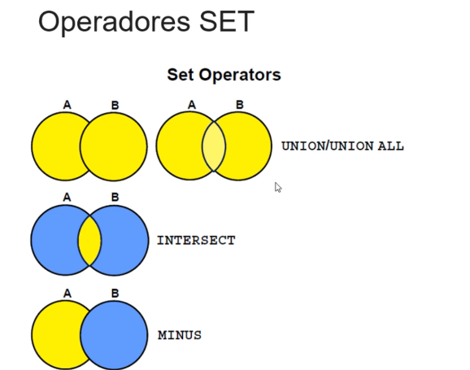

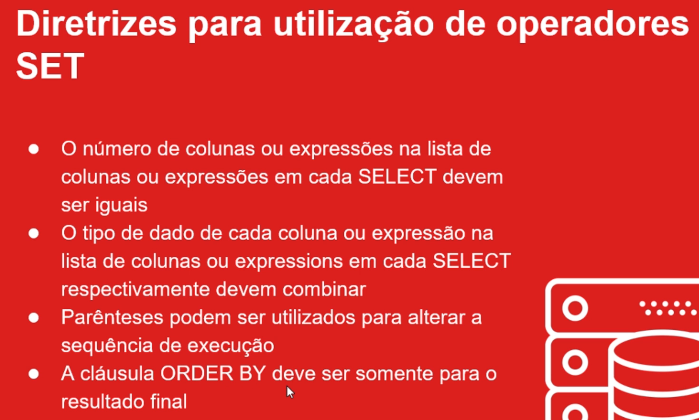


---

### RESUMO GEMINI

Aqui está a lista de diretrizes atualizada e explicada:

### Diretrizes para Utilização de Operadores SET

* O número de colunas ou expressões na lista de colunas ou expressões em cada SELECT devem ser iguais.
* O tipo de dado de cada coluna ou expressão na lista de colunas ou expressions em cada SELECT respectivamente devem combinar.
* **Linhas duplicadas são automaticamente eliminadas, exceto pelo pelo operador UNION ALL**.
* **São os nomes de colunas da primeira consulta que aparecem no cabeçalho do resultado**.
* Parênteses podem ser utilizados para alterar a sequência de execução.
* A cláusula ORDER BY deve ser somente para o resultado final.

### Explicação Detalhada das Diretrizes

#### Número Igual de Colunas
Cada instrução `SELECT` que você combina com um operador `SET` **precisa ter exatamente o mesmo número de colunas**. O banco de dados une os resultados verticalmente, e se uma consulta tivesse um número diferente de colunas, o alinhamento dos dados seria impossível, resultando em erro.

***

#### Tipos de Dados Combinando
As colunas em cada `SELECT` devem corresponder em **tipo de dado**. A primeira coluna do primeiro `SELECT` deve ser compatível com a primeira do segundo, a segunda com a segunda, e assim por diante.
* **Boas Práticas 👍**: Use funções de conversão explícita (como `TO_CHAR()`) se precisar combinar colunas de tipos diferentes.

***

#### Eliminação de Linhas Duplicadas
Por padrão, os operadores `UNION`, `INTERSECT` e `MINUS` realizam uma operação implícita de `DISTINCT` para eliminar todas as linhas duplicadas antes de apresentar o resultado final. A única exceção é o `UNION ALL`, que mantém todas as linhas, incluindo as duplicatas.
* **Boas Práticas 👍**: Se a performance for crucial e você não precisar remover duplicatas, sempre prefira `UNION ALL` a `UNION`, pois ele evita o trabalho extra de verificação.

***

#### Nomes das Colunas no Resultado
O cabeçalho do conjunto de resultados final é determinado pelos nomes das colunas ou pelos aliases da **primeira instrução `SELECT`** da sua consulta. Nomes ou aliases de colunas em `SELECT`s subsequentes são ignorados no cabeçalho final.
* **Boas Práticas 👍**: Defina aliases claros e descritivos na primeira instrução `SELECT` para garantir que o resultado final seja fácil de entender. Por exemplo: `SELECT nome AS "Nome do Cliente" FROM TabelaA UNION SELECT nome_contato FROM TabelaB;`. O cabeçalho será "Nome do Cliente".

***

#### Parênteses para Alterar a Sequência
Ao misturar operadores `SET`, use parênteses para ditar a ordem de execução e garantir a lógica correta. A parte da consulta dentro dos parênteses será executada primeiro.
* **Boas Prásticas 👍**: É uma boa prática sempre usar parênteses ao misturar operadores para não depender da ordem de precedência padrão e tornar a consulta mais legível.

***

#### Cláusula `ORDER BY` no Final
A cláusula `ORDER BY` serve para ordenar o resultado final e combinado. Por isso, ela só pode aparecer **uma vez, no final** de toda a instrução.
* **Boas Práticas 👍**: Você pode ordenar usando o nome do alias definido no primeiro `SELECT` ou pela posição da coluna (ex: `ORDER BY 1`).

---

#### Utilizando a cláusula ORDER BY em SELECTs com operadores SET

* A cláusula ORDER BY somente pode aparecer no final da consulta resultante
* As consultas componentes não podem ter cláusula ORDER BY individual
* Na cláusula ORDER BY referencie somente as colunas ou expressões do primeiro SELECT

---
### Explicação das Regras do `ORDER BY` com Operadores SET

Aqui está o detalhamento de cada uma das regras, que são essenciais para ordenar os resultados de consultas que utilizam `UNION`, `UNION ALL`, `INTERSECT` ou `MINUS`.

***

#### 1. `ORDER BY` Apenas no Final da Consulta

A cláusula `ORDER BY` é projetada para ordenar o **resultado final e combinado** de todas as operações SET. Ela não pode ser aplicada a cada consulta individualmente, pois o banco de dados primeiro precisa juntar todos os resultados para depois poder classificá-los como um conjunto único.

* **Boas Práticas** 👍: Sempre posicione a cláusula `ORDER BY` como a última linha de toda a sua instrução SQL, após o último `SELECT`.
    ```sql
    SELECT nome, sobrenome FROM tabela_a
    UNION
    SELECT nome_contato, sobrenome_contato FROM tabela_b
    ORDER BY 1;
    ```

* **Más Práticas** 👎: Tentar ordenar cada consulta antes de uni-las. O código abaixo resultará em um erro de sintaxe.
    ```sql
    -- INCORRETO
    SELECT nome, sobrenome FROM tabela_a ORDER BY nome
    UNION
    SELECT nome_contato, sobrenome_contato FROM tabela_b ORDER BY nome_contato;
    ```

***

#### 2. Consultas Componentes Sem `ORDER BY`

Este ponto reforça a primeira regra: as consultas individuais (ou "componentes") que formam a união **não podem ter sua própria cláusula `ORDER BY`**. Tentar fazer isso viola a sintaxe do SQL para operadores SET.

* **Boas Práticas** 👍: Se você precisar de uma ordenação intermediária complexa, considere usar uma subconsulta na cláusula `FROM` ou uma CTE (Common Table Expression), mas para operadores SET diretos, a regra é clara: sem `ORDER BY` no meio do caminho.

* **Más Práticas** 👎: Envolver uma consulta em parênteses na esperança de "enganar" a regra e aplicar uma ordenação individual. Isso não funciona com operadores SET e apenas torna o código inválido e confuso.

***

#### 3. Referenciar Colunas do Primeiro `SELECT`

O cabeçalho (nomes e aliases das colunas) do resultado final é **sempre definido pela primeira instrução `SELECT`**. Consequentemente, a cláusula `ORDER BY` só pode se referir aos nomes ou aliases de colunas dessa primeira consulta.

* **Boas Práticas** 👍:
    * **Use aliases claros no primeiro `SELECT`** e utilize esses mesmos aliases no `ORDER BY` para máxima legibilidade.
    * **Use a notação posicional** (`ORDER BY 1, 2 DESC`), que é concisa e funciona independentemente dos nomes das colunas.
    ```sql
    SELECT nome AS "Nome Completo", data_cadastro FROM clientes
    UNION
    SELECT contato, data_inclusao FROM fornecedores
    ORDER BY "Nome Completo"; -- Correto, usando o alias do primeiro SELECT.
    ```
* **Más Práticas** 👎: Tentar ordenar por um nome de coluna ou alias que só existe na segunda consulta (ou em consultas subsequentes). O código abaixo resultará em um erro de "identificador inválido".
    ```sql
    -- INCORRETO
    SELECT nome AS "Nome Completo" FROM clientes
    UNION
    SELECT contato AS nome_fornecedor FROM fornecedores
    ORDER BY nome_fornecedor; -- Erro: "nome_fornecedor" não existe no cabeçalho final.
    ```
---

#### Utilizando o operador UNION
* O operador UNION retorna linhas de ambas as consultas após eliminar as linhas duplicadas

---
### O Operador `UNION`

O operador `UNION` é usado para combinar os resultados de duas ou mais instruções `SELECT` em um único conjunto de resultados. Sua principal característica é que ele **automaticamente remove todas as linhas duplicadas** do resultado final. Para que uma linha seja considerada duplicada, os valores em todas as colunas selecionadas devem ser idênticos aos de outra linha.

Essa eliminação de duplicatas é, na prática, uma operação `DISTINCT` realizada no conjunto de dados combinado.

**Exemplo:**
Se a `tabela_A` tem as linhas (1, 2) e a `tabela_B` tem as linhas (2, 3), o resultado de `(SELECT * FROM tabela_A) UNION (SELECT * FROM tabela_B)` seria:
```
1
2
3
```
A linha com o valor `2` aparece apenas uma vez, pois a duplicata foi removida.

## Boas e Más Práticas

#### 👍 Boas Práticas
* **Use para Listas Únicas**: Utilize o `UNION` quando o objetivo é obter uma lista de valores únicos a partir de fontes que podem ter dados sobrepostos. Por exemplo, criar uma lista única de todos os clientes de 2023 e 2024.
* **Clareza de Intenção**: Usar `UNION` deixa claro para outros desenvolvedores que a remoção de duplicatas é um requisito intencional da consulta.

#### 👎 Más Práticas
* **Uso Desnecessário (Problema de Performance)**: A má prática mais comum é usar `UNION` por padrão quando `UNION ALL` seria suficiente. O processo de verificação e eliminação de duplicatas consome recursos e tempo. Se você sabe que as consultas não produzirão duplicatas, ou se as duplicatas são aceitáveis, **sempre prefira `UNION ALL` para um melhor desempenho**.
* **Mascarar Problemas de Dados**: Utilizar `UNION` para "limpar" dados duplicados pode, em alguns casos, esconder problemas na qualidade dos dados ou na lógica da aplicação que deveriam ser corrigidos na origem.
* **Uso com Tipos LOB**: O `UNION` não pode ser usado com colunas de tipos de dados LOB (`BLOB`, `CLOB`, etc.), pois a operação de `DISTINCT` não é suportada para esses tipos. Nesse caso, `UNION ALL` seria a única opção.

```sql
-- Utilizando o operador UNION 

SELECT employee_id, job_id, hire_date, salary
FROM   employees
WHERE  department_id IN (60, 90, 100)
UNION
SELECT employee_id, job_id, hire_date, salary
FROM   employees
WHERE  job_id = 'IT_PROG'
ORDER BY employee_id;
```
---

#### Utilizando o operador UNION ALL
* O operador UNION ALL retorna linhas de ambas as consultas, incluindo todas as linhas duplicadas

---
### O Operador `UNION ALL`

O operador `UNION ALL` combina os resultados de duas ou mais instruções `SELECT` em um único conjunto de resultados. A sua principal característica, e a que o diferencia do `UNION`, é que ele **inclui todas as linhas de ambas as consultas, sem eliminar as duplicatas**.

Por não precisar verificar e remover linhas duplicadas, o `UNION ALL` é **significativamente mais rápido** e consome menos recursos do que o `UNION`, tornando-o a escolha preferencial em muitos cenários.

**Exemplo:**
Se a `tabela_A` tem as linhas (1, 2) e a `tabela_B` tem as linhas (2, 3), o resultado de `(SELECT * FROM tabela_A) UNION ALL (SELECT * FROM tabela_B)` seria:
```
1
2
2
3
```
A linha com o valor `2` aparece duas vezes, pois nenhuma duplicata foi removida.

### Boas e Más Práticas

#### 👍 Boas Práticas
* **Preferência por Performance**: Use `UNION ALL` como sua escolha padrão sempre que não houver a necessidade estrita de remover linhas duplicadas. Essa é a melhor prática mais importante para otimização de consultas.
* **Dados que Não se Sobrepõem**: É ideal quando você sabe que as consultas que está unindo já retornam conjuntos de dados mutuamente exclusivos.
* **Análise de Dados Completos**: Utilize quando for importante manter todas as ocorrências de um registro para fins de contagem, auditoria ou análise estatística.
* **Compatibilidade com LOBs**: Ao contrário do `UNION`, o `UNION ALL` pode ser usado com colunas de tipos de dados LOB (`CLOB`, `BLOB`, `NCLOB`), pois não realiza a operação de `DISTINCT`.

#### 👎 Más Práticas
* **Gerar Listas Inválidas**: A pior prática é usar `UNION ALL` quando o requisito do negócio é uma lista de itens únicos (por exemplo, uma lista de clientes distintos). Isso pode levar a relatórios com contagens incorretas e dados enganosos.
* **Ignorar a Necessidade de Unicidade**: Usá-lo por hábito sem analisar se o resultado final precisa ou não de valores únicos. Sempre se questione: "As duplicatas são aceitáveis ou desejáveis aqui?". Se a resposta for não, use `UNION`.

```sql
-- Utilizando o operador UNION ALL

SELECT employee_id, job_id, hire_date, salary
FROM   employees
WHERE  job_id = 'IT_PROG'
UNION ALL
SELECT employee_id, job_id, hire_date, salary
FROM   employees
WHERE  department_id = 60
ORDER BY employee_id;

```
---

### O Operador `INTERSECT`

O operador `INTERSECT` compara os resultados de duas ou mais instruções `SELECT` e retorna **apenas as linhas que são comuns a todas as consultas**. Como o Diagrama de Venn da imagem ilustra perfeitamente, ele retorna apenas a área de sobreposição entre os conjuntos de dados.

Assim como o `UNION`, o `INTERSECT` também elimina automaticamente as linhas duplicadas do resultado final.

**Exemplo:**
Se a `tabela_A` contém as linhas (1, 2, 3) e a `tabela_B` contém as linhas (2, 3, 4), a consulta `(SELECT * FROM tabela_A) INTERSECT (SELECT * FROM tabela_B)` retornaria:
```
2
3
```
Estes são os únicos valores que existem em ambos os conjuntos.

### Boas e Más Práticas

#### 👍 Boas Práticas
* **Encontrar Dados em Comum**: Use `INTERSECT` quando o objetivo claro é encontrar registros idênticos que existem em dois ou mais conjuntos de dados. É perfeito para perguntas como: "Quais produtos foram vendidos tanto na loja física quanto na online?".
* **Reconciliação de Dados**: É uma ferramenta excelente para validar dados e reconciliar listas. Por exemplo, para encontrar quais funcionários de uma lista de "ativos" também aparecem em uma lista de "alocados em projetos".
* **Simplificar Lógica Complexa**: Pode ser mais legível do que um `JOIN` ou uma subconsulta complexa quando a única intenção é encontrar a correspondência exata de linhas inteiras entre dois conjuntos.

#### 👎 Más Práticas
* **Confundir com `JOIN`**: A má prática mais comum é usá-lo quando você na verdade precisa de um `JOIN`. Lembre-se: `INTERSECT` compara linhas e retorna um único conjunto de colunas (baseado no primeiro `SELECT`). Um `JOIN` combina colunas de tabelas diferentes em uma única linha.
* **Performance em Grandes Volumes**: Em tabelas muito grandes e sem os índices apropriados, o `INTERSECT` pode ser lento, pois o banco de dados precisa processar ambos os conjuntos de dados inteiros para depois encontrar as correspondências.
* **Ignorar Alternativas**: Para cenários simples, um `INNER JOIN` ou uma subconsulta com `IN` ou `EXISTS` pode ser mais performático e mais familiar para outros desenvolvedores. Avalie sempre a melhor ferramenta para a tarefa.

```sql
-- Utilizando operador INTERSECT

SELECT employee_id, job_id
FROM   employees
WHERE  job_id = 'IT_PROG'
INTERSECT
SELECT employee_id, job_id
FROM   employees
WHERE  department_id IN (60, 90, 100)
ORDER BY employee_id;
```

---

### O Operador `MINUS`

O operador `MINUS` retorna todas as linhas únicas do resultado da **primeira** instrução `SELECT` que **não existem** no resultado da **segunda** instrução `SELECT`. Como o diagrama ilustra, ele retorna o que está no conjunto A, subtraindo qualquer parte que também esteja no conjunto B.

A característica mais importante do `MINUS` é que **a ordem das consultas é crucial**. `A MINUS B` é completamente diferente de `B MINUS A`. Assim como outros operadores SET, ele também elimina duplicatas do resultado final.

**Exemplo:**
Se a `tabela_A` contém as linhas (1, 2, 3) e a `tabela_B` contém as linhas (2, 3, 4), a consulta `(SELECT * FROM tabela_A) MINUS (SELECT * FROM tabela_B)` retornaria:
```
1
```
Este é o único valor que existe em A, mas não existe em B.

### Boas e Más Práticas

#### 👍 Boas Práticas
* **Encontrar Exceções**: Use `MINUS` quando precisar encontrar a diferença entre dois conjuntos de dados. É ideal para perguntas como: "Quais clientes do ano passado não fizeram compras este ano?".
* **Auditoria e Validação**: Excelente para encontrar registros que estão faltando. Por exemplo, "Liste todos os funcionários que não registraram o ponto hoje".
* **Clareza Lógica**: Para encontrar diferenças, `MINUS` é frequentemente mais legível e direto do que alternativas como `LEFT JOIN` com `WHERE IS NULL`.

#### 👎 Más Práticas
* **Inverter a Ordem**: A má prática mais comum e crítica é errar a ordem das consultas, o que levará a um resultado completamente diferente do esperado.
* **Confundir com `NOT IN`**: Embora pareçam similares, `MINUS` e `NOT IN` tratam valores `NULL` de maneiras diferentes. `MINUS` pode ser mais previsível, pois `NOT IN` pode falhar em retornar resultados se a subconsulta contiver `NULL`s.
* **Ignorar Performance**: Em alguns cenários com tabelas muito grandes, um `LEFT JOIN ... WHERE column IS NULL` ou uma subconsulta com `NOT EXISTS` pode ser mais performático. Vale a pena testar as alternativas.

```sql
-- Utilizando operador MINUS

SELECT employee_id, job_id
FROM   employees
WHERE  department_id IN (60, 90, 100)
MINUS
SELECT employee_id, job_id
FROM   employees
WHERE  job_id = 'IT_PROG'
ORDER BY employee_id;
```

### CUIDADOS

```sql
-- Cuidados com os tipos de dados na lista de colunas ou expressões do SELECT

SELECT employee_id, job_id, hire_date
FROM   employees
WHERE  department_id IN (60, 90, 100)
UNION
SELECT employee_id, job_id, salary
FROM   employees
WHERE  job_id = 'IT_PROG'
ORDER BY employee_id;

-- Corrigindo o erro

SELECT employee_id, job_id, hire_date, salary
FROM   employees
WHERE  department_id IN (60, 90, 100)
UNION
SELECT employee_id, job_id, hire_date, salary
FROM   employees
WHERE  job_id = 'IT_PROG'
ORDER BY employee_id;

-- Utilizando mais de um operador SET

SELECT employee_id, job_id, hire_date, salary
FROM   employees
WHERE  department_id IN (60, 90, 100)
UNION
(SELECT employee_id, job_id, hire_date, salary
FROM   employees
WHERE  job_id = 'IT_PROG'
INTERSECT
SELECT employee_id, job_id, hire_date, salary
FROM   employees
WHERE  salary > 10000)
ORDER BY employee_id;
```


[Voltar ao Índice](#indice)

---


## <a name="parte14">14 - Seção 14: Oracle SQL - Comandos DML Manipulando dados</a>


[Voltar ao Índice](#indice)

---


## <a name="parte15">15 - Seção 15: Oracle SQL - Comandos DDL</a>


[Voltar ao Índice](#indice)

---


## <a name="parte16">16 - Seção 16: Oracle SQL - Criando e Gerenciando Constraints</a>


[Voltar ao Índice](#indice)

---


## <a name="parte17">17 - Seção 17: Oracle SQL - Criando e Gerenciando Visões</a>


[Voltar ao Índice](#indice)

---


## <a name="parte18">18 - Seção 18: Oracle SQL - Criando e Gerenciando Sequencias</a>


[Voltar ao Índice](#indice)

---


## <a name="parte19">19 - Seção 19: Oracle SQL - Criando e Gerenciando Índices</a>


[Voltar ao Índice](#indice)

---


## <a name="parte20">20 - Seção 20: Oracle SQL - Criando Sinônimos</a>


[Voltar ao Índice](#indice)

---


## <a name="parte21">21 - Seção 21: Oracle SQL - Utilizando o SQL*PLUS</a>


[Voltar ao Índice](#indice)

---


## <a name="parte22">22 - Seção 22: Oracle PL/SQI - Apresentação do curso Oracle 19c PL/SQL Furndamentos</a>


[Voltar ao Índice](#indice)

---


## <a name="parte23">23 - Seção 23: Oracle PL/SQL - Visão Geral do Oracle PL/SQL</a>


[Voltar ao Índice](#indice)

---


## <a name="parte24">24 - Seção 24: Oracle PL/SQL- Bloco Anônimo</a>


[Voltar ao Índice](#indice)

---


## <a name="parte25">25 - Seção 25: Oracle PL/SQL - Declaração de Identificadores - Variáveis e Constantes</a>


[Voltar ao Índice](#indice)

---


## <a name="parte26">26 - Seção 26: Oracle PL/SQL - Sintaxe e Diretrizes de um Bloco PL/SQL</a>


[Voltar ao Índice](#indice)

---


## <a name="parte27">27 - Seção 27: Oracle PL/SQL - Utilizando comandos SQL no PL/SQL</a>


[Voltar ao Índice](#indice)

---


## <a name="parte28">28 - Seção 28: Oracle PL/SQL - Estruturas de Controle</a>


[Voltar ao Índice](#indice)

---


## <a name="parte29">29 - Seção 29: Oracle PL/SQL - Tipos Compostos - Variável Tipo PL/SQL Record</a>


[Voltar ao Índice](#indice)

---


## <a name="parte30">30 - Seção 30: Oracle PL/SQL - Tipos Compostos - Collections</a>


[Voltar ao Índice](#indice)

---


## <a name="parte31">31 - Seção 31: Oracle PL/SQL - Cursor Explícito</a>


[Voltar ao Índice](#indice)

---


## <a name="parte32">32 - Seção 32: Oracle PL/SQL - Tratamento de Exceções</a>


[Voltar ao Índice](#indice)

---


## <a name="parte33">33 - Seção 33: Oracle PL/SQL - Procedures de Banco de Dados</a>


[Voltar ao Índice](#indice)

---


## <a name="parte34">34 - Seção 34: Oracle PL/SQL - Funções de Banco de Dados</a>


[Voltar ao Índice](#indice)

---


## <a name="parte35">35 - Seção 35: Oracle PL/SQL - Gerenciando Procedures e Functions</a>


[Voltar ao Índice](#indice)

---


## <a name="parte36">36 - Seção 36: Oracle PL/SQL - Gerenciando Dependências de Objetos</a>


[Voltar ao Índice](#indice)

---


## <a name="parte37">37 - Seção 37: Oracle PL/SQL - Debugando Procedures e Functions</a>


[Voltar ao Índice](#indice)

---


## <a name="parte38">38 - Seção 38: Oracle PL/SQL - Packages de Banco de Dados</a>


[Voltar ao Índice](#indice)

---


## <a name="parte39">39 - Seção 39: Oracle PL/SQL - Database DML Triggers</a>


[Voltar ao Índice](#indice)

---


## <a name="parte40">40 - Seção 40: Modelagem de Dados - Apresentação do curso Modelagem de Banco de Dados</a>


[Voltar ao Índice](#indice)

---


## <a name="parte41">41 - Seção 41: Modelagem de Dados - Instalação do Oracle SQL Developer Data Modeler</a>


[Voltar ao Índice](#indice)

---


## <a name="parte42">42 - Seção 42: Modelagem de Dados -Metodologia Oracle</a>


[Voltar ao Índice](#indice)

---


## <a name="parte43">43 - Seção 43: Modelagem de Dados - Modelagem de Dados Conceitual</a>


[Voltar ao Índice](#indice)

---


## <a name="parte44">44 - Seção 44: Modelagem de Dados - Modelagem de Dados Avançada (Detalhada)</a>


[Voltar ao Índice](#indice)

---


## <a name="parte45">45 - Seção 45: Modelagem de Dados - Database Design - Projeto do Banco de Dados</a>


[Voltar ao Índice](#indice)

---


## <a name="parte46">46 - Seção 46: Modelagem de Dados - Construção</a>


[Voltar ao Índice](#indice)

---


## <a name="parte47">47 - Seção 47: Oportunidades de Carreira utilizando Tecnologias Oracle</a>


[Voltar ao Índice](#indice)

---

